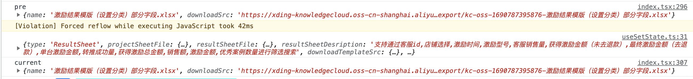
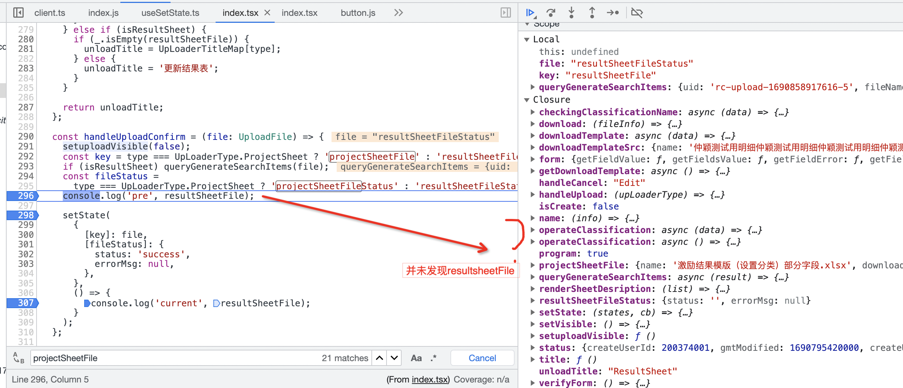
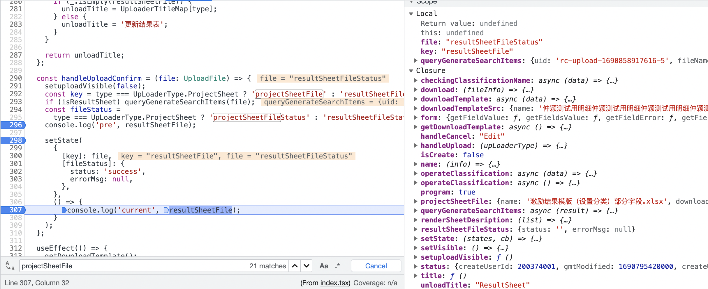
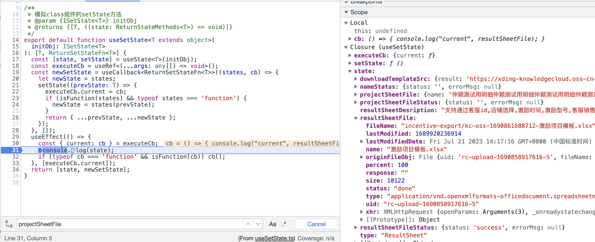
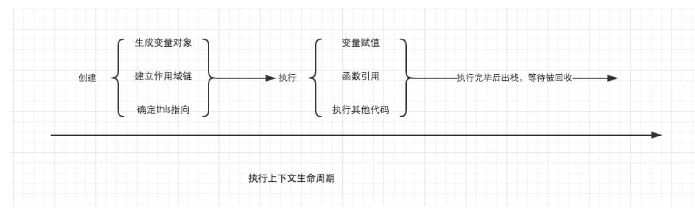

##  按位运算

下面是各种按位运算符的说明：

1. 按位与（&）：对两个数值的二进制位进行与运算，只有两位都是 1 时，结果才是 1，否则为 0。

2. 按位或（|）：对两个数值的二进制位进行或运算，只要两位中有任意一位是 1，结果就是 1，否则为 0。

3. 按位异或（^）：对两个数值的二进制位进行异或运算，如果两位不同，则结果为 1，否则为 0。

4. 左移位（<<）：将一个数值的二进制位向左移动指定的位数，空出的位用 0 填充。

5. 有符号右移位（>>）：将一个数值的二进制位向右移动指定的位数，空出的位用符号位（即最高位）填充。

6. 无符号右移位（>>>）：将一个数值的二进制位向右移动指定的位数，空出的位用 0 填充。

``` js
const a = 5; // 二进制表示为 101
const b = 3; // 二进制表示为 011

const c = a & b; // 按位与运算，结果为 001，即 1
const d = a | b; // 按位或运算，结果为 111，即 7
const e = a ^ b; // 按位异或运算，结果为 110，即 6
const f = a << 2; // 左移 2 位，结果为 10100，即 20
const g = a >> 1; // 有符号右移 1 位，结果为 10，即 2
const h = a >>> 1; // 无符号右移 1 位，结果为 10，即 2
```

需要注意的是，按位运算符只能用于整数，如果用于非整数，则会将非整数转换为整数进行计算。另外，按位运算符的操作数是数值类型，如果操作数是字符串类型，则会将其转换为数值类型进行计算。


## 如何确定函数的执行上下文，以及堆栈信息
思考以下代码 
前置：初始resultSheetFile为CustomizeFile，handleUploadConfirm接受UploadFile并更改resultSheetFile
打印的pre和current的resultSheetFile是否相等
``` ts

interface CustomizeFile {
  name: string;
  downloadSrc: string;
}
 const [state, setState] = useSetState<StateType>(initialValues);
  const {
    type,
    downloadTemplateSrc,
    projectSheetFile,
    resultSheetFile,
    projectSheetFileStatus,
    resultSheetFileStatus,} = state;
  const handleUploadConfirm = (file: UploadFile) => {
    // file {file:xxx,uid,filename.......}
    setuploadVisible(false);
    const key = type === UpLoaderType.ProjectSheet ? 'projectSheetFile' : 'resultSheetFile';
    if (isResultSheet) queryGenerateSearchItems(file);
    const fileStatus = 
      type === UpLoaderType.ProjectSheet ? 'projectSheetFileStatus' : 'resultSheetFileStatus';
    console.log('pre', resultSheetFile); // pre {name: 'x',downloadSrc:'sss' }
    setState(
      {
        [key]: file,
        [fileStatus]: {
          status: 'success',
          errorMsg: null,
        },
      },
      () => {

        console.log('current', resultSheetFile);// pre {name: 'x',downloadSrc:'sss' }
      }
    );
  };
```
**现象：**
pre和current打印的值相等
  、
此时handleUploadConfirm的堆栈信息
 、
setState的回掉函数：
 、
执行setState的回调函数，发现此时的state已经改变了
 、

疑问：该如何确定一个函数的执行上下文、作用域链

#### 执行上下文栈

执行上下文的生命周期：
 、
 分为创建、执行两个阶段

**创建阶段：**
1. 创建变量对象
  变量对象是与 执行上下文 相关的数据作用域，存储了在上下文中定义的 变量 和 函数声明。
 全局执行上下文中：变量对象就是全局对象
 函数执行上下文：用 活动对象（Activation Object，AO）来表示变量对象。
 活动对象 和 变量对象 其实是同一个东西，只是变量对象是规范上的或者说是引擎实现上的，不可在 JavaScript 环境中访问，只有到当进入一个执行上下文中，这个执行上下文的变量对象才会被激活，所以才叫 Activation Object ，而只有 被激活 的变量对象，也就是活动对象上的各种属性才能被访问。
 变量对象的创建，依次经历了以下几个过程：
 第一、处理入参（形参） ：
 建立 Arguments 对象
检查当前上下文的参数，由名称和对应值组成的一个变量对象的属性被创建
没有实参，属性值设为 undefined
第二、函数声明
检查当前上下文的函数声明，也就是使用 function 关键字声明的函数
在变量对象中以函数名建立一个属性，属性值为指向该函数所在内存地址的引用（name：地址？？？？）
如果变量对象已经存在相同名称的属性，那么该属性将会被新的引用所覆盖
第三、变量的声明
检查当前上下文中的变量声明
每找到一个变量声明，就在变量对象中以变量名建立一个属性，属性值为 undefined
如果变量名称与已经声明的形式参数或函数相同，则变量声明不会干扰已经存在的这类属性（亦可理解为为了防止同名的变量属性被修改为 undefined，则会直接跳过，原属性值不会被修改）
``` js
function foo(a) {
  var b = 2;

  function c() {}

  var d = function () {};

  b = 3;
}
// 在进入执行上下文后，这时候的活动对象 AO 是：
AO = {
  arguments: {
      0: 1,
      length: 1
  },
  a: 1,
  b: undefined,
  c: reference to function() {},
  d: undefined
}
// 代码执行阶段的变量对象:
// 在代码执行阶段，会根据代码，顺序执行代码，修改变量对象的值
// 还是上面的例子，当代码执行完后，这时候的 AO 是：
AO = {
  arguments: {
    0: 1,
    length: 1
  },
  a: 1,
  b: 3,
  c: reference to function c(){},
  d: reference to FunctionExpression "d"
}
```

