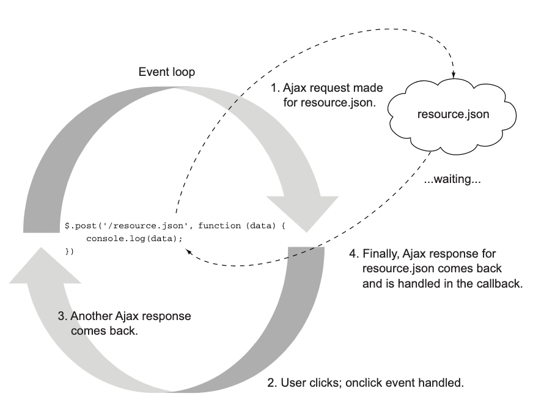

# node in action

## 前言

写一本关于nodejs的书籍是一项很有挑战性的工作。

## Part1 Node fundamentals（node 基本原理）

## Welcome to Node.js

这个章节覆盖以下内容：

1. node.js是什么
2. 服务器上的javascript
3. Node 的异步和事件性质
4. Node 设计用于的应用程序类型
5. Node示例程序

所以node.js是什么？它可能是你已经听到过的术语。或许已经使用node。也许你对此感到好奇。目前，Node 非常流行，年轻（2009年首次亮相）。这是 GitHub 上观看次数第二多的项目，它在 Google 群组中拥有相当多的追随者(http://groups.google.com/group/nodejs) 和 IRC 频道 (http://webchat.freenode.net/?channels=node.js)，并且拥有超过 15,000 个社区 mod-规则发布在 NPM（包管理器）(http://npmjs.org) 中。这一切都是为了说，这个平台背后有相当大的吸引力。

瑞安·达尔 (Ryan Dahl) 谈 Node：你可以在JSCONF Berlin 2009网站上观看Node的第一次演示，演讲者是创建者Ryan Dahl。链接是http://jsconf.eu/2009/video_nodejs_by_ryan_dahl.html。

官方网站（http://www.nodejs.org）将Node定义为“基于Chrome的JavaScript运行时平台，可轻松构建快速、可扩展的网络应用。Node.js使用事件驱动、非阻塞I/O模型，使其轻巧高效，非常适合跨分布式设备运行的数据密集型实时应用。”
在本章中，我们将探讨以下概念：

1. 为什么 JavaScript 对于服务器端开发很重要
2. 浏览器如何使用JavaScript处理I/O
3. Node在服务器端如何处理I/O
4. DIRTy应用程序的含义以及它们为什么适合Node
5. 一些基本Node程序的样例
6. 让我们先关注JavaScript...

**1.1 基于 JavaScript 构建**

无论好坏，JavaScript 都是世界上最流行的编程语言。如果你做过任何网络编程，这是不可避免的。 JavaScript，因为网络的纯粹覆盖范围，实现了 Java 的“一次编写，随处运行”的梦想
早在20世纪90年代。
2005 年 Ajax 革命前后，JavaScript 从一个“玩具”语言变成了一个人们用语言来编写真实且重要的程序。 一些值得注意的第一个是 Google 地图和 Gmail，并且今天有许多网络应用程序从 Twitter 到 Facebook 再到 GitHub。
自 2008 年底发布 Google Chrome 以来，由于浏览器供应商（Mozilla、Microsoft、Apple、Opera 和 Google）之间的激烈竞争，改进速度令人难以置信，JavaScript 性能已大幅提升。 这些现代的表现JavaScript 虚拟机正在真正改变您可以构建的应用程序类型。一个引人注目且坦率地说令人兴奋的例子是 jslinux，一台 PC在 JavaScript 中运行的模拟器，您可以在其中加载 Linux 内核，与终端会话，并编译 C 程序，所有这些都在您的浏览器中进行。
Node 使用 V8，即为 Google Chrome 提供支持的虚拟机，用于服务器端编程。 V8 为 Node 带来了巨大的性能提升，因为它省去了中间人，比起执行，更喜欢直接编译为本机机器代码字节码或使用解释器。 由于 Node 在服务器上使用 JavaScript，因此还有其他好处：

1. 开发人员可以用一种语言编写 Web 应用程序，这有助于减少在客户端和服务器开发之间进行上下文切换，并允许客户端和服务器之间的代码共享，例如表单重复使用相同的代码验证或游戏逻辑
2. JSON 是当今非常流行的数据交换格式，并且是 JavaScript 原生的
3. JavaScript 是各种 NoSQL 数据库（例如 CouchDB和 MongoDB），因此与它们交互是很自然的事情（例如，MongoDB 的 shell 和查询语言是 JavaScript； CouchDB的map/reduce是JavaScript）。
4. JavaScript 是一个编译目标，并且已经有许多语言可以编译它。
5. Node 使用一台符合 ECMAScript 标准的虚拟机 (V8)。5 换句话说，您不必等待所有浏览器都赶上来在 Node 中使用新的 JavaScript 语言功能

谁知道 JavaScript 最终会成为一种引人注目的用于编写服务器端应用程序的语言？ 然而，由于其广泛的覆盖范围、性能和其他特征前面提到，Node 已经获得了很大的关注。 JavaScript 只是这个难题的一小部分； Node 使用 JavaScript 的方式更加引人注目。 为了了解 Node 环境，让我们深入了解您最熟悉的 JavaScript 环境：浏览器。

**1.2 异步和事件驱动：浏览器**
  node提供一个事件驱动和异步平台给服务端js。它将js引入服务器的方式与浏览器引入客户端的方式非常相似。为了理解 Node 的工作原理，了解浏览器的工作原理非常重要。 两者都是事件驱动的（它们使用事件循环）并且在处理 I/O 时是非阻塞的（它们使用异步 I/O）。 让我们看一个例子来解释这意味着什么
事件循环和异步I/O 想了解更多关于事件循环和异步I/O，可以看Wikipedia相关的文章： http://en.wikipedia.org/wiki/Event_loop 、 http://en.wikipedia.org/wiki/Asynchronous_I/O
采用 jQuery 使用 XMLHttp-Request (XHR) 执行 Ajax 请求的常见片段

```js
$.post('/resource.json',function(data){
    console.log(data);
    });//script execution continues  
I/O 不会阻塞执行
```

该程序对resource.json执行HTTP请求。 当响应返回时，将调用包含参数数据的匿名函数（在本上下文中称为“回调”），该参数数据是从该请求接收到的数据
注意代码不是这样写的：
```js
vardata=$.post('/resource.json'); // I/O阻塞直到执行结束
console.log(data); 

```
浏览器中非阻塞 I/O 的示例

在此示例中，假设 resources.json 的响应在准备就绪时将存储在 data 变量中，并且在此之前 console.log 函数不会执行。I/O 操作（Ajax 请求）将“阻止”脚本继续执行，直到准备就绪。由于浏览器是单线程的，如果此请求需要 400 毫秒返回，则该页面上发生的任何其他事件都会等到那时才执行。您可以想象如果动画暂停或用户尝试以某种方式与页面交互，用户体验会很差。
  值得庆幸的是，事实并非如此。 当 I/O 发生在浏览器中时，它发生在事件循环之外（主脚本执行之外），然后当 I/O 完成时发出一个“事件”，由函数处理通常称为“回调”）如图1.1所示
  I/O 异步发生，不会“阻止”脚本执行，从而允许事件循环响应页面上正在执行的任何其他交互或请求。 这使得浏览器能够响应客户端并处理页面上的大量交互。
  记下这一点，然后切换到服务器
**1.3 异步和事件驱动：服务器**
  在大多数情况下，您可能熟悉服务器端编程的传统 I/O 模型，例如 1.2 节中的“阻塞”jQuery 示例。 这是 PHP 中的示例
  ```js
$result=mysql_query('SELECT*FROMmyTable'); // 执行会暂停直到DB请求完成
print_r($result);

```
  此代码执行一些 I/O，并且该进程将被阻止继续执行，直到所有数据返回。对于许多应用来说，这个模型很好并且很容易遵循。可能不明显的是，该进程具有状态或内存，并且在 I/O 完成之前基本上不执行任何操作。这可能需要 10 毫秒到几分钟不等，具体取决于 I/O 操作的延迟。意外原因也可能导致延迟：
  1. 磁盘正在执行维护操作，暂停读/写
  2. 由于负载增加，数据库查询速度变慢
  3. 由于某种原因，今天从 sitexyz.com 提取资源的速度很慢。
  如果程序在 I/O 上阻塞，当有更多请求需要处理时服务器会做什么？通常，您会在这种情况下使用多线程方法。一种常见的实现是每个连接使用一个线程，并为这些连接设置一个线程池。您可以将线程视为计算工作空间，处理器在其中处理一项任务。在许多情况下，线程包含在进程内并维护自己的工作内存。每个线程处理一个或多个服务器连接。虽然这听起来像是一种委派服务器工作的自然方式（至少对于长期这样做的开发人员来说是这样），但管理应用程序中的线程可能很复杂。此外，当需要大量线程来处理许多并发服务器连接时，线程会消耗操作系统资源。线程需要 CPU 来执行上下文切换，以及额外的RAM.
为了说明这一点，让我们看一个比较 NGINX 和 Apache 的基准测试（如图 1.2 所示，来自 http://mng.bz/eaZT）。 NGINX (http://nginx.com/)，如果你不熟悉的话，它是一个像 Apache 一样的 HTTP 服务器，但它没有使用阻塞 I/O 的多线程方法，而是使用具有异步 I/O 的事件循环。 （如浏览器和 Node）。 由于这些设计选择，NGINX 通常能够处理更多请求和连接的客户端，使其成为响应速度更快的解决方案。
在 Node 中，I/O 几乎总是在主事件循环之外执行，从而使服务器保持高效和响应能力，就像 NGINX 一样。 这使得进程更难成为 I/O 限制，因为 I/O 延迟不会使您的服务器崩溃，也不会像阻塞一样使用资源。 它允许服务器轻量级执行服务器通常执行的最慢的操作。
事件驱动和异步模型以及广泛使用的 JavaScript 语言的这种组合有助于打开数据密集型实时应用程序的令人兴奋的世界。
  