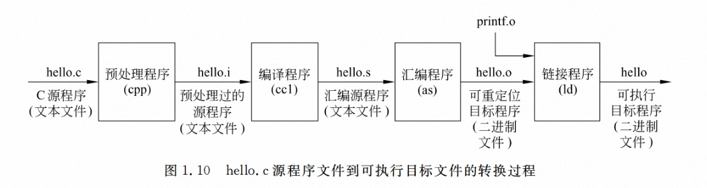
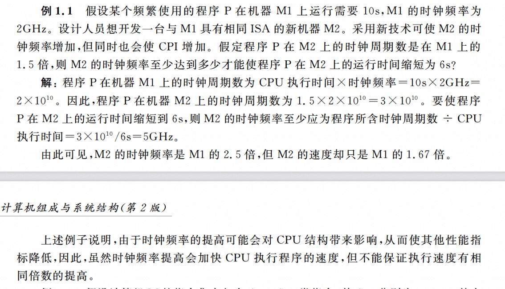
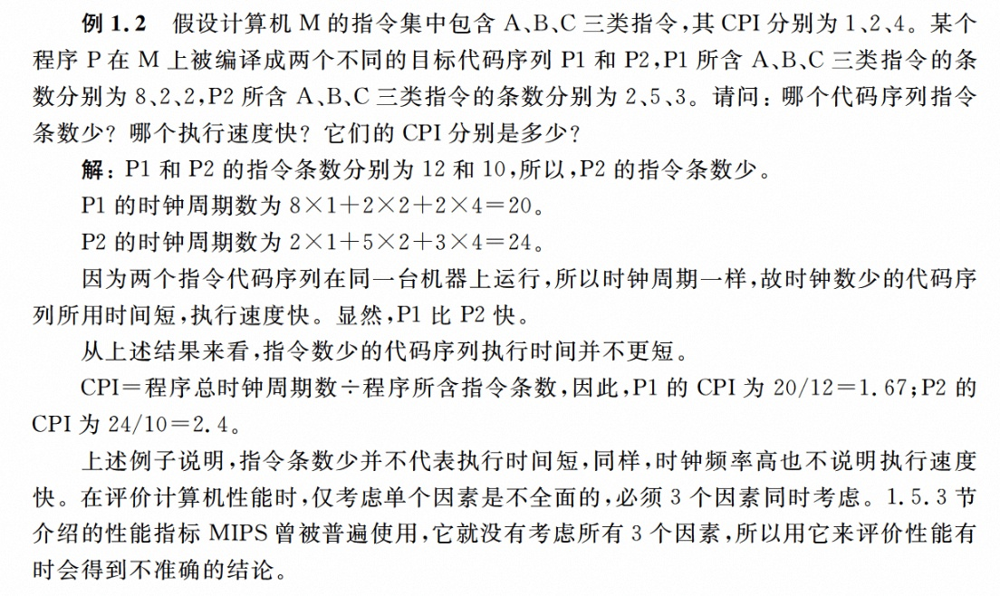
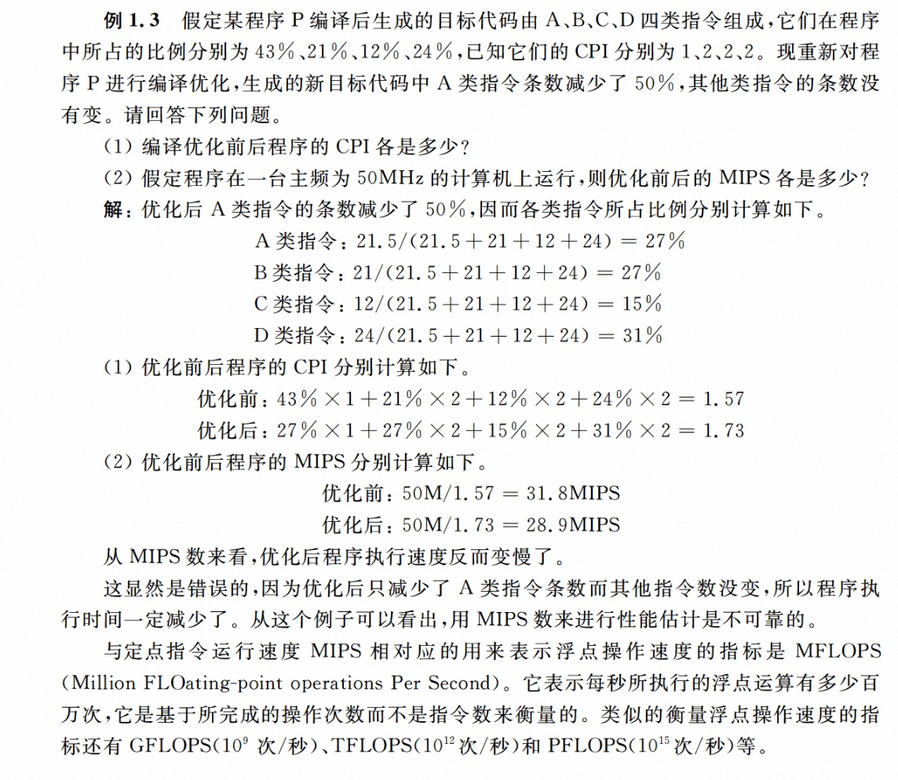
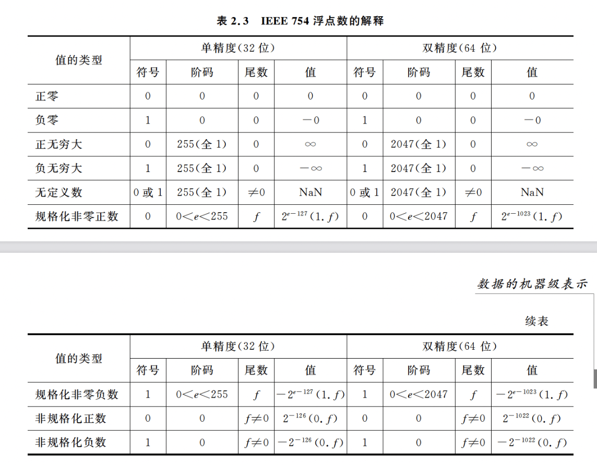
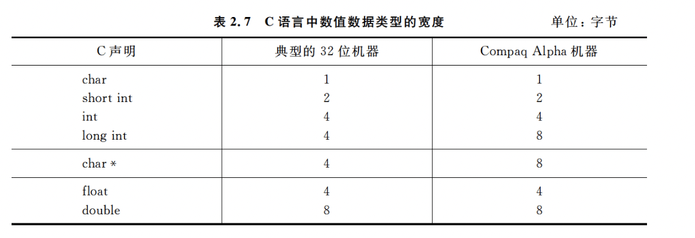

# 计算机组成原理
## 计算机的发展历程
第一代计算机：电子管计算机 其逻辑元件采用电子管，存储器为声延迟线或磁鼓，典型逻辑结构为定点运算。
冯诺依曼提出“存储程序”，其基本思想是：必须将事先编好的程序和原始数据送入主存后才能执行程序，一旦程序被启动执行，计算机在不需要操作人员干预自动完成逐条指令并执行的任务。
IAS计算机：

第二代计算机：晶体管计算机 逻辑元件采用晶体管，其内存采用磁芯存储器，外存采用磁鼓与磁带存储器，实现了浮点数运算，并在系统结构方面提出了变址、中断、I/O处理器等新概念。

第三代计算机：集成电路计算机 集成电路的应用时微电子与计算机技术相结合的一大突破，为构建运算速度快、价格低、容量大、可靠性高、体积小、功耗低的各类计算机提供了技术条件。

第四代计算机： 超大规模集成电路计算机 

## 计算机系统的基本组成 

计算机系统由硬件和软件两部分组成。

#### 计算机硬件

冯诺依曼计算机的基本特征：
(1) 采用“存储程序”工作方式 
(2) 计算机由运算器、控制器、存储器、输入/输出设备 5部分组成。
(3) 存储器不仅能存储数据，还能存放指令，形式上数据和指令没有区别，但计算机能区分它们。控制器应能控制指令的自动执行。运算器应能进行加、减、乘、除4种基本运算，并且能进行逻辑运算。操作人员可以通过输入/输出设备操作计算机。
(4) 计算机内部以二进制形式表示指令和数据，每条指令由操作吗和地址吗两部分组成，操作码指出操作类型，地址码指出操作数的地址，由一串指令组成程序。

计算机的硬件主要包括：中央处理器，存储器，I/O控制器，外部设备和各类总线 
中央处理器(CPU)：简称处理器，是整个计算机的核心部件 ，主要用于指令的执行。CPU包括两种基本部件：数据通路和控制器。数据通路主要包括算数逻辑部件和通用寄存器等，其功能是用来执行算术和逻辑运算等操作。控制器 用来对指令进行译码，生成相应的控制信号，以控制数据通路正确的操作。
存储器：外存和内存。内存：主存储器和高速缓存cache 外存：辅助存储器和海量后备存储器
外部设备：外设 也称为I/O设备 I/O是输入输出的缩写。外设由机械部分和电子部分组成，机械部分是外部设备本身，电子部分是控制外部设备的I/O控制器或I/O适配器
总线：传输信息的介质，用于在部件之间传输信息，CPU、主存和I/O模块通过总线互连，在CPU和I/O模块中都含有相应的存储部件，即缓存器。

#### 计算机软件
根据用途分：系统软件和应用软件
系统软件：操作系统、语言处理系统(如C语言编译器)、数据库管理系统(如Oracle)和各类实用程序(如磁盘碎片整理程序、备份程序)
应用软件：专门为处理数据处理、科学计算、事务管理、多媒体处理、工程设计以及过程控制等应用所编写的各类程序

## 计算机系统的层次结构
向上层用户提供一个抽象的简洁接口而将较低层次的实现细节隐藏起来
#### 计算机系统抽象层的转换

高级语言和低级语言(机器级语言)
机器级语言：机器语言（可读性差 由 0 1 组成）和汇编语言（由英文符号和二进制代码）；
高级语言 -> 机器语言 
转换过程需要 “程序设计语言处理系统” 其包含翻译程序（将一种编程语言转换成另一种编程语言）
翻译程序：
(1) 汇编程序：也成汇编器 将汇编语言源程序翻译为机器语言目标程序
(2) 解释程序：解释器 将源程序中的语句将其执行顺序逐条翻译为机器指令并立即执行。
(3) 编译程序：编译器 将高级语言源程序翻译成汇编语言或机器语言目标程序

透明：一个存在的事物或概念从某个角度看似乎不存在，即，对实际存在事物或概念感觉不到，则称为透明 对用户透明 指用户看不见

## 程序开发与执行过程

#### 从源程序到可执行程序
(1) 通过程序编辑软件(vscode)的到hello.c文件,hello.c文件在计算机中以ASCII字符方式存放 这样的文件称为文本文件，源程序文件都是文本文件，是可显示和可读的

(2)预处理阶段：预处理程序 do...
(3)编译阶段:编译程序 do...
(4)汇编阶段:汇编程序 do...
(5)链接阶段:链接程序 do...
最终生成的可执行文件被保存在磁盘上，可以通过某种方式启动一个磁盘上的可执行文件 

#### 可执行文件的启动和执行

#### 程序与指令的关系

#### 指令执行的过程
第一步：根据Pc取指令到IR
第二步：指令译码并送出控制信号。
第三步：取操作数。
第四步：指令执行。
第五步：回写结果。

## 计算机系统性能评价

#### 计算机性能的定义
吞吐率和响应时间是考量一个计算机系统性能的两个基本指标。
吞吐率：也称为带宽 表示在单位时间内所完成的工作量。
响应时间：也称为执行时间或等待时间，指从作业提交开始到作业完成所用的时间。
#### 计算机性能的测试
CPU时间：CPU用于程序执行的时间，包含两部分
(1)用户CPU时间，指真正用于运行用户程序代码的时间
(2)系统CPU时间，指为了执行用户程序而需要CPU运行操作系统的时间。
其他时间：I/O操作，CPU执行其他用户程序的时间

CPU时间的衡量:
(1)时钟周期：计算机执行一条指令的过程被分成若干步骤和相应的动作来完成，每个动作都要由响应的控制信号进行控制，控制信号都要由定时信号进行同步，定时信号就是CPU的主脉冲信号，其宽度称为时钟周期。
(2)时钟频率：CPU的主频就是CPU中的主脉冲信号的时钟频率，是CPU时钟周期的倒数。
(3)CPI：表示执行一条指令所需的时钟周期数。
        CPU执行时间 = 程序所含时钟周期数 ➗ 时钟频率
                  = 程序所含时钟周期数 ✖️ 时钟周期
        程序总时钟周期数 = 程序所含指令条数 ✖️ CPI
        n种不同类型的指令，第i种指令的条数和CPI分别为Ci和CPIi
        程序总时钟周期数 = C1*CPI1 + C2*CPI2+ C3*CPI3 + ... + Cn*CPIn
        平均CPI = 程序总时钟周期数 ➗ 程序所含指令条数
例1: 

例2:

#### 用指令执行速度进行评估
MIPS：平均每秒钟执行多少百万条指令
MIPS = 1/一条指令的平均执行时间
MFLOPS：每秒所执行的浮点运算有多少百万次
GFLOPS：10^9
TFLPOS:10^12 
PFLOPS:10^15

#### 用基准程序进行性能评估
基准程序：
课后习题：

## 第二张 数据的机器级表示

### 数制和编码

####  信息的二进制编码
#### 进位记数制
R进制转十进制
按权展开：数位i*该位上的权R^i 再进行累加 R称为基数

十进制转R进制
要将整数和小数分别进行转换 。
(1) 整数部分的转换
“除基取余，上右下左” 
(2)小数部分的转换
“乘基取整，上左下右”
(3)含整数和小数部分的数转换
分别对整数和小数进行转换，再组合起来

二、八、十六进制数的相互转换
(1)八进制转二进制
将八进制的每一位改成等值的3位二进制数
(2)十六进制转二进制
将十六进制的每一位改成等值的4位二进制数
(3)二进制转八进制
整数部分：从低位到高位每3位用等值的八进制数来替换，最后高位不满3位时补0凑满3位
小数：从高位向低位每3位用等值的八进制数来替换，最后低位不满3位时补0凑满3位
(4)二进制转十六进制 
整数部分：从低位到高位每4位用等值的八进制数来替换，最后高位不满4位时补0凑满4位
小数：从高位向低位每4位用等值的八进制数来替换，最后低位不满4位时补0凑满4位
#### 定点与浮点表示
小数点位置约定在固定位置的数称为定点数，小数点位置约定为可浮动的数称为浮点数
1.定点表示
定点表示法用来对定点小数和定点整数进行表示。
定点小数：小数点总是固定在数的最左边，一般用来表示浮点数的尾数部分。
定点整数：小数点总是固定在数的最右边，因此可以用"定点整数"来表示整数。
2.浮点表示
   X = (-1)^S ✖️ M ✖️ R^E
S:取值为0或1 M:二进制定点小数 反应X的有效位数 R:基数 E:二进制定点整数，称为数X的阶或指数 其位数决定X的表示范围，其值确定了小数点的位置

#### 定点数的编码表示
定点数的编码表示方法有4种：原码、补码、反码和移码。
机器数：数值数据在计算机内部编码表示的数称为机器数 
真值：机器数真正的值(现实世界带有正负号的数)称为机器数的真值。
1.原码表示法
定义：由符号位直接后跟数值位构成，也称为“符号-数值”表示法。正数和负数的编码表示仅符号位不同，数值位完全相同
       [ +0 ]原 = 000...0
       [ -0 ]原 = 100...0
优点：与真值的对应关系直观、方便 实现乘除运算比较简便 
缺点：0的表示不唯一，原码加减运算规则复杂
2.补码表示法 
实现加减运算的统一，即用加法来实现减法运算。也称为“2-补码”表示法，由符号位后跟真值的模2^n补码构成
(1)模运算
       A = B + K ✖️ M 记为 A = B (mod M)
A、B各除以M后的余数相同，故称为B和A为模M同余，也就是说 一个数与它除以“模”后得到的余数是等价的
时钟 ：
(2)补码的定义
正数的补码：符号位取0，其余不变
负数的补码等于模与该负数绝对值之差-> 写出二进制 从右向左找到第一个1，1左边的数按位取反，符号位不参与。
(3)特殊数据的补码表示
补码0的表示是唯一的 
(1)减少了 +0和-0之间的转换
(4)补码与真值之间的转换方法
正数：正号转换位0，数值部分不变 
负数：做减法运算，“各位取反，末位加1”。
注意：最小负数取负后的补码表示是不存在的

3.反码表示法
各位取反 
优点：
缺点：

4.移码表示法
浮点数的指数都是用一种移码表示
指数的阶：真值 
阶码：机器数
定义：[E]移 = 2^n-1 + E (2^n-1为偏置常数)
主要用来表示浮点数的指数，移码只能用来表示定点整数

### 整数的表示

#### 无符号整数的表示

#### 带符号整数的表示

补码的优点：

#### C语言中的整数类型
c语言中，一个运算同时有无符号数和有符号整数参加，C编译器会隐含地将带符号整数强制类型转换为无符号数。
-2147483648 二进制 真值：1 1000……000 补码：1 1000……000
-2147483647 二进制 真值：1 0111……111 补码：1 1000……001
-2147483648  < -2147483647

### 实数的表示
计算机中用专门用浮点数来表示实数
#### 浮点数的表示格式
X = (-1)^S ✖️ M ✖️ R^E
S：取值为0或1 0为正数 1为负数 
M：表示定点小数 称为X的尾数 原码小数表示 
E：是一个二进制定点整数，称为数X的阶或指数 用移码表示
R：基数 2、4、16

**IBM370**

#### 浮点数的规格化
浮点数尾数的位数决定浮点数的有效位数，有效位数越多，数据的精度越高。
规格化操作：“左归”和“右归”，当有效位进到小数点前面时，需要进行右归，右归时，尾数每右移一位，阶码加1，直到尾数变成规格化的形式，形如0.0000bbb✖️2^E，需要左归，尾数每前进一位，阶码减1，直到尾数变成规格化的形式为止。

#### IEEE 754浮点数标准
几乎所有计算机都采用IEEE754标准制定浮点数。这个标准提供了两种基本浮点格式：32位单精度和64位双精度格式。
32位单精度：1位    8位      23位
          符号位  阶码     尾数 
64位双精度：1位    11位     52位
          符号位  阶码     尾数
32位单精度包含1位符号位s，8位阶码e和23位尾数f；
64位双精度格式包含1位符号位s，11位阶码和52位尾数f;
尾数用**原码**表示，第一位总为1，因此可在尾数中省略第一位的1，称为隐藏位，使得单精度格式的23位尾数实际上表示了24位有效数字，双精度格式的52位尾数实际上表示了53位有效数字。隐藏位1的位置在小数点之前
指数用**移码**表示，偏置常数并不是通常n位移码所用的2^n-1，而是**2^n-1 - 1**,因此单精度和双精度的偏执常数分别位127和1023 
优点：
（1）尾数可表示的位数多一位，因而使浮点数的精度更高
（2）指数的可表示范围更大，因而使浮点数范围更大。

1.全0阶码全0尾数：+0 / -0 
IEEE754的零有两种表示：+0 和 -0 零的符号取决于数符s。一般情况下+0和-0是等效的
2.全0阶码非0尾数：非规格化数
非规格化数的特点：阶码全为0，尾数高位有一个或几个连续的0，但不全为0，非规格化数的隐藏位位0，并且单精度和双精度浮点数的指数分别为-126和-1022 (-1)^s ✖️ 0.f ✖️2^-126和(-1)^s ✖️ 0.f ✖️ 2^-1022  
3.全1阶码全0尾数：+∞ / -∞ 
4.全1阶码非0尾数：NAN
5.阶码非全0且非全1:规格化非0数

例题：

IEEE754标准的单精度和双精度格式的特征参数：

### C语言中的浮点数类型
整数数据类型：
char：通常是8位，但可能是16位或32位。
short：通常是16位。
int：通常是32位。
long：通常是32位，但有时也可能是64位。
long long：通常是64位。

浮点数类型：
float：通常是32位，其中1位表示符号，8位表示指数，23位表示尾数。
double：通常是64位，其中1位表示符号，11位表示指数，52位表示尾数。
long double：位数因编译器和操作系统而异，通常是80位或128位。

C语言中有float和double两种不同的浮点数类型，分别对应IEEE754单精度浮点数格式和双精度格式，相应的十进制有效数字分别为7位和17位
int、float和double类型转换
（1）从int转换为float，不会发生溢出，但可能有数据被舍入 
（2）从int或float转换为double，因为double的有效位更多，故能保留精确值
（3）从double转为float，因为float表示范围更小，故可能发生溢出，此外，有效位数表少，故可能被舍入
（4）从float或double转位int时，因为int没有小数部分，所以数据有可能会向0方向截断，例如1.99999999截断为1 因为int的表示范围更小，故可能发生溢出 

###  十进制数的表示

#### 用ASCII码字符表示
#### 用BCD码表示

### 非数值数据的编码表示

#### 逻辑值
逻辑数据只能参加逻辑运算，并且是按位进行的，如按位“与”，按位“或”，逻辑左移，逻辑右移等。
### 西文字符

### 数据的宽度和存储 

#### 数据的宽度和单位
二进制数据的每一位（0或1）是组成二进制信息的最小单位，称为一个比特（bit），或称为位元，简称位。比特是计算机处理、存储后劲儿传输信息的最小单位。
西文字符需用8个bit表示，汉字需用16个比特才能表示。在计算机内部，二进制信息的计量单位是字节（byte），也称为位组，一个字节等于8个比特。
还经常使用字（word）作为单位，不同的计算机，字的长度和组成不完全相同，一个字可能由2个字节，4个字节，8个字节甚至16个字节组成
机器字长：指CPU内部用于整数运算的数据通路的宽度。
CPU数据通路：指CPU内部数据流经的路径以及路径上的部件，主要是CPU内部进行数据运算、存储和传送的部件，这些部件的宽度基本一致，才能互相匹配，因此CPU内部用于整数运算的运算器位数和通用寄存器宽度一致。

表示容量：
1KB = 2^10B = 1024B
1MB = 2^20B = 1058576B
1GB = 2^30B = 1073741824B
1TB = 2^40B 
1PB = 2^50B
1EB = 2^60B
1ZB = 2^70B
1YB = 2^80B

表示距离、频率 速率 ：
比特/秒(b/s) bps
1kb/s = 10^3b/s = 1000b/s
1Mb/s = 10^6b/s
1Gb/s = 10^9b/s
1Tb/s = 10^12b/s

C语言数值类型的宽度

