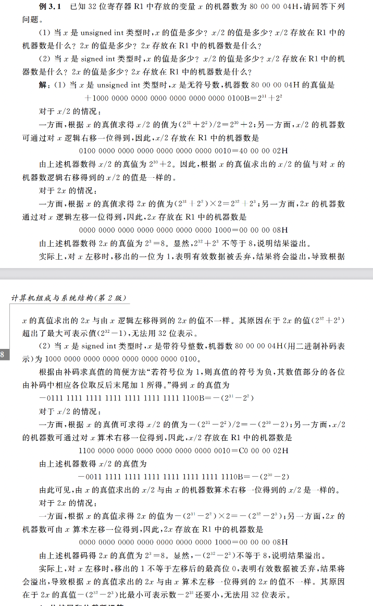
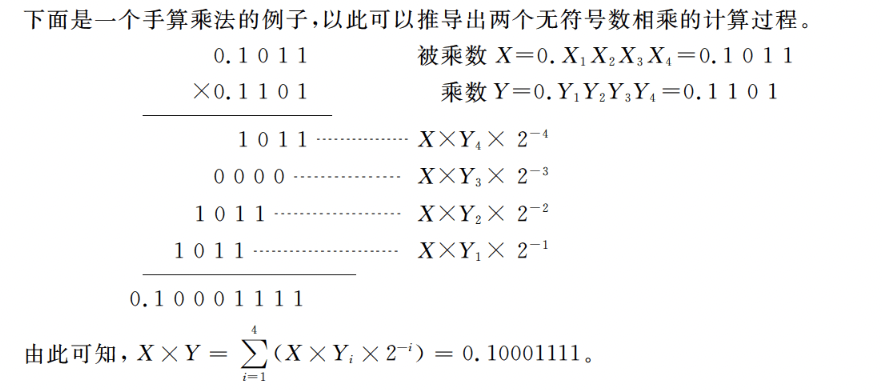
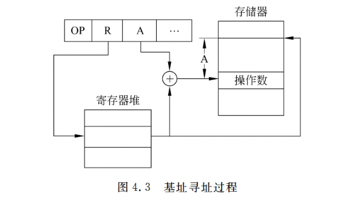
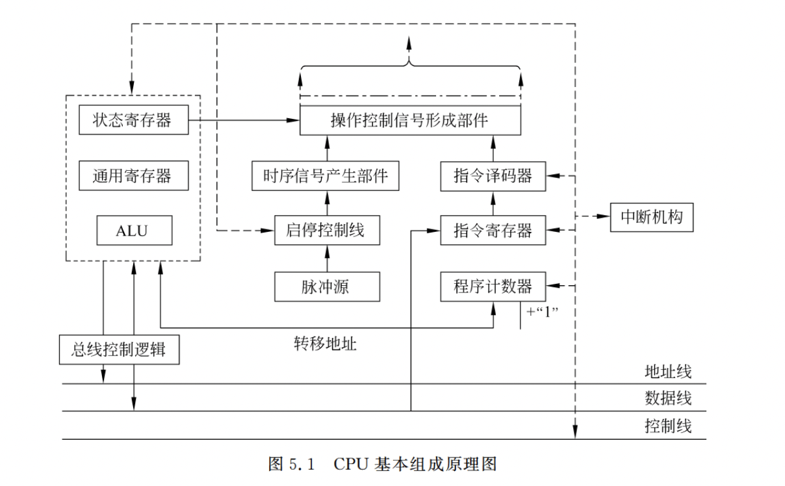
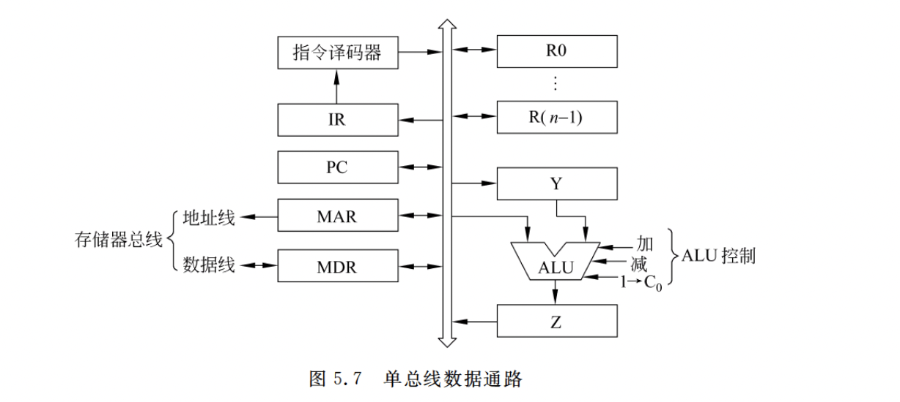

# 计算机组成原理
## 计算机的发展历程
第一代计算机：电子管计算机 其逻辑元件采用电子管，存储器为声延迟线或磁鼓，典型逻辑结构为定点运算。
冯诺依曼提出“存储程序”，其基本思想是：必须将事先编好的程序和原始数据送入主存后才能执行程序，一旦程序被启动执行，计算机在不需要操作人员干预自动完成逐条指令并执行的任务。
IAS计算机：

第二代计算机：晶体管计算机 逻辑元件采用晶体管，其内存采用磁芯存储器，外存采用磁鼓与磁带存储器，实现了浮点数运算，并在系统结构方面提出了变址、中断、I/O处理器等新概念。

第三代计算机：集成电路计算机 集成电路的应用时微电子与计算机技术相结合的一大突破，为构建运算速度快、价格低、容量大、可靠性高、体积小、功耗低的各类计算机提供了技术条件。

第四代计算机： 超大规模集成电路计算机 

## 计算机系统的基本组成 

计算机系统由硬件和软件两部分组成。

#### 计算机硬件

冯诺依曼计算机的基本特征：
(1) 采用“存储程序”工作方式 
(2) 计算机由运算器、控制器、存储器、输入/输出设备 5部分组成。
(3) 存储器不仅能存储数据，还能存放指令，形式上数据和指令没有区别，但计算机能区分它们。控制器应能控制指令的自动执行。运算器应能进行加、减、乘、除4种基本运算，并且能进行逻辑运算。操作人员可以通过输入/输出设备操作计算机。
(4) 计算机内部以二进制形式表示指令和数据，每条指令由操作吗和地址吗两部分组成，操作码指出操作类型，地址码指出操作数的地址，由一串指令组成程序。

计算机的硬件主要包括：中央处理器，存储器，I/O控制器，外部设备和各类总线 
中央处理器(CPU)：简称处理器，是整个计算机的核心部件 ，主要用于指令的执行。CPU包括两种基本部件：数据通路和控制器。数据通路主要包括算数逻辑部件和通用寄存器等，其功能是用来执行算术和逻辑运算等操作。控制器 用来对指令进行译码，生成相应的控制信号，以控制数据通路正确的操作。
存储器：外存和内存。内存：主存储器和高速缓存cache 外存：辅助存储器和海量后备存储器
外部设备：外设 也称为I/O设备 I/O是输入输出的缩写。外设由机械部分和电子部分组成，机械部分是外部设备本身，电子部分是控制外部设备的I/O控制器或I/O适配器
总线：传输信息的介质，用于在部件之间传输信息，CPU、主存和I/O模块通过总线互连，在CPU和I/O模块中都含有相应的存储部件，即缓存器。

#### 计算机软件
根据用途分：系统软件和应用软件
系统软件：操作系统、语言处理系统(如C语言编译器)、数据库管理系统(如Oracle)和各类实用程序(如磁盘碎片整理程序、备份程序)
应用软件：专门为处理数据处理、科学计算、事务管理、多媒体处理、工程设计以及过程控制等应用所编写的各类程序

## 计算机系统的层次结构
向上层用户提供一个抽象的简洁接口而将较低层次的实现细节隐藏起来
#### 计算机系统抽象层的转换

高级语言和低级语言(机器级语言)
机器级语言：机器语言（可读性差 由 0 1 组成）和汇编语言（由英文符号和二进制代码）；
高级语言 -> 机器语言 
转换过程需要 “程序设计语言处理系统” 其包含翻译程序（将一种编程语言转换成另一种编程语言）
翻译程序：
(1) 汇编程序：也成汇编器 将汇编语言源程序翻译为机器语言目标程序
(2) 解释程序：解释器 将源程序中的语句将其执行顺序逐条翻译为机器指令并立即执行。
(3) 编译程序：编译器 将高级语言源程序翻译成汇编语言或机器语言目标程序

透明：一个存在的事物或概念从某个角度看似乎不存在，即，对实际存在事物或概念感觉不到，则称为透明 对用户透明 指用户看不见

## 程序开发与执行过程

#### 从源程序到可执行程序
(1) 通过程序编辑软件(vscode)的到hello.c文件,hello.c文件在计算机中以ASCII字符方式存放 这样的文件称为文本文件，源程序文件都是文本文件，是可显示和可读的

(2)预处理阶段：预处理程序 do...
(3)编译阶段:编译程序 do...
(4)汇编阶段:汇编程序 do...
(5)链接阶段:链接程序 do...
最终生成的可执行文件被保存在磁盘上，可以通过某种方式启动一个磁盘上的可执行文件 

#### 可执行文件的启动和执行

#### 程序与指令的关系

#### 指令执行的过程
第一步：根据Pc取指令到IR
第二步：指令译码并送出控制信号。
第三步：取操作数。
第四步：指令执行。
第五步：回写结果。

## 计算机系统性能评价

#### 计算机性能的定义
吞吐率和响应时间是考量一个计算机系统性能的两个基本指标。
吞吐率：也称为带宽 表示在单位时间内所完成的工作量。
响应时间：也称为执行时间或等待时间，指从作业提交开始到作业完成所用的时间。
#### 计算机性能的测试
CPU时间：CPU用于程序执行的时间，包含两部分
(1)用户CPU时间，指真正用于运行用户程序代码的时间
(2)系统CPU时间，指为了执行用户程序而需要CPU运行操作系统的时间。
其他时间：I/O操作，CPU执行其他用户程序的时间

CPU时间的衡量:
(1)时钟周期：计算机执行一条指令的过程被分成若干步骤和相应的动作来完成，每个动作都要由响应的控制信号进行控制，控制信号都要由定时信号进行同步，定时信号就是CPU的主脉冲信号，其宽度称为时钟周期。
(2)时钟频率：CPU的主频就是CPU中的主脉冲信号的时钟频率，是CPU时钟周期的倒数。
(3)CPI：表示执行一条指令所需的时钟周期数。
        CPU执行时间 = 程序所含时钟周期数 ➗ 时钟频率
                  = 程序所含时钟周期数 ✖️ 时钟周期
        程序总时钟周期数 = 程序所含指令条数 ✖️ CPI
        n种不同类型的指令，第i种指令的条数和CPI分别为Ci和CPIi
        程序总时钟周期数 = C1*CPI1 + C2*CPI2+ C3*CPI3 + ... + Cn*CPIn
        平均CPI = 程序总时钟周期数 ➗ 程序所含指令条数
例1: 

例2:

#### 用指令执行速度进行评估
MIPS：平均每秒钟执行多少百万条指令
MIPS = 1/一条指令的平均执行时间
MFLOPS：每秒所执行的浮点运算有多少百万次
GFLOPS：10^9
TFLPOS:10^12 
PFLOPS:10^15

#### 用基准程序进行性能评估
基准程序：
课后习题：

## 第二张 数据的机器级表示

### 数制和编码

####  信息的二进制编码
#### 进位记数制
R进制转十进制
按权展开：数位i*该位上的权R^i 再进行累加 R称为基数

十进制转R进制
要将整数和小数分别进行转换 。
(1) 整数部分的转换
“除基取余，上右下左” 
(2)小数部分的转换
“乘基取整，上左下右”
(3)含整数和小数部分的数转换
分别对整数和小数进行转换，再组合起来

二、八、十六进制数的相互转换
(1)八进制转二进制
将八进制的每一位改成等值的3位二进制数
(2)十六进制转二进制
将十六进制的每一位改成等值的4位二进制数
(3)二进制转八进制
整数部分：从低位到高位每3位用等值的八进制数来替换，最后高位不满3位时补0凑满3位
小数：从高位向低位每3位用等值的八进制数来替换，最后低位不满3位时补0凑满3位
(4)二进制转十六进制 
整数部分：从低位到高位每4位用等值的八进制数来替换，最后高位不满4位时补0凑满4位
小数：从高位向低位每4位用等值的八进制数来替换，最后低位不满4位时补0凑满4位
#### 定点与浮点表示
小数点位置约定在固定位置的数称为定点数，小数点位置约定为可浮动的数称为浮点数
1.定点表示
定点表示法用来对定点小数和定点整数进行表示。
定点小数：小数点总是固定在数的最左边，一般用来表示浮点数的尾数部分。
定点整数：小数点总是固定在数的最右边，因此可以用"定点整数"来表示整数。
2.浮点表示
   X = (-1)^S ✖️ M ✖️ R^E
S:取值为0或1 M:二进制定点小数 反应X的有效位数 R:基数 E:二进制定点整数，称为数X的阶或指数 其位数决定X的表示范围，其值确定了小数点的位置

#### 定点数的编码表示
定点数的编码表示方法有4种：原码、补码、反码和移码。
机器数：数值数据在计算机内部编码表示的数称为机器数 
真值：机器数真正的值(现实世界带有正负号的数)称为机器数的真值。
1.原码表示法
定义：由符号位直接后跟数值位构成，也称为“符号-数值”表示法。正数和负数的编码表示仅符号位不同，数值位完全相同
       [ +0 ]原 = 000...0
       [ -0 ]原 = 100...0
优点：与真值的对应关系直观、方便 实现乘除运算比较简便 
缺点：0的表示不唯一，原码加减运算规则复杂
2.补码表示法 
实现加减运算的统一，即用加法来实现减法运算。也称为“2-补码”表示法，由符号位后跟真值的模2^n补码构成
(1)模运算
       A = B + K ✖️ M 记为 A = B (mod M)
A、B各除以M后的余数相同，故称为B和A为模M同余，也就是说 一个数与它除以“模”后得到的余数是等价的
时钟 ：
(2)补码的定义
正数的补码：符号位取0，其余不变
负数的补码等于模与该负数绝对值之差-> 写出二进制 从右向左找到第一个1，1左边的数按位取反，符号位不参与。
(3)特殊数据的补码表示
补码0的表示是唯一的 
(1)减少了 +0和-0之间的转换
(4)补码与真值之间的转换方法
正数：正号转换位0，数值部分不变 
负数：做减法运算，“各位取反，末位加1”。
注意：最小负数取负后的补码表示是不存在的

3.反码表示法
各位取反 
优点：
缺点：

4.移码表示法
浮点数的指数都是用一种移码表示
指数的阶：真值 
阶码：机器数
定义：[E]移 = 2^n-1 + E (2^n-1为偏置常数)
主要用来表示浮点数的指数，移码只能用来表示定点整数

### 整数的表示

#### 无符号整数的表示

#### 带符号整数的表示

补码的优点：

#### C语言中的整数类型
c语言中，一个运算同时有无符号数和有符号整数参加，C编译器会隐含地将带符号整数强制类型转换为无符号数。
-2147483648 二进制 真值：1 1000……000 补码：1 1000……000
-2147483647 二进制 真值：1 0111……111 补码：1 1000……001
-2147483648  < -2147483647

### 实数的表示
计算机中用专门用浮点数来表示实数
#### 浮点数的表示格式
X = (-1)^S ✖️ M ✖️ R^E
S：取值为0或1 0为正数 1为负数 
M：表示定点小数 称为X的尾数 原码小数表示 
E：是一个二进制定点整数，称为数X的阶或指数 用移码表示
R：基数 2、4、16

**IBM370**

#### 浮点数的规格化
浮点数尾数的位数决定浮点数的有效位数，有效位数越多，数据的精度越高。
规格化操作：“左归”和“右归”，当有效位进到小数点前面时，需要进行右归，右归时，尾数每右移一位，阶码加1，直到尾数变成规格化的形式，形如0.0000bbb✖️2^E，需要左归，尾数每前进一位，阶码减1，直到尾数变成规格化的形式为止。

#### IEEE 754浮点数标准
几乎所有计算机都采用IEEE754标准制定浮点数。这个标准提供了两种基本浮点格式：32位单精度和64位双精度格式。
32位单精度：1位    8位      23位
          符号位  阶码     尾数 
64位双精度：1位    11位     52位
          符号位  阶码     尾数
32位单精度包含1位符号位s，8位阶码e和23位尾数f；
64位双精度格式包含1位符号位s，11位阶码和52位尾数f;
尾数用**原码**表示，第一位总为1，因此可在尾数中省略第一位的1，称为隐藏位，使得单精度格式的23位尾数实际上表示了24位有效数字，双精度格式的52位尾数实际上表示了53位有效数字。隐藏位1的位置在小数点之前
指数用**移码**表示，偏置常数并不是通常n位移码所用的2^n-1，而是**2^n-1 - 1**,因此单精度和双精度的偏执常数分别位127和1023 
优点：
（1）尾数可表示的位数多一位，因而使浮点数的精度更高
（2）指数的可表示范围更大，因而使浮点数范围更大。

1.全0阶码全0尾数：+0 / -0 
IEEE754的零有两种表示：+0 和 -0 零的符号取决于数符s。一般情况下+0和-0是等效的
2.全0阶码非0尾数：非规格化数
非规格化数的特点：阶码全为0，尾数高位有一个或几个连续的0，但不全为0，非规格化数的隐藏位位0，并且单精度和双精度浮点数的指数分别为-126和-1022 (-1)^s ✖️ 0.f ✖️2^-126和(-1)^s ✖️ 0.f ✖️ 2^-1022  
3.全1阶码全0尾数：+∞ / -∞ 
4.全1阶码非0尾数：NAN
5.阶码非全0且非全1:规格化非0数

例题：

IEEE754标准的单精度和双精度格式的特征参数：

### C语言中的浮点数类型
整数数据类型：
char：通常是8位，但可能是16位或32位。
short：通常是16位。
int：通常是32位。
long：通常是32位，但有时也可能是64位。
long long：通常是64位。

浮点数类型：
float：通常是32位，其中1位表示符号，8位表示指数，23位表示尾数。
double：通常是64位，其中1位表示符号，11位表示指数，52位表示尾数。
long double：位数因编译器和操作系统而异，通常是80位或128位。

C语言中有float和double两种不同的浮点数类型，分别对应IEEE754单精度浮点数格式和双精度格式，相应的十进制有效数字分别为7位和17位
int、float和double类型转换
（1）从int转换为float，不会发生溢出，但可能有数据被舍入 
（2）从int或float转换为double，因为double的有效位更多，故能保留精确值
（3）从double转为float，因为float表示范围更小，故可能发生溢出，此外，有效位数表少，故可能被舍入
（4）从float或double转位int时，因为int没有小数部分，所以数据有可能会向0方向截断，例如1.99999999截断为1 因为int的表示范围更小，故可能发生溢出 

###  十进制数的表示

#### 用ASCII码字符表示
#### 用BCD码表示

### 非数值数据的编码表示

#### 逻辑值
逻辑数据只能参加逻辑运算，并且是按位进行的，如按位“与”，按位“或”，逻辑左移，逻辑右移等。
### 西文字符

### 数据的宽度和存储 

#### 数据的宽度和单位
二进制数据的每一位（0或1）是组成二进制信息的最小单位，称为一个比特（bit），或称为位元，简称位。比特是计算机处理、存储后劲儿传输信息的最小单位。
西文字符需用8个bit表示，汉字需用16个比特才能表示。在计算机内部，二进制信息的计量单位是字节（byte），也称为位组，一个字节等于8个比特。
还经常使用字（word）作为单位，不同的计算机，字的长度和组成不完全相同，一个字可能由2个字节，4个字节，8个字节甚至16个字节组成
机器字长：指CPU内部用于整数运算的数据通路的宽度。
CPU数据通路：指CPU内部数据流经的路径以及路径上的部件，主要是CPU内部进行数据运算、存储和传送的部件，这些部件的宽度基本一致，才能互相匹配，因此CPU内部用于整数运算的运算器位数和通用寄存器宽度一致。

表示容量：
1KB = 2^10B = 1024B
1MB = 2^20B = 1058576B
1GB = 2^30B = 1073741824B
1TB = 2^40B 
1PB = 2^50B
1EB = 2^60B
1ZB = 2^70B
1YB = 2^80B

表示距离、频率 速率 ：
比特/秒(b/s) bps
1kb/s = 10^3b/s = 1000b/s
1Mb/s = 10^6b/s
1Gb/s = 10^9b/s
1Tb/s = 10^12b/s

C语言数值类型的宽度

#### 数据的存储和排列顺序 

最低有效位：LSB 最高位
最高有效位：MSB 最低位 
带符号数：最高位就是符号位 6 
现代计算机采用字节编址方式，即对存储空间上的存储单元进行编号时，每个地址编号中存放一个字节。换而言之，采用字节编址，对存储空间进行按字节分组，并对每个分组进行编号。
假定int型变量i的地址为0800H,i的机器数为01 23 45 67H
大端方式：     0800H  0801H  0802H  0803H
              01H    23H    45H    67H  
小端方式：     0800H  0801H  0802H  0803H 
              67H    45H    23H    01H 
大端方式将数据的最高有效字节MSB存放在低地址单元中，将最低有效字节LSB存放在最高地址单元中，即数据的地址就是MSB所在的地址 
小端方式将数据的最高有效字节MSB放在高地址中，将最低有效字节LSB放在低地址中，即数据的地址就是LSB所在地址。

### 数据校验码

#### 奇偶校验码 
只能发现奇数位的错位，不能发现偶数位的错位。不提供纠错功能 
#### 海明码 
将数据按某种规律分成若干组，对每组进行相应的奇偶检测，以提供多位校验信息，从而可对错误位置进行定位，并将其纠正。实质上就是一种多重奇偶校验码
1.校验位的位数的确定
2.分组方式的确定
3.校验位的生成和检错、纠错
#### 循环冗余码(CRC)
具有较强检错、纠错能力的校验码，常用于外存储器的数据校验。
1.CRC码的检错方式
一个CRC码一定能被生成多项式整除，所以当数据和校验位一起送到接收端后，只要接受到的数据和校验位用同样的生成多项式相除，如果正好除尽，表示没有发生错误，若除不尽，则表示某些数据位发生了错误。
2.校验位的生成

3.CRC码的纠错
余数是否为0

## 第3章 运算方法和运算部件 

### 高级语言和机器指令的运算 

#### C语言中涉及的运算
加、减、乘、除等运算，可以有无符号、带符号整数和浮点数运算
按位运算、逻辑运算、移位运算、位运算和位截断运算

1.按位运算 
C语言中的按位运算：符号｜ 表示按位OR运算；符号&表示按位AND运算；符号～表示按位NOT运算；符号^表示按位XOR运算；
按位运算一个最重要的运用就是实现掩码(子网掩码)，可以进行“置1”、“清0”、“1测试”或“0测试”。
按位与（&）：对两个数值的二进制位进行与运算，只有两位都是 1 时，结果才是 1，否则为 0。

按位或（|）：对两个数值的二进制位进行或运算，只要两位中有任意一位是 1，结果就是 1，否则为 0。

按位异或（^）（同0异1）：对两个数值的二进制位进行异或运算，如果两位不同，则结果为 1，否则为 0。

2.逻辑运算
符号||表示OR运算
符号&&表示AND运算
符号!表示NOT运算
逻辑运算是非数值运算 

3.移位运算 
移位操作：逻辑移位和算术移位
逻辑移位：不考虑符号位，总是把高（低）位移出，低（高）位补0。对无符号整数的逻辑左移，如果高位是1，则发生溢出。
算术移位：带符号数在计算机内部采用补码表示的，所以对于带符号整数的移位操作应采用补码算术移位方式，左移时，高位移出，低位补0，每移一位，如果移出的高位不同于移位后符号位，即左移前、后符号位不同，则发生溢出；右移时，低位移出，高位补符号位。
x<<k 表示对数x左移k位
每左移一位，相当于数值扩大一倍，所以左移可能会发生溢出，左移k位，相当于数值乘2^k；每右移一位，相当于数值缩小一半，右移k位，相当于数值除以2^k
左移位（<<）：将一个数值的二进制位向左移动指定的位数，空出的位用 0 填充。
无符号数进行逻辑移位，带符号数进行算术移位
有符号右移位（>>）：将一个数值的二进制位向右移动指定的位数，空出的位用符号位（即最高位）填充。
无符号右移位（>>>）：将一个数值的二进制位向右移动指定的位数，空出的位用 0 填充。

例题 

4.位拓展和位截断运算
数据类型进行转换时，如果遇到一个短数向长数转换，就要进行位拓展运算了。
拓展方式：0拓展和符号拓展。0拓展用于无符号数，只要在短的无符号数前添加足够多的0即可。符号拓展用于补码表示的带符号整数，通过在短的带符号数前添加足够多的符号位来拓展。
长数向短数转换，就要进行截断运算。
截断一个数可能会因为溢出而改变它的值。因为长数的表示范围远远大于短数的表示范围，所以当一个长数足够大到短数无法表示的程度，则截断时就会发生溢出。

#### MIPS指令中涉及的运算 

### 基本运算部件(？？？)

#### 串行进位加法器

#### 并行进位加法器

#### 带标志加法器 
溢出标志位：OF 符号标志位：SF 零标志位：ZF 进位/借位：CF

#### 算术逻辑部件
ALU时一种能进行多种算术运算与逻辑运算的组合逻辑电路，其核心部件是带标志加法器，采用先行进位方式。

### 定点数运算

#### 补码加减运算

零标志ZF=1表示结果F为0，不管作为无符号数还是带符号数整数运算，ZF都有意义
符号标志SF表示结果的符号，即F的最高位，对于无符号数运算，SF没有意义
进/借位标志CF表示无符号数加/减运算时的进/借位。加法时，CF=1表示无符号数加法溢出；减法时，若CF=1表示有借位，不够减。对于带符号整数运算，CF没有意义。
溢出标志OF=1表示带符号整数运算时发生了溢出，对无符号整数运算，OF没有意义
减法变加法 原码转补码 进行加法运算

#### 原码加减运算
浮点数采用IEEE754标准，其尾数采用原码表示，故在浮点数加减运算中涉及原码加减运算。
原码加减运算规则如下：
(1) 比较两个操作数的符号，对加法实行“同号求和，异号求差”，对减法实行“异号求和，同号求差”
(2)求和时，

#### 移码加减运算
移码的和、差等于和、差的补码

#### 原码乘法运算

1.原码一位乘法
(1) 确定乘积的符号位，由两个乘数的符号异或得到。
(2)计算乘积的数值位。乘积的数值部分分为两个乘数的数值部分之积

2.原码二位乘法

#### 补码乘法运算

1.补码一位乘法
符号位与数值位一起参与运算，直接得出补码表示的乘积，且正数和负数同等对待，这种算法被称为布斯乘法

2.补码两位乘法

#### 补码除法运算
1.补码恢复余数除法
2.补码不恢复余数除法

### 浮点数运算

#### 浮点数加减运算
对阶、尾数加减、规格化和舍入。还必须考虑溢出判断和溢出处理问题

1.对阶 
对阶原则是：小阶向大阶看齐，阶小的那个数的尾数右移，右移的位数等于两个阶(指数)的差的绝对值
2.尾数加减
原码小数加减运算，注意隐藏位
3.尾数规格化
4.尾数的舍入处理
5.溢出判断
(1)右归和尾数舍入
(2)左归 

#### 浮点数乘法运算 

### 运算部件的组成

#### 定点数运算部件

#### 浮点数运算部件

### 小结 

## 指令系统
 
### 指令格式设计

#### 指令地址码的个数
一条指令中必须明确地(显示)或隐含地包含以下信息。
(1)操作码。指定操作类型，如移位、加、减、乘、除、传送等
(2)源操作数或其地址。指出一个或多个源操作数或其所在地址，可能是主(虚)存地址，寄存器编号或I/O端口，也可以在指令中直接给出一个立即数。
(3)结果的地址。结果所存放的地址，可以是主存地址、寄存器编号或I/O端口。
(4)下一条指令地址。一般隐含在PC中，指令按顺序执行时，只要自动将PC的值加上指令的长度，就可以得出下一条指令的地址，如果遇到转移指令，则需要由指令给出转移到的目标地址。

#### 指令格式设计原则
(1)指令应尽量短。降低开销
(2)要有足够的操作码位数。向后兼容
(3)操作码的编码必须有唯一的解释。
(4)指令长度应是字节的整数倍。指令存放在内存中，而内存往往按字节编址，指令的长度为字节的整数倍，便于指令的读取和指令地址的计算。
(5)合理选择地址字段的个数。
(6)指令应尽量规整。

### 指令系统设计 

#### 基本设计问题

#### 操作数类型
(1)指针或地址
(2)数值数据。
(3)位、位串、字符和字符串。
(4)逻辑(布尔)数据

#### 寻址方式
通常把指令中给出的操作数所在的存储单元的地址称为有效地址，存储单元地址可能是主存物理地址，也可能是虚拟地址。
常见的寻址方式：
1.立即寻址 
指令中直接给出操作数本身，这种操作数称为立即数。
2.直接寻址
指令中给出的地址码是操作数的有效地址，这种地址称为直接地址或绝对地址。
3.间接寻址
指令中给出的地址码是存放操作数有效地址的主存单元地址。
4.寄存器寻址
指令中给出的地址码是操作数所在的寄存器编号，操作数在寄存器中。
优点：
(1)寄存器数量远小于内存单元数，故寄存器编号和存储地址短，因而寄存器寻址方式的指令较短。
(2)操作数已在CPU中，不用访存，因而指令执行的速度快。
5.寄存器间接寻址
指令中给出的地址码是一个寄存器编号，该寄存器中存放的是操作数的有效地址。指令长度和寄存器寻址指令差不多，但由于要访存，所以寄存器间接寻址指令的执行时间比寄存器寻址指令的执行时间更长。
6.变址寻址
变址寻址方式主要是用于对线性表之类的数组元素进行方便的访问。
采用变址寻址方式时，指令中的地址码字段A给出的是一个基准地址，例如数组的起始地址，而数组元素相对于基准地址的偏移量在指令中明显或隐含地由变址寄存器I给出，这样变址寄存器(简称变址器)的内容实际上就相当于数组元素的下标，每个元素的有效地址为基准地址加变址寄存器的内容，即操作数的有效地址EA = (I) + A 其中I表示变址寄存器I的内容
7.相对寻址 
如果某指令的操作数的有效地址或转移目标地址位于该指令所在位置的钱、后某个固定位置上，则该操作数或转移目标可用相对寻址方式。采用相对寻址方式时，指令中的地址码字段A给出一个偏移量，基准地址隐含由PC给出，即操作数有效地址或目标地址EA = (PC) + A
相对寻址方式可用来实现公共子程序的浮动或实现相对转移。
8.基址寻址 
基址寻址方式下，指令中的地址码字段A给出一个偏移量，基准地址可以明显或隐含地由基址寄存器B给出。
操作数有效地址EA = (B)+A 

变址、基址和相对3中寻址方式，都是将某个寄存器的内容与一个形式地址相加来生成操作数的有效地址。统称为偏移寻址。
9.其他寻址方式
为了缩短指令字长度，有些指令采用隐含地址码方式。即在指令中不明显给出操作数地址或变址寄存器和基址寄存器编号，而是由操作码隐含给出。

#### 操作类型

1.算术和逻辑运算指令
加(ADD)、减(SUB)、比较(CMP)、乘(MUL)、除(DIV)、与(AND)、或(OR)、取反(NOT)、取负(NEG)、异或(XOR)、加1(INC)、减1(DEC)等。
2.移位指令 
算术移位、逻辑移位、循环移位、半字交换。
算术左移：操作数的各位依次向左移，低位补零。有些机器将最高位移入进位标志CF位，这样可以通过判断符号标志和进位标志是否相等就可以判断是否发生了溢出。
算术右移：各位依次向右移，高位补符号。有些机器将最低位移入进位标志位。
逻辑左移：同算术左移。
逻辑右移：各位依次向右移，高位补零。
小循环左移：最高位移入进位标志位，同时也移入最低位。
小循环右移：最低位移入进位标志位，同时也移入最高位。
大循环左移：最高位移入进位标志位，而进位标志位移入最低位。
大循环右移：最低位移入进位标志位，而进位标志位移入最高位。
3.传送指令
传送指令通常有寄存器之间的传送MOV、从内存单元读取数据到CPU寄存器LOAD、从CPU寄存器写数据到内存单元STORE等。
4.串指令
串指令是对字符串进行操作的指令。如串传送，串比较，检索和传送出转换等指令。
5.顺序控制指令
顺序控制指令用来控制程序执行的顺序。有条件转移BRANCH、无条件转移JMP、跳步SKIP、调用CALL、返回RET等指令。
顺序控制类指令的功能通过将转移目标地址送到PC中来实现。
无条件转移指令在任何情况下都执行转移操作，而条件转移指令(分支指令)仅仅在特定条件满足时才执行转移操作。
调用指令也称为转子指令，和转移指令的根本区别在于执行调用指令时必须保存下一条指令的地址（返回地址）。调用指令用于子程序调用(即过程调用或函数调用)，当子程序执行结束时，根据返回地址回到主程序继续执行；而转移指令则不返回执行，因而无法保存返回地址。
返回指令的功能是在子程序执行完毕时，将事先保存的返回地址送到PC，这样处理器就能回到原来的主程序继续执行。
6.CPU控制指令 
停机、开中断、关中断】系统模式切换以及进入特殊处理程序等指令。大多数机器将这类指令划为“特权”指令(也称为管态指令)，只能在内核代码执行时使用。
7.输入输出指令
这类指令用户完成CPU与外部设备交换数据或传送控制指令及状态信息。

#### 操作码编码
指令的操作码字段可以是固定长度，也可以是可变长度。
1.定长操作码编码
指令的操作码部分采用固定长度编码，这种译码方式方便，指令执行速度更快，但信息冗余。
2.拓展操作码编码
拓展操作码编码方式将操作码的编码长度分成几种固定长度的格式。操作码长度不固定，是可变的。

#### 标志信息的生成和使用 

常用的条件转移指令：

CF = Count 异或 Sub 

#### 指令系统设计风格

1.按操作数位置指定风格来分
1） 累加器型指令系统
总是把其中一个操作数隐含在累加器(一般用AC表示)中，指令执行的结果也总是送到累加器中。
2） 栈型指令系统
JAVA虚拟机采用的是栈型指令系统。FILO。操作数总是来自栈顶。通常是零地址或异地址指令。
3）通用寄存器型指令系统
使用通用寄存器而不是累加寄存器。其指令的操作数可以是立即数，或来自通用寄存器(R)，或来自存储单元(S)。
4）load/Store型指令系统
也是通过使用通用寄存器来来存放运算过程中的临时数据。只有取数指令和存数指令才可以访问存储器，运算类指令不能访存。

2.指令格式的复杂程度来分
1）CISC风格指令系统(complex Instruction Set Computer )
特点：
（1）指令系统复杂。指令多，寻址方式多，指令格式多。
（2）指令周期长。绝大多数指令需要多个时钟周期才能完成。
（3）指令周期差距大。各种指令都能访问存储器，使得简单指令和复杂指令所用的时钟周期数相差很大，不利于指令流水线。
（4）采用微程序控制。
（5）难以进行编译优化。

2）RISC风格指令系统 (Reduced Instruction Set Computer)
（1）指令数目少，只包含使用频度高的简单指令。
（2）指令格式规整。寻址方式少，指令格式少，指令长度一致
（3）采用Load/Store型指令设计风格。
（4）采用流水线方式执行指令。
（5）采用大量通用寄存器。
（6）采用硬连线控制器。
（7）采用优化的编译系统。

## 程序的机器及表示 

### MISPS汇编语言和机器语言

1.MIPS指令中数据的表示
2.MIPS指令格式和寻址方式
3.MIPS汇编语言

从汇编转为机器代码的过程称为汇编，从机器代码转为汇编表示的过程称为反汇编。

## 第五章中央处理器

### CPU概述

#### 指令执行过程
指令按顺序存放在内存连续单元中，指令地址由PC给出。CPU取出并执行一条指令称为指令周期，不同指令的指令周期可能不同。
CPU执行一条指令的大致过程如下
（1）取指令并计算下一条指令地址。
（2）对指令操作码译码。
（3）计算源操作数地址并取源操作数。
（4）数据操作。
（5）目的操作数地址计算并存结果。
每条指令指令的功能总是由以下4种基本操作来实现。
（1）读取某个存储单元内容（可能是指令或操作数或操作数地址），并将其装入某个寄存器。
（2）把一个数据从某个寄存器存入给定的寄存器单元中。
（3）把一个数据从某个寄存器送到另一个寄存器或者ALU输入端。
（4）进行某种算术运算或逻辑运算，将结果送入某个寄存器。

寄存器传送语言（RTL）
（1）用R[r] 表示寄存器堆中寄存器r的内容
（2）用M[addr] 表示读取存储单元addr的内容。
（3）传送方向用〈- 表示，传送源在右，传送目的在左。
（4）程序计数器PC直接用PC表示内容。

#### CPU的基本功能和基本组成

CPU由数据通路和控制部件两大部分组成。
数据通路：将指令执行过程中数据所经过的路径，包括路径上的部件称为数据通路。ALU、通用寄存器、状态寄存器、cache、MMU、浮点运算逻辑、异常和中断处理逻辑等都是指令执行过程中数据流经的部件，都属于数据通路的一部分。通常将数据通路中专门进行数据运算的部件称为执行部件或功能部件。
控制部件：数据通路由控制部件进行控制。控制部件根据每条指令功能的不同生成对数据通路的控制信号，并正确控制指令的执行过程。

CPU基本组成原理图：

（1）程序计数器（PC）：又称指令计数器或指令指针（IP），用来存放指令的地址。顺序执行pc+1，需要改变执行顺序的时，由转移类指令形成转移地址送到PC，作为下一条指令地址。
（2）指令寄存器（IR）：用以存放现行指令。上文提到，每条指令总是先从存储器去除后才能在CPU中执行，指令取出后存放在指令寄存器中，以便送指令译码器进行译码。
（3）指令译码器。对指令寄存器中的操作码部分进行分析解释，产生相应的译码信号，提供给操作控制信号形成部件。
（4）脉冲源及起停控制线路。脉冲源产生一定频率的脉冲信号作为整个机器的时钟脉冲，是CPU时序的基准信号。启停线路在需要时能保证可靠地开放或封锁时钟脉冲，控制时序信号的发生与停止，并实现对机器的启动与停机。
（5）时序信号产生部件。以时钟脉冲为基础，产生不同指令对应的周期、节拍、工作脉冲等信号、实现机器指令执行过程的时许控制。
（6）操作控制信号形成部件。综合时序信号、指令译码信号和执行部件反馈的状态标志等，形成不同指令所需要的操作控制信号序列。
（7）总线控制逻辑。实现对总线传输的控制，包括数据、地址信息和缓冲与三态控制。
（8）中断机构。实现对异常情况和某些外部中断请求的处理。

#### 数据通路的基本结构
指令执行所用到的元件有两类：组合逻辑元件（也称为操作元件）和存储元件（也称为状态元件）。连接这些元件的方式有两种：总线方式和分散连接方式。数据通路就是由操作元件和存储元件通过总线或分散方式连接而成的进行数据存储、处理和传送的路径。
1.组合逻辑元件
组合逻辑元件的输入只决定于当前的输入。常用的组合逻辑元件有多路选择器（MUX）、加法器（Adder）、算术逻辑部件（ALU）、译码器（Decoder）等。
2.状态元件
状态元件具有存储功能，输入状态在时钟控制下被写到电路中，并保持电路的输出值不变，直到下一个时钟到达。例如D触发器。

数据通路中的寄存器是一种典型的状态存储元件，由n个D触发器可构成一个n位寄存器。根据功能和实现方式的不同，有各种不同类型的寄存器。
例如：
1）带“写使能”输入信号的触发器构成的寄存器，通常这类触发器位锁存器，所组成的寄存器称为暂存器，通常用来实现指令寄存器IR，通用寄存器
2）输出端带一个三态门的寄存器，通常用来于总线相连的寄存器，可以通过三态门来控制信息是否打到总线上。
3）带复位（清零）功能的寄存器
4）带计数（自增）功能的寄存器
5）带移位功能的寄存器

3.数据通路与时序控制

1）早期计算的三级时序系统
机器周期、节拍和脉冲三级时序对数据通路进行定时控制。
2）现代计算机的时钟信号
整个数据通路中的定时信号就是时钟，一个时钟周期就是一个节拍。

4.单总线数据通路
CPU内部的部件之间通过总线方式连接。将ALU及所有寄存器通过一条内部的公共总线连接起来，构成单总线结构的数据通路。因为此总线在CPU内部，所以称为CPU内部总线。

通用寄存器对程序员是可见的 而CPU临时存储数据的寄存器对程序员不可见。
单总线CPU结构中，完成指令执行的4种基本操作
1）在通用寄存器之间传送数据
总线是一组共享的传输信号线，它不能存储信息，某一时刻也只能有一个部件能把信息送到总线上。
2）完成算术、逻辑运算
ALU是一个没有记忆功能的组合逻辑电路，若要进行正确的运算，必须将两个操作数都送到ALU的输入端。
3）从内存中读取一个字（指令或数据或数据的地址）
4）把一个字（数据）写入主存
5.三总线数据通路
 