# 第一章 操作系统引论

## 操作系统的目标和作用 

### 操作系统的目标
在计算机系统上配置操作系统，其主要的目标是：方便性，有效性，可扩展性和开放性。
### 操作系统的使用 

1. OS作为用户与计算机硬件系统之间的接口 
OS处于用户与计算机硬件系统之间，用户通过OS来使用计算机系统。
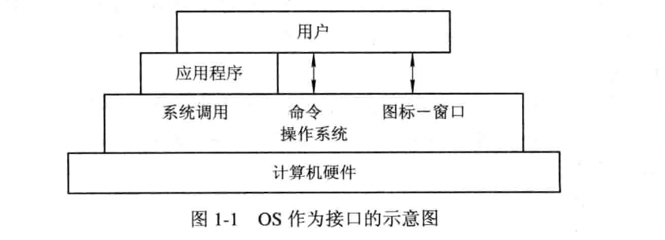
2. OS作为计算机系统资源管理的管理者
计算机资源分为 
3. OS实现了对计算机资源的抽象

## 操作系统的发展过程

### 单道批处理系统
缺点 系统中的资源得不到充分的利用。因为内存中仅有一道程序，每逢该程序在运行中发出的I/O请求之后，CPU便处于等待状态，必须在其I/O完成之后才继续进行，又因I/O设备的低速性，更使CPU的利用率显著降低 
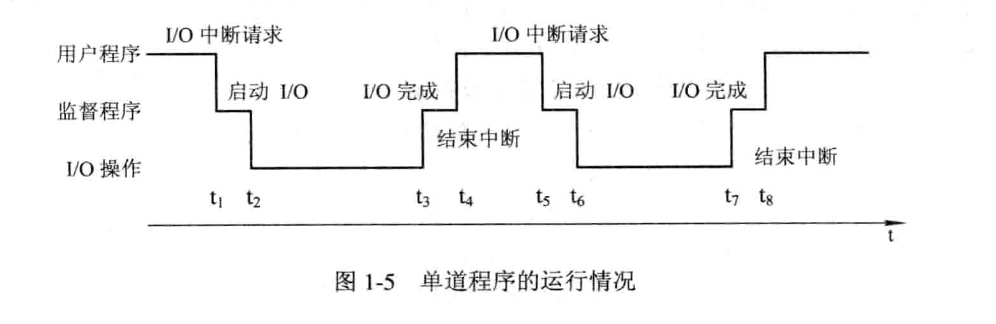
### 多道批处理系统
优缺点：
(1) 资源利用率高。多道程序交替运行，以保持CPU处于忙碌状态。在内存中装入多道程序可提高内存的利用率；此外还可以提高I/O设备的利用率
(2)系统吞吐量大。第一 CPU和其他资源保持"忙碌"状态 第二 仅当作业完成时或运行不下去时才进行切换，系统开销小
(3)平均周转时间长。由于作业要排队依次进行处理，因而作业的周转时间较长。
(4)无交互能力
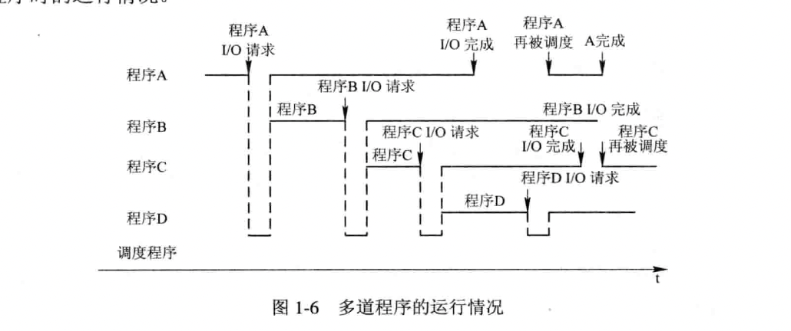

### 分时操作系统
(1)多路性
(2)独立性
(3)及时性
(4)交互性

### 实时操作系统

### 微机操作系统的发展

## 操作系统的基本特性

#### 并发

1. 并发和并行
并行：指两个或多个事件在同一时刻发生。
并行：指在一段时间内宏观上有多个程序同时进行，微观上这些程序只能是分时地交替执行
2. 引入进程
进程：指系统中能独立运行并作为资源分配的基本单位，它是由一组机器指令、数据和堆栈等组成的，是一个能独立运行的活动实体

#### 共享

1. 互斥共享方式
规定在一段时间内，只允许一个进程访问该资源。若其他进程请求访问该资源，必须等待正在访问的进程访问完毕并释放资源之后，才允许另一个进程对该资源进行访问。这种资源共享方式称为互斥式共享。
临界资源（独占资源）：这段时间内只允许一个进程访问的资源。例如大多数的物理设备，以及栈、变量和表格。
2. 同时访问方式
系统中还有另外一类资源，允许在一段时间内由多个进程“同时”对它们进行访问。”同时“指的是宏观意义上的，在微观上，对该资源的访问是交替进行的。例如磁盘设备。

#### 虚拟

1. 时分复用技术
（1）虚拟处理机技术
利用多道程序设计技术，为每道程序建立至少一个进程，让多道程序并发执行。
（2）虚拟设备技术 
通过时分复用技术，将一台物理I/O设备虚拟为多台逻辑上的I/O设备，并允许每个用户占用一个逻辑上的I/O设备。

2. 空分复用技术
利用存储器的空闲空间分区域存放和运行其他的多道程序

#### 异步

以不可预知的速度向前推进，进程的异步性

### 操作系统的主要功能

#### 处理机管理功能

在传统的多道程序系统中，处理机的分配和运行都是以进程为基本单位的，因而对处理机的管理可归结为对进程的管理。例如，创建和撤销进程，对进程进行协调，实现进程之间信息交换，以及按照一定的算法把处理机分配给其他进程。

1. 进程控制 
为作业创建进程、撤销已结束的进程，以及控制进程在运行过程中的状态转换。

2. 进程同步
为多个进程的运行进行协调。常见的方式有两种：第一种，进程互斥方式，指进程在对临界资源进行访问时，应采用互斥方式。第二，进程同步方式，指在相互合作区完成共同任务的诸进程间，由同步机构对他们的执行次序加以协调。PV操作。

3. 进程通信
实现相互合作进程之间的信息交换

4. 调度
（1）作业调度 。作业调度的基本任务时从后备队列中按照一定的算法选择出若干作业，为它们分配运行所需的资源，在将这些作业调入内存后，分别为它们建立进程，使它们都成为可能获得处理机的就绪就绪进程，并将它们插入到就绪队列中。
（2）进程调度。进程调度的任务是从进程的就绪队列中按照一定的算法选出一个进程，将处理机分配给它，并为它设置运行现场。

#### 存储器管理功能

主要是任务就是为多道程序的运行提供良好的环境，提高存储器的利用率，方便用户使用，并能从逻辑上扩充内存。为此，存储器管理应具有内存分配和回收、内存保护、地址映射和内存扩充等。

1. 内存分配 
（1）为每道程序分配内存空间，使它们“各得其所”
（2）提高存储器的利用率，尽量减少不可用的内存空间（碎片）
（3）允许正在运行的程序申请附加的内存空间，以适当程序和数据动态增长的需要

OS在实现内存分配时，可采用静态和动态两种方式
（1）静态分配方式。每个作业的内存空间是在作业装入时确定的，在作业装入后的整个运行期间不允许该作业再申请新的内存空间，也不允许作业在内存中’移动‘
（2）动态分配方式。 每个作业所要求的基本内存空间虽然也是在装入时确定的，但允许作业在运行过程中继续申请新的附加内存空间，以适应程序和数据的动态增长，页允许作业在内存中“移动

2. 内存保护 

（1）独立运行，互不干扰
（2）不允许访问OS的程序和数据
在各自的内存去运行，设置两个界限寄存器，用于存放执行程序的上界和下界，防止越界。

3. 地址映射

逻辑地址->物理地址

4. 内存扩充
   
虚拟技术，从逻辑上扩充内存容量
（1）请求调入功能
（2）置换功能

#### 设备管理功能

主要任务：
（1）完成用户进程提出的I/O请求，为用户进程分配所需要的的I/O设备，并完成指定的I/O操作
（2）提高CPU和I/O设备的利用率，提高I/O速度

1. 缓冲管理

在I/O设备和CPU之间引入缓冲，有效的解决CPU和I/O设备速度不匹配矛盾

2. 设备分配管理

根据现有资源的情况按照某种算法分配I/O设备

3. 设备处理

设备驱动程序。实现CPU和设备控制器之间的通信。 

#### 文件管理功能

1. 文件存储空间的管理 
2. 目录管理
3. 文件的读/写管理和保护

#### 操作系统与用户之间的接口

1. 用户接口 
 操作系统向用户提供了命令接口，用户可通过该接口向作业发出命令以控制作业的运行。
 （1） 联机用户接口。
 （2） 脱机用户接口。
 （3） 图形用户接口。

2. 程序接口 
  程序接口是为用户程序在执行中访问系统资源设置的，是用户程序去的操作系统服务的唯一途径。系统调用

#### 现代操作系统的新功能

1. 系统安全
（1）认证技术。
（2）密码技术。
（3）访问技术控制，可通过两种途径来保证系统中的资源的安全：1 对用户存取权限的设置。 2 对文件属性控制保证文件的安全
（4）反病毒技术。

2. 网络的功能和服务 
 （1）网络通信 
 （2）资源管理 
 （3）应用互操作 

3. 支持多媒体
（1）接纳控制功能
（2）实时调度
（3）多媒体文件的存储

### OS结构设计

#### 传统操作系统结构

1. 无结构操作系统
2. 模块化结构OS
（1）模块化程序设计的基本概念
3. 分层式结构OS

#### 客户/服务器模式简介

1. 客户/服务器模式的由来、组成和类型 
2. 客户/服务器之间的交互
3. 客户/服务器模式的优点

#### 面向对象程序技术

1. 对象 
2. 对象类 
3. 继承

面向对象技术的优点

#### 微内核OS结构

1. 微内核操作系统的基本概念 
（1）足够小的内核
（2）基于客户/服务器模式
（3）应用“机制与策略分离”原理
（4）采用面向对象技术
2. 微内核的基本功能 
（1）进程（线程）管理
（2）低级存储器管理
（3）中断和陷入处理 
3. 微内核操作系统的优点
可拓展性 可靠性 可移植性 对分布式系统的支持 面向对象技术 

4. 微内核存在问题 

## 进程的描述与控制

### 前驱图和程序执行 

#### 前驱图 

作用：用于描述程序执行先后顺序
定义：一个有向无循环图（DAG），用于描述进程之间执行的先后顺序。
每个结点可用来表示一个进程或程序段，乃至一条语句，结点之间的有向边表示两个节点之间存在的偏序或前驱关系。
初始结点：没有前驱的结点
终止结点：没有后继的结点。
重量（weight）：每个结点含有一个重量，用于表示该结点所含的程序量或程序的执行时间。

#### 程序顺序执行

1. 程序的顺序执行 
2. 程序顺序执行时的特征
   顺序性：
   封闭性：程序在封闭的环境下运行，运行时独占全机资源，资源的状态只有本程序才能改变它，程序一旦开始执行，其执行结果不受外界因素影响
   可再现性：只要程序执行时的环境和初始条件相同，当程序重复执行时，不论它时从头到尾不停顿地执行，还是走走停停，都可获得相同的结果。

#### 程序并发执行

只有在不存在前驱关系的程序之间才可能并发执行，否则无法并发执行。
1. 程序的并发执行
2. 程序并发执行时的特征
  （1）间断性。程序在并发执行时，由于它们共享系统资源，以及完成同一项任务而相互合作，致使在这些并发执行的程序之间形成了相互制约的关系。“执行-暂停-执行”
  （2）失去封闭性。当系统中存在着多个可以并发执行的程序时，系统中的各种资源将为它们所共享，而这些资源的状态也由这些程序来改变，致使其中任一程序在运行时，其环境都必然会收到其他程序的影响。
  （3）不可再现性。程序在并发执行时，由于失去了封闭性，也将导致其又失去了可再现性。

### 进程的描述

#### 进程的定义和特征 

1. 进程的定义
进程控制块（PCB）：一种数据结构，用来描述进程的基本情况和活动过程，进而控制和管理进程。
进程实体-进程（进程映像）：由程序段、相关的数据段和PCB组成。
定义：
（1）进程是程序的一次执行。
（2）进程是一个程序及其数据在处理机上顺序执行时所发生的活动。
（3）进程是具有独立功能的程序在一个数据集合上运行的过程，它是系统进行资源分配和调度的一个独立单位。
总结：进程是进程实体的运行过程，是系统进行资源分配和调度的一个独立单位

2. 进程的特征
  （1）动态性。
  （2）并发性。
  （3）独立性。
  （4）异步性。

#### 进程的基本状态及转换

1. 进程的三种基本状态 
  （1）就绪态。指进程已处于准备好运行的状态，即进程已分配到除CPU以外的所有必要资源后，只要再获得CPU，便可立即执行。
  （2）执行态。已获得CPU，其程序正在执行的状态。
  （3）阻塞态。指正在执行的进程由于发生某事件（I/O，申请缓冲区失败）等暂时无法继续执行时的状态，亦即进程的执行收到阻塞。

2. 三种基本状态的转换 
   
3. 创建状态和终止状态 

  1）创建状态
  进程申请空白的PCB，并向PCB中填写用于控制和管理进程的信息，然后为该进程分配所必须的资源，最后，将该进程转入就绪状态并插入就绪队列。
  2）终止状态
  等待OS进行善后处理，最后将其PCB清空，并将PCB空间返回给系统。
  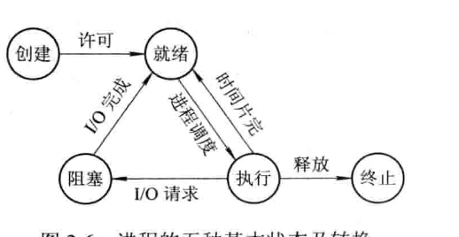

#### 挂起操作和进程状态的转换 

1. 挂起操作的引入 
  （1）终端用户的需要。
  （2）父进程请求。
  （3）负荷调节的需要
  （4）操作系统的需要 
2. 引入挂起原语操作后三个进程状态的转换
   （1）活动就绪->静止就绪。
   （2）活动阻塞->静止阻塞。
   （3）静止就绪->活动就绪。
   （4）静止阻塞->活动阻塞
  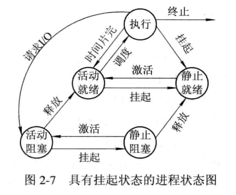
3. 引入挂起操作后五个进程状态的转换 

  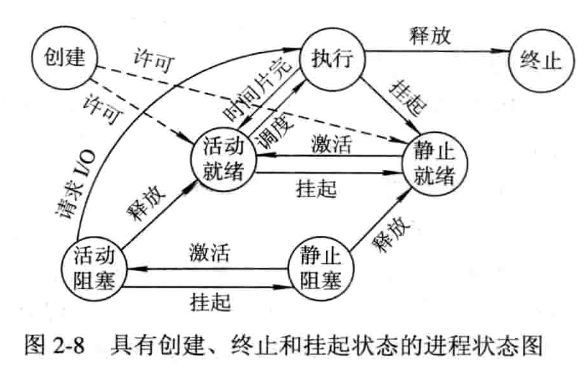

#### 进程管理中的数据结构 

1. 操作系统中用于管理控制的数据结构 
 资源信息表（进程信息表）：对每个资源和每个进程都设置了一个数据结构，用于表征其实体，其中包含了资源或进程的标识、描述、状态等信息以及一批指针。
 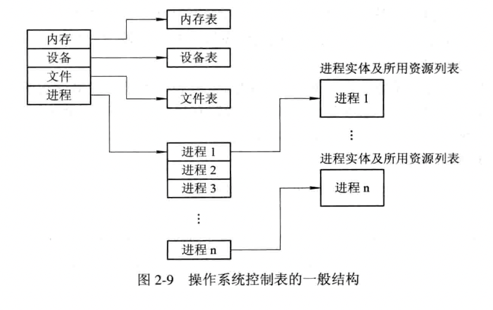

2. 进程控制块PCB的作用 

（1）作为独立运行基本单位的标志。PCB是进程存在与系统中的唯一标志。
（2）能实现间断性运行方式。
（3）提供进程管理所需要的信息。
（4）提供进程调度所需要的信息。
（5）实现与其他进程的同步与通信。

3. 进程控制块中的信息
  1）进程标识符
  用于唯一地标识一个进程。
  （1）外部标识
  （2）内部标识
  2）处理机状态
  处理机信息也称为处理的上下文，主要是由处理机的各种寄存器中的内容组成。
  通用寄存器（用户可见寄存器）、指令计数器、程序状态字PSW、用户栈指针、
  3）进程调度信息
  进程状态、进程优先级、进程调度所需其他信息、事件
  4）进程控制信息 
  程序和数据的地址、进程同步和通信机制、资源清单、链接指针

4. 进程控制块的组织方式 
  （1）线性方式
  （2）链接方式
  （3）索引方式

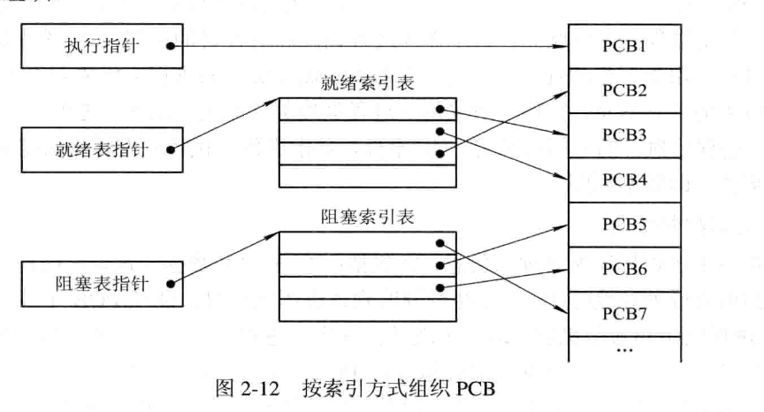

### 进程控制 

进程控制一般由OS的内核中的原语来实现
#### 操作系统内核 

系统态 ： 又称为管态，也称为内核态，它具有较高的特权，能执行一切指令，访问所有寄存器和存储区，传统的OS都在系统态运行。
用户态：又称为目态，具有较低特权的执行状态，仅能执行规定的指令，访问特定的寄存器和存储区，一般情况下，应用程序只能在用户态运行，不能取执行OS指令及访问OS区域，以防止应用程序对OS的破坏。

1. 支撑功能 
  （1）中断处理。
  （2）时钟管理。
  （3）原语操作。由若干条指令组成的，用于完成一定功能的一个过程。它与一般过程的区别在于，它们是“原子操作”，指一个操作中的所有动作要么全不做，要么全做。它是一个不可分割的基本单位，因此原语在执行过程中不允许被中断，原子操作在系统态下执行，常驻内存。

2. 资源管理功能 
   （1）进程管理
   （2）存储器管理
   （3）设备管理
#### 进程的创建 

1. 进程的层次结构 
2. 进程图 
描述进程家族关系的有向树
3. 引起创建进程的事件
   （1）用户登陆
   （2）作业调度
   （3）提供服务
   （4）应用请求
4. 进程的创建
  （1）申请空白的PCB，为新进程申请获得唯一的数字标识符，并从PCB集合中索取一个空白PCB
  （2）为新进程分配其运行所需的资源，包括各种物理和逻辑资源，如内存、文件、I/O设备和CPU时间等。
  （3）初始化进程控制块（PCB）
  （4）如果进程就绪队列能够接纳新进程，便将新进程插入就绪队列。

#### 进程的终止 

1. 引起进程终止的事件
   （1）正常结束
   （2）异常结束。
   常见的异常事件：
   越界错：指程序所访问的存储区，已越出该进程的区域
   保护错：指进程试图取访问一个不允许访问的资源或文件，或者以不适当的方式进程访问，例如，去写一个只读文件。
   非法指令：指程序试图去执行一条不存在的指令
   特权指令错：指用户进程试图去执行一条只允许OS执行的指令
   运行超时：指进程的执行时间超过了指定的最大值
   等待超时：指进程等待某事件的时间超过了规定的最大值
   算术运算错：指进程试图去执行一个被禁止的运算
   I/O故障：指I/O过程中发生了错误
   （3）外界干预
2. 进程的终止过程 
   

#### 进程的阻塞与唤醒 

1. 引起进程阻塞和唤醒的事件 
   （1） 向系统请求共享资源失败。
   （2）等待某种操作的完成。
   （3）新数据尚未到达。
   （4）等待新任务的到达
2. 进程阻塞过程
  通过调用阻塞原语block将自己阻塞。
3. 进程唤醒过程 
  调用wakeup原语唤醒：首先将被阻塞的进程从等待该事件的阻塞队列中移出，将其PCB中的现行状态由阻塞态改为就绪，然后再将PCB插入到就绪队列中。

#### 进程的挂起与激活 

1. 进程的挂起 
  使用suspend挂起原语将指定进程或处于阻塞状态的进程挂起。活动就绪 ->  静止就绪 。
  活动阻塞 -> 静止阻塞 
2. 进程的激活过程 
  使用active原语激活进程。

### 进程同步 

#### 进程同步的基本概念 

  同步机制的主要任务：对多个相关进程在执行次序上进行协调，使并发执行的诸进程之间能按照一定的规则（或时序）共享系统资源

  1. 两种形式的制约关系 
   1）间接相互制约关系 
   访问共享系统资源（同一时间只允许一个进程访问），所以形成了间接相互制约关系。
   2）直接相互制约关系
   完成同一项任务的两个进程而相互合作。例如A输入进程，B计算进程，共享一个缓冲区，进程A向B提供数据，B从缓冲区中取出数据。
  2. 临界资源
   对临界资源（打印机、磁带机）的访问，诸进程之间应采用互斥方式。
   生产者-消费者
  3. 临界区 
   临界区：把每个进程中访问临界资源的那段代码称为临界区。
  4. 同步机制应遵循的规则
   （1）空闲让进：当无进程进入自己的临界区，表明临界资源处于空闲状态，应允许一个请求进入临界区的进程立即进入自己的临界区，以有效地利用临界资源。
   （2）忙则等待：当已有进程进入临界区时，表明临界资源正在被访问，因而其它试图进入临界区的进程必须等待，以保证对临界资源的护持访问。
   （3）有限等待：对要求访问临界资源的进程，应保证在有限时间内能进入自己的临界区，以免陷入“死等”状态。
   （4）让权等待：当进程不能进入自己的临界区时，应立即释放处理机，以免进程陷入“忙等”状态

   

#### 硬件同步机制 

1. 关中断 
2. 利用Test-and-Set 指令实现互斥
3. 利用Swap指令实现进程互斥
  不符合“让权等待”

#### 信号量机制

1. 整型信号量 
  S：表示资源数目的整型量S 
  wait（S）和signal（S） -> P、V操作
    
    未遵循让权等待

2. 记录型信号量 
 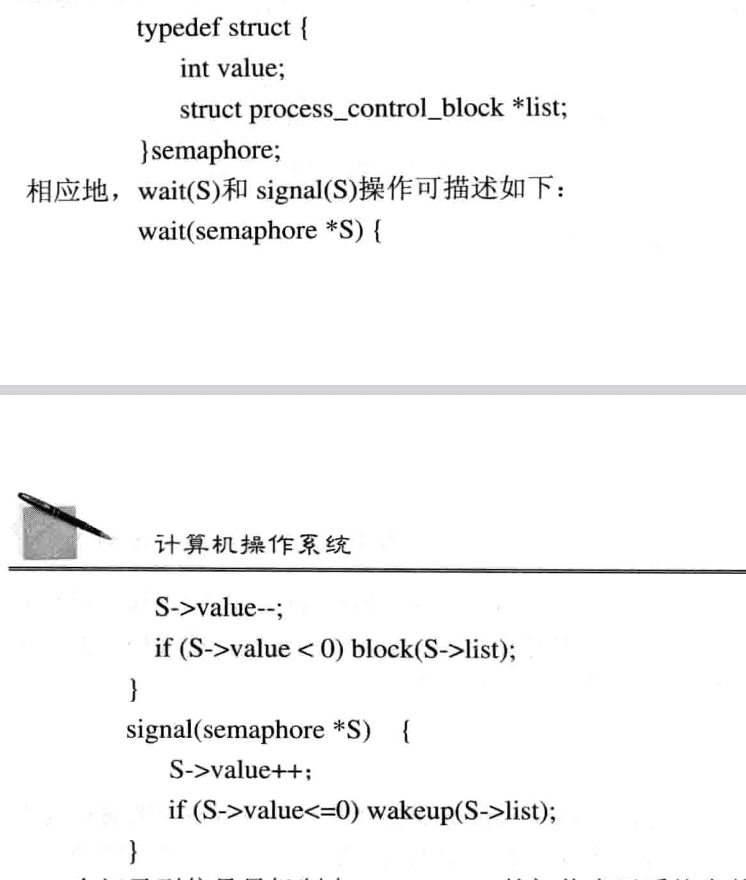

3. AND型信号量
  基本思想：将进程在整个运行过程中需要的所有资源，一次性全部地分配给进程，待进程使用完后再一起释放。只要尚有一个资源分配给进程，其它所有可能其它所有可能为之分配的资源也不分配给它。要么把它所请求的资源全部分配到进程，要么一个也不分配
 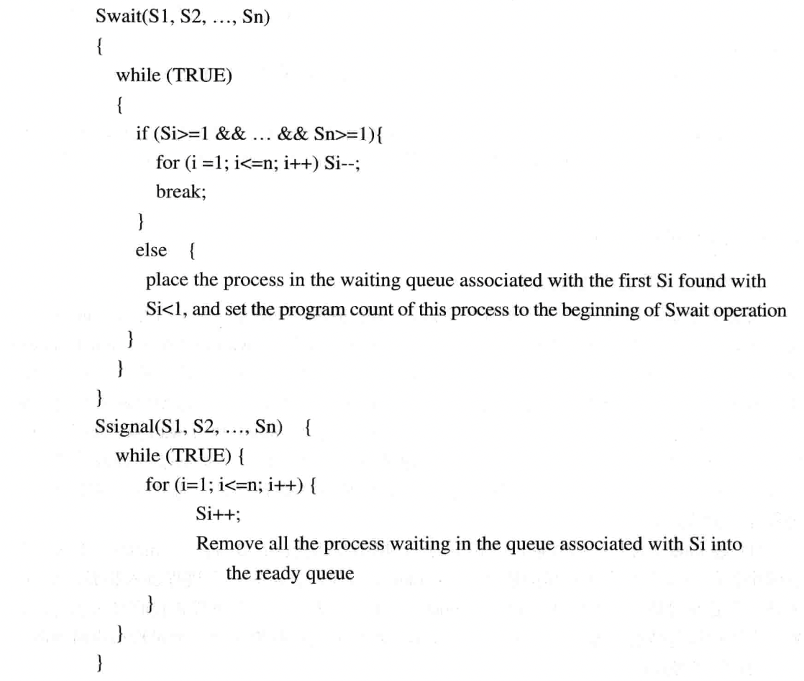
4. 信号量集
  

#### 信号量的应用 
  
1. 利用信号量实现进程互斥
  设置mutex为互斥信号量，初始值为1，取值范围为（-1，0，1）。当mutex=1时，表示两个进程皆未进入需要互斥的临界区；当mutex=0时，表示有一个进程进入临界区运行，另一个必须等待，挂入阻塞队列；当mutex = -1时，表示有一个进程正在临界区运行，另一个进程因等待而阻塞在信号量队列中，需要被当前已在临界区运行的进程退出时唤醒。
   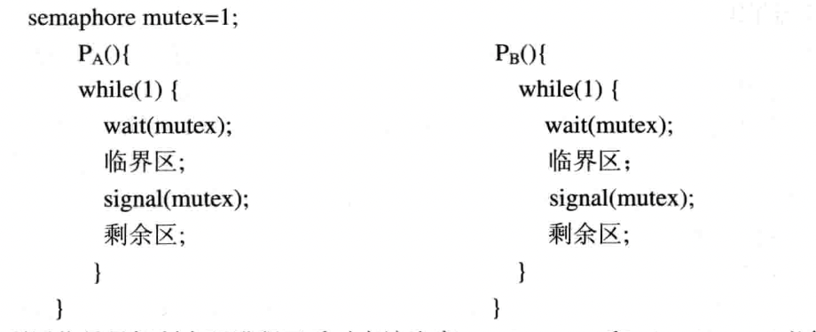
   PV必须成对的出现。缺失P将会导致系统混乱，不能保证对临界区资源的互斥访问；缺少V操作将会使临界资源永远不被释放，从而使等待该资源而阻塞的进程不能被唤醒。
2. 利用信号量实现前趋关系
  设置信号量S，初始值为0，欲使P1进程的S1语句要在P2进程中的S2语句之前执行。
  在进程P1中，执行S1；signal(s)；
  在进程P2中，wait(s);执行S2；
  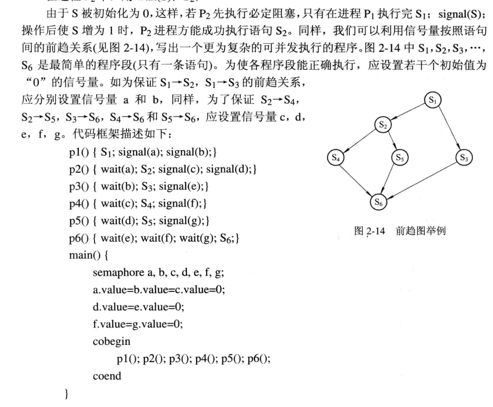

#### 管程机制

1. 管程的定义 
  代表共享资源的数据结构以及由对该共享数据实施操作的一组过程所组成的资源管理程共同构成了一个操作系统的资源管理模块，称为管程
  组成：
  （1）管程的名称
  （2）局部于管程的共享数据结构说明
  （3）对该数据结构进行操作的一组过程
  （4）对局部于管程的共享数据设置初始值
管程包含了面向对象的思想，它将表征共享资源的数据结构及其数据结构操作的一组过程，包括同步机制，都集中并封装在一个对象内部，隐藏了实现细节
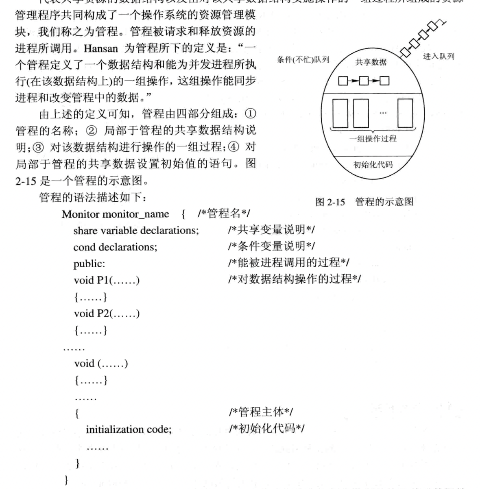

2. 条件变量 
  conditionx,y 
  (1)x.wait:正在调用管程的进程因x条件被阻塞或挂起，则调用x.wait将自己插入到x条件的等待队列上，并释放管程，直到x条件变化。
  （2）x.signal:正在调用管程的进程发现x条件发生了变化，则调用x.signal，重新启动一个因x条件而阻塞或挂起的进程，如果存在多个这样的进程，则选择其中的一个，如果没有，则继续执行原进程

### 经典进程的同步问题

#### 生产者-消费者 

1. 利用记录型信号量解决生产者-消费者问题

  假定在生产者和消费者之间的公用缓冲池中具有n个缓冲区，这时可利用mutex互斥信号量实现进程对缓冲池的互斥使用。利用信号量empty和full分别表示缓冲池中空缓冲区和满缓冲区的数量。只要缓冲池未满，生产者便可将消息送入缓冲池；只要缓冲池未空，消费者便可从缓冲池中取走一个消息。
  **注意：** 每个程序用于实现互斥的wait和signal必须成对地出现；其次，对资源信号量empty和full的PV操作，同样也需要成对出现，但它们分别处于不同的程序中。

2. 利用AND信号量解决生产者-消费者问题
  用Swati(empty,mutex)来代替wait(empty)和wait(mutex)
  
  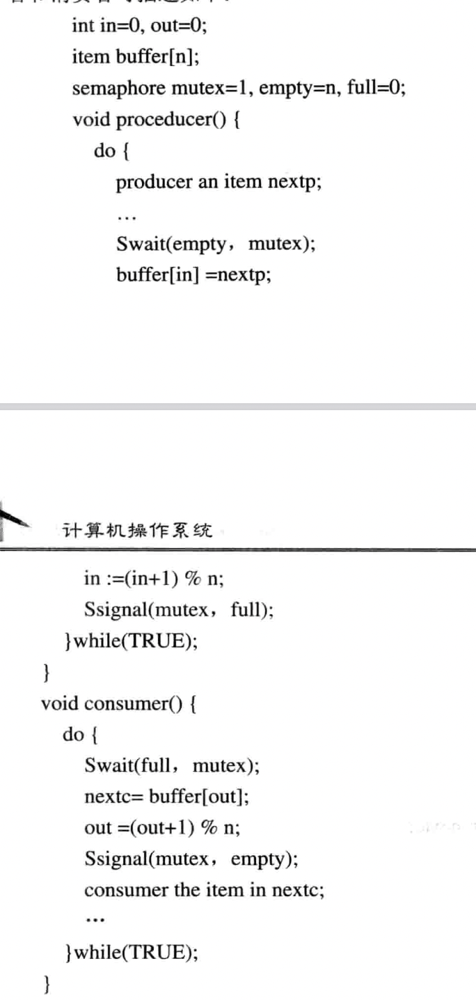

3. 利用管程解决生产者-消费者问题
  PC管程描述：
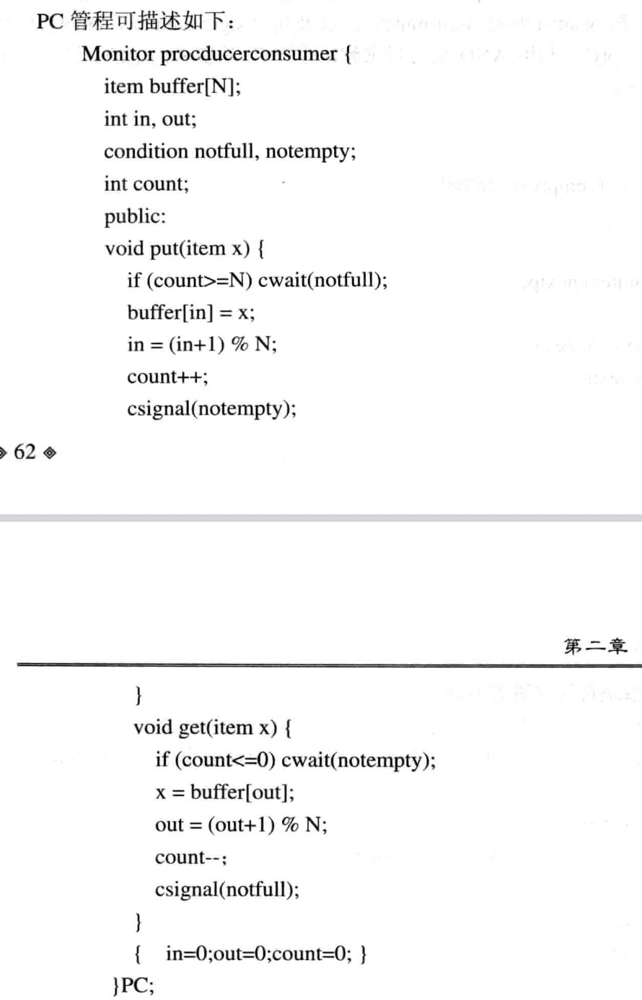
管程解决描述：
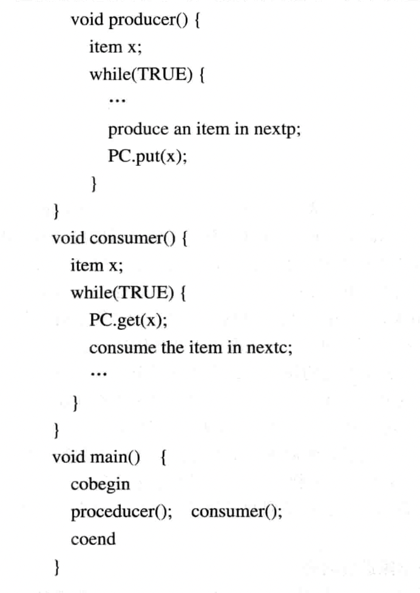

### 哲学家进餐问题 

一个圆桌，五把椅子，五个碗，五只筷子。只有拿到两只筷子才能进餐。

1. 利用记录型信号量解决哲学家进餐问题 
  筷子是临界资源，在一段时间内只允许一位哲学家使用。
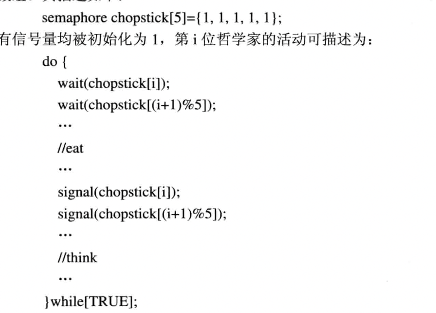

当哲学家饥饿时，总是先去拿他左边的筷子，再去拿他右边的筷子。
问题：可能发生死锁，如果五位哲学家同时拿起左边的筷子，再去拿右边的筷子时，都会因为无筷子可拿而导致无限期等待。
解决办法：
（1）至多只允许有四位哲学家同时取拿左边的筷子，最终能保证至少有一位哲学家能够进餐，并在用完时，能释放出他用过的两只筷子，从而使更多的哲学家能够进餐。
（2）仅当哲学家的左右两只筷子均可用时，才允许他拿起筷子进餐。
（3）规定奇数号哲学家先拿他左边的筷子，然后再去拿右边的筷子；而偶数号哲学家则相反。那么，1，2号哲学家竞争1号筷子；3，4号哲学家竞争3号筷子。即五位哲学家都先去竞争奇数筷子，获得后再去竞争偶数号筷子，最后总会有一位哲学家能获得两只筷子而进餐。

2. 利用AND信号量机制解决哲学家进餐问题 
  

#### 读者-写者问题

一个数据文件可被多个进程共享，读该文件的进程称为“Reader进程”，其它进程称为“Writer进程”。允许多个进程同时读一个共享对象，因为读操作不会使数据文件混乱。但不允许一个Writer进程和其它Reader进程或Writer进程同时访问共享对象。-> Writer进程必须和其它进程互斥的访问共享对象。

1. 利用记录型信号量解决读者-写者问题
  Wmutex：Reader进程与Writer进程的互斥信号量
  Readcount：正在读的进程数
  Rmutex：Readcount：正在读的进程数是一个可被多个Reader进程访问的临界资源，所以为它设置一个互斥信号量rmutex。

   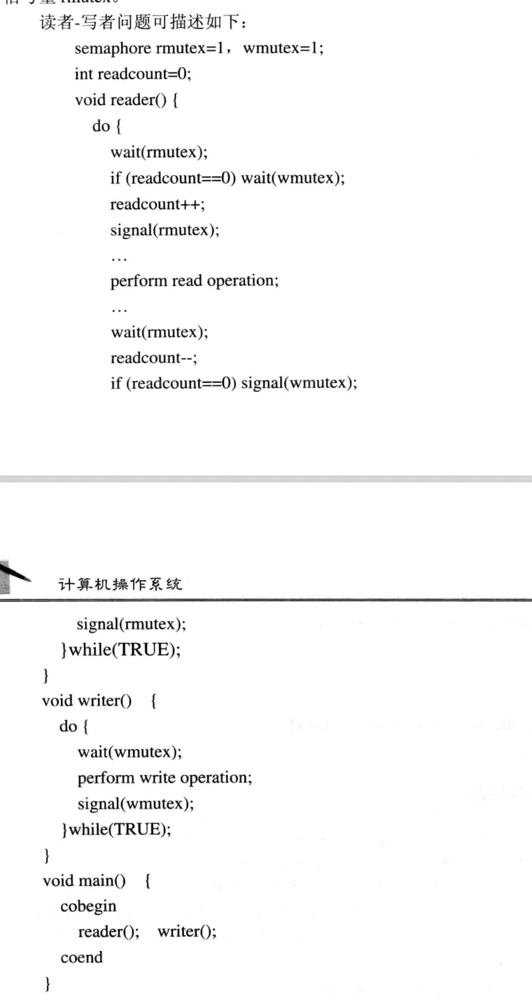

2. 利用信号量集解决读者-写者问题 

### 进程通信 

#### 进程通信的类型

1. 共享存储器系统
  （1）基于共享数据结构的通信方式
  （2）基于共享存储区的通信方式
2. 管道(pipe)通信系统
   所谓”管道“，是指用于连接一个读进程和一个写进程以实现它们之间通信的一个共享文件，又称为pipe文件。向管道(共享文件)提供输入的发送进程（即写进程）以字符流形式将大量的数据送入管道；而接受管道输出的接受进程（即读进程）则从管道中接受数据。由于发送进程和接受进程时利用管道进行通信的，故成为了管道通信。
   为了协调双方的通信，管道机制必须提供以下三方面的协调功能：
   （1）互斥 
   （2）同步
   （3）确定对方是否存在，只有确定了对方已存在时才能进行通信。
3. 消息传递系统 
  在该机制中，进程不必借助任何共享存储区或数据结构，而是以格式化的消息为单位，将通信的数据封装在消息中，并利用操作系统提供的一组通信命令（原语），在进程间进行消息传递，完成进程间的数据交换。
  （1）直接通信方式：指发送进程利用OS所提供的发送原语，直接把消息发送给目标进程；
  （2）间接通信方式：指发送和接受进程，都通过共享中间实体（邮箱）的方式进行消息的发送和接受，完成进程间的通信。
4. 客户机-服务器系统
  
  1）套接字
  2）远程过程调用和远程方法调用

#### 消息传递通信的实现方式

1. 直接消息传递系统
  1）直接通信原语
  （1）对称寻址方式
  send（receiver，message）
  receive（sender，message）
  （2）非对称寻址方式
  send（P，message）
  seceive（id，message）
  （2）消息的格式
  （3）进程的同步方式
  （4）通信链路

2. 信箱通信
  1）信箱的结构
  （1）信箱头
  （2）信箱体
  2）信箱通信原语
  （1）信箱的创建和撤销
  （2）消息的发送和接受。
  3）信箱的类型
  （1）私用邮箱
  （2）公用邮箱
  （3）共享邮箱

#### 直接消息传递系统实例

1. 消息缓冲队列通信机制中的数据结构
  （1）消息缓冲区
  （2）PCB中有关通信的数据项
2. 发送原语
3. 接受原语
   

### 线程的基本概念 

#### 线程的引入 

1. 进程的两个基本属性

（1）进程是一个可拥有资源的独立单位。
（2）进程是一个可独立调度和分配的基本单位。

2. 程序并发执行所需付出的时空开销

3. 线程--作为调度和分配的基本单位 

#### 线程与进程的比较 

1. 调度的基本单位
  引入线程的OS中，线程作为调度和分配的基本单位，因而线程是能够独立运行的基本单位当线程切换时，仅需保存和设置少量寄存器内容，切换代价远低于进程。在同一进程中，线程的切换不会引起进程的切换，但从一个进程中的线程切换到另一个进程中的线程时，必然就会引起进程的切换。
2. 并发性 
  在引入线程的OS中，不仅进程之间可以并发执行，而且在一个进程中的多个线程之间亦可并发执行，甚至还允许在一个进程中的所有线程都能并发执行。同样，不同进程中的线程也能并发执行。
3. 拥有资源 
  进程可以拥有资源，并作为你系统中拥有资源的一个基本单位。然后，线程本身并不拥有系统资源，而是仅有一点必不可少的、能够保证独立运行的资源。允许多个线程共享该进程所拥有的所有的资源：属于同一进程的所有线程都具有相同的地址空间，意味着，线程可以访问该地址空间中的每一个虚拟地址；还可以访问进程所拥有的资源。
4. 独立性
  同一进程的不同线程的之间的独立性要比不同进程之间的独立性低得多。因为线程会共享同一进程的资源，访问所属进程地址空间中的所有地址。
5. 系统开销
  OS创建或撤销进程所付出的开销要比线程所付出的开销大的多
6. 支持多处理机系统

#### 线程的状态和线程控制块 

1. 线程运行的三个状态 
  （1）执行状态
  （2）就绪状态
  （3）阻塞状态

2. 线程控制块TCB
  （1）线程标识符
  （2）一组寄存器，程序计数器PC、状态寄存器和通用寄存器
  （3）线程运行的状态
  （4）优先级
  （5）线程专有存储区
  （6）信号屏蔽
  （7）堆栈指针

3. 多线程OS中的进程属性
  （1）进程是一个可拥有资源的基本单位。
  （2）多个线程可并发执行。
  （3）进程已不是可执行的实体。在多线程中，把线程作为独立运行（或称为调度）的基本单位。

### 线程的实现 

#### 线程的实现方式

1. 内核支持线程
  （1）在多处理器系统中，内核能够同时调度同一进程中的多个线程并执行；
  （2）如果在进程中的一个线程被阻塞了，内核可以调度该进程中的其它线程占有处理器运行，也可以运行其它进程中的线程。
  （3）内核支持线程具有很小的数据结构和堆栈，线程的切换比较快，切换开销小；
  （4）内核本身可以采用多线程技术，可以提高系统的执行速度和效率。
  缺点：同一进程中，从一个线程切换到另一个线程，需要从用户态转到核心态，这是因为用户进程的线程在用户态运行，而线程调度和管理是在内核实现的，系统开销较大。

2. 用户级线程ULT
用户级线程是在用户空间中实现的。对线程的创建、撤销、同步与通信等功能，都无需内核的支持，即用户及线程是与内核无关的。
  （1）线程的切换不需要轮换到内核空间。
  （2）调度算法可以是进程专用的。
  （3）用户及线程的实现与OS平台无关，因为对于线程管理的代码属于用户程序的一部分，所有的应用程序都可以对之共享。
缺点：
（1）系统调用的阻塞问题。当一个线程执行系统调用，那么所属进程将被阻塞，该进程下的所有线程也会被阻塞。
（2）在单纯的用户及线程实现方式中，多线程应用不能利用多处理机进程多重处理的优点，内核每次分配给一个进程的仅有一个CPU，因此，进程中仅有一个线程能执行，其它线程只能等待。

3. 组合方式
将用户及线程和内核支持线程两种方式进行组合。
（1）多对一模型，即将用户及线程映射到一个内核控制线程。
多个线程同属于一个进程，运行在该进程的空间。仅当用户线程需要访问内核时，才将其映射到一个内核控制线程上，但每次只允许一个线程进程映射。
优点：线程管理的开销小，效率高。
缺点：如果一个线程阻塞，那么整个进程都会阻塞，任何时刻，只有线程能够访问内核。
（2）一对一模，即将每个用户及线程映射到一个内核支持线程。
优点：每个用户及线程都设置一个内核控制线程与之连接，当一个线程阻塞时，允许调度另一个线程运行，提供更好的并发功能
缺点：每创建一个用户及线程，响应地需要创建一个内核线程，开销较大，因此需要限制整个系统的线程数。
（3）多对多模型，即将许多用户线程映射到同样的数量或更少数量的内核线程上。结合了上述两个模型的优点。
 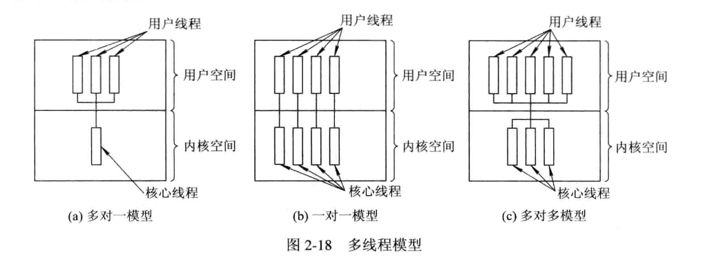

#### 线程的实现

1. 内核支持线程的实现 
2. 用户及线程的实现
  （1）运行时系统
  （2）内核控制线程

#### 线程的创建和终止

1. 线程的创建
2. 线程的终止

## 处理机调度与死锁

#### 处理机调度的层次

1. 高级调度 
高级调度又称为长程调度或作业调度，其所调度的对象是作业。其重要功能是根据某种算法，决定将外存上的处于后备队列中的哪几个作业调入内存，为它们创建进程、分配必要的资源，并将它们放入就绪队列。
2. 低级调度
又称为进程调度或短程调度，其调度的对象是进程（或内核级线程）。
功能：根据某种算法，决定就绪队列中的哪个进程应获得处理机，并由分派程序将处理机分配给被酸中的进程
3. 中级调度
  又称为内存调度，为了提高内存利用率和系统吞吐量。把那些暂时不用运行的进程，调至外存等待，此时进程状态为挂起态。把具备运行条件且内存又稍有空闲时，由中级调度来决定，把外存上那些已具备运行条件的就绪进程再重新调入内存，并修改其状态为就绪态。
  中级调度实际上就是存储器管理中的对换功能

#### 处理机调度算法的目标

1. 处理机调度算法的共同目标
  （1）资源利用率
  CPU利用率 = CPU有效工作时间 / CPU有效工作时间 + CPU空闲等待时间 
  （2）公平性
  应使所有进程都获得合理的CPU时间，不会发生进程饥饿现象。
  （3）平衡性
  保持系统资源使用的平衡性
  （4）策略强制执行。
2. 批处理系统的目标
  （1）平均周转时间短
  周转时间：指从作业被提交给系统开始，到作业完成为之的这段时间间隔称为作业周转时间。
  包括四个时间：作业在外存后备队列上等待调度的时间，进程在就绪队列上等待进程调度的时间，进程在CPU上执行的时间，以及进程等待I/O操作完成的时间。
  带权周转时间：作业的周转时间T与系统为它提供服务的时间Ts之比。
  （2）系统吞吐量高。
  吞吐量：指单位时间内系统所完成的作业数
  （3）处理机利用率高
3. 分时系统的目标
  （1）响应时间快
  响应时间：从用户通过键盘提交一个请求开始，知道屏幕上显示处理结果为之的一段时间间隔。分为三部分时间：一是请求信息从键盘输入开始，直至将其传送到处理机的时间；二是处理机对请求信息进行处理的时间；三是将所形成的响应信息回送到终端显示器的时间。
  （2）均衡性
  指系统响应时间的快慢应与用户所请求服务的复杂性相适应。

4. 实时系统的目标
  （1）截止时间的保证
  截止时间：指某任务必须开始执行的最迟时间，或必须完成的最迟时间
  （2）可预测性

### 作业与作业调度

#### 批处理系统中的作业

1. 作业与作业步
  （1）作业：在批处理系统中，以作业为基本单位从外存调入内存的
  （2）作业步：
2. 作业控制块（JCB）
  它是作业在系统中存在的标志，其中保存了系统对作业进行管理和调度所需的全部信息。

3. 作业运行的三个阶段和三种状态
  （1）收容阶段
  操作人员把用户提交的作业通过某种输入方式或SPOOling系统输入到硬盘上，再为该作业建立JCB并把它放入作业后备队列中。
  （2）运行阶段
  为它分配必要的资源和建立进程，并将它放入就绪队列。
  （3）完成阶段

#### 作业调度的主要任务

1. 接纳多少个作业
2. 接纳哪些作业

#### 先来先服务（FCFS）和短作业优先（SJF）调度算法

1. 先来先服务调度算法（FCFS）
每次调度就是从就绪的进程队列中选择一个最先进入该队列的作业，将它们调入内存，为它们分配资源和创建进程。然后把它放入就绪队列
2. 短作业优先的调度算法（SJF）
  以作业的长短（以所要求运行时间来衡量）来计算优先级，作业越短，优先级越高，
  缺点：
  （1）必须预知作业的运行时间。很难估计
  （2）对长作业非常不利。会出现饥饿现象
  （3）无法实现人机交互
  （4）不能保证紧迫作业的得到及时处理

#### 优先级调度算法和高响应比优先调度算法

1. 优先级调度算法（PSA）
  对于先来先服务算法，作业的等待时间就是作业的优先级，等待时间越长，其优先级越高
  对于短作业优先调度算法，作业的长短就是作业的优先级，所需运行时间越短，优先级越高。
  优先级调度算法中，基于作业的**紧迫程度**，由外部赋予作业相应的优先级

2. 高响应比优先调度算法
  既考虑作业的等待时间，又考虑作业的运行时间
  优先权 = （等待时间 + 要求服务时间） / 要求服务时间 
  Rp = 响应时间 / 要求服务时间 

如果作业的等待时间相同，则要求服务的时间越短，其优先权越高，类似于短作业优先，有利于短作业。要求服务时间相等，等待时间越长，优先级越高-> 先来先服务 。对于长作业的优先级，等待时间越长，即可获得处理机。

### 进程调度

#### 进程调度的任务、机制和方式

1. 进程调度的任务
  （1）保存处理机的现场信息
  （2）按某种算法选取进程。
  （3）把处理机分配给进程
2. 进程调度机制
  （1）排队器。
  将系统中的所有就绪进程按一定的策略排成一个或多个队列。
  （2）分派器
  分派器依据调度程序所选定的进程，将其从就绪队列中取出，然后进行从分派器到新选出进程间的上下文切换，将处理机分配给新选的进程。
  （3）上下文切换器
  第一对上下文切换时，OS将保存当前进程的上下文，把处理机寄存器内容保存到该进程的进程控制块内的相应单元再转入分派程序的上下文，以便分派程序运行。
  第二对上下文切换是移出分派程序的上下文，而是把新选进程的CPU现场信息装入到处理机的各个相应寄存器中，以便新选取进程运行。
  需要执行大量的load和store等操作指令，以保存寄存器的内容
    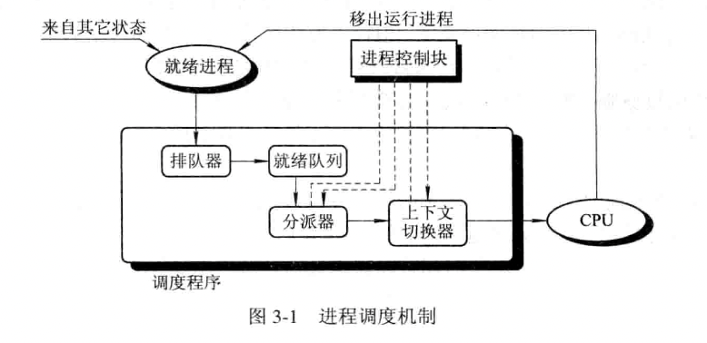

3. 进程调度方式
  （1）非抢占方式
  一旦把处理机分配给某进程后，就一直让它运行下去，绝不会因为时钟中断或任何其它原因去抢占当前正在运行进程的处理机，直至该进程完成，或发生某事件而被阻塞时，才把处理机分配给其它进程。
  （2）抢占式
  允许调度程序根据某种原则，去暂停某个正在运行的进程，将已分配给该进程的处理机重新分配给另一个进程。
  “抢占”不是一种任意性行为，必须遵循一定的原则，主要原则有：
  优先权原则
  短进程优先原则
  时间片原则

#### 轮转调度算法

  1. 轮转法的基本原理 
   所有就绪进程按FCFS策略排成一个就绪队列。
  2. 进程切换时机
   一个时间片尚未用完，正在运行的进程便已经完成，就立即激活调度程序，将它从就绪队列中删除，再调度就绪队列中队首的进程运行，并启动一个新的时间片。
   一个时间片用完时，计时器中断处理程序被激活，如果进程尚未运行完毕，调度程序将它送往就绪队列的末尾。
  3. 时间片大小的确定 
   时间片很小，有利于短作业，进行进程调度和上下文切换增加系统的开销。
   时间片太长，且每个进程能在一个时间片内完成，RR算法便退化FCFS。
  
    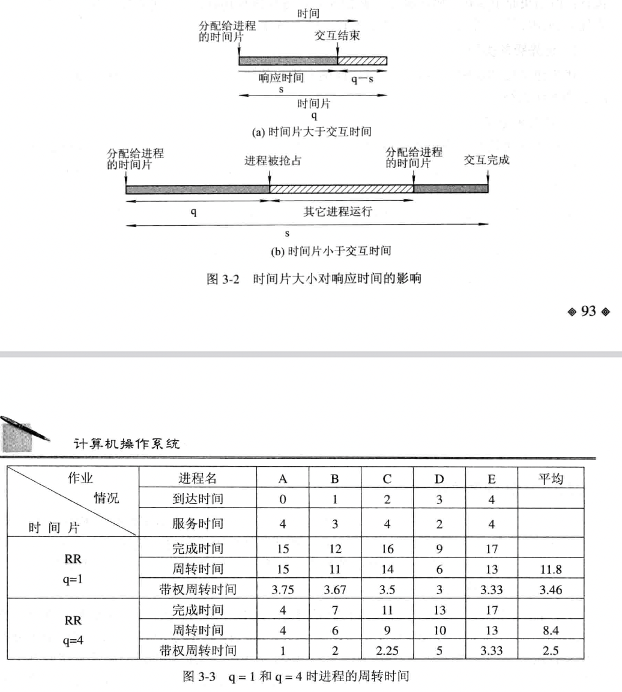

#### 优先级调度算法

1. 优先级调度算法的类型 
  （1）非抢占式优先级调度算法
  （2）抢占式优先级调度算法

2. 优先级的类型
  1）静态优先级
  再创建进程时确定的，在进程的整个运行期间保持不变
  （1）进程类型。
  （2）进程对资源的需求。
  （3）用户要求
  2）动态优先级
  创建进程之初，先赋予其一个优先级，然后其值进程的推进或等待时间的增长，使其优先级相应提高。

#### 多队列调度算法

将系统中的进程就绪队列从一个拆分为若干个，将不同类型或性质的进程固定分配在不同的就绪队列，不同的就绪队列采用不同的调度算法。

#### 多级反馈队列调度算法

1. 调度机制 
  （1）设置多个就绪队列 。
  第一队列优先级最高，其余依次降低
  （2）每个队列都采用FCFS算法
  （3）按队列优先级调度
  仅当第一队列空闲时才调度第二队列中的进程运行
     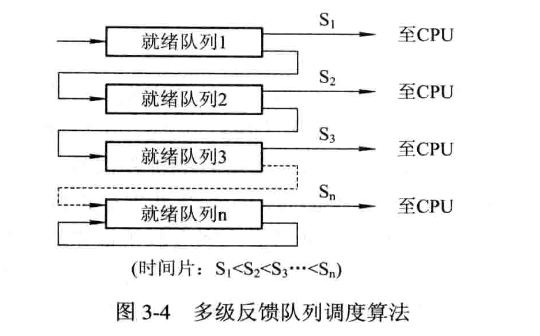
2. 调度算法的性能
  

#### 基于公平原则的调度算法

1. 保证调度算法
2. 公平分享调度算法

### 实时调度

#### 实现实时调度的基本条件

1. 提供必要的信息
  （1）就绪时间
  （2）开始截止时间和完成截止时间
  （3）处理时间
  （4）资源要求
  （5）优先级
2. 系统处理能力强
  （处理时间 / 周期时间 ）<= 1 
  进程处理时间 要小于或等于 周时期时间 
3. 采用抢占式调度机制
4. 具有快速切换机制
  （1）对中断的快速响应能力
  （2）快速的任务分派能力

#### 实时调度算法的分类

#### 资源问题

根据实时任务性质分类，硬实时调度算法和软实时调度算法
按调度方式分类：非抢占式调度算法和抢占式调度算法

1. 非抢占式调度算法
（1）非抢占式**轮转**调度算法。轮转队列（循环队列）
（2）非抢占式**优先**调度算法。将优先级高的任务放在队首。
2. 抢占式调度算法
（1）基于时钟中断的抢占式优先级调度算法。
如果它的优先级高于当前任务的优先级，这时并不立即抢占当前任务的处理机，而是等到**时钟中断**发生时，调度程序才剥夺当前任务的执行，将处理机分配给新的高优先级任务。
（2）立即抢占的优先级调度算法
一旦出现外部中断，只要当前任务未处于临界区，便能立即剥夺的当前任务的执行，把处理机分配给请求中断的紧迫任务。
 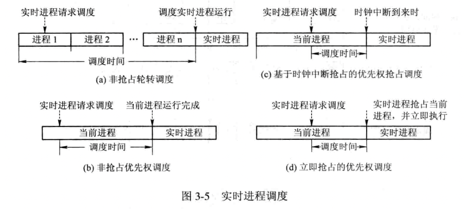

 #### 最早截止时间优先EDF算法

根据任务的截止时间确定任务的优先级，任务的截止时间越早，其优先级越高，

1. 非抢占式调度方式用于非周期实时任务
  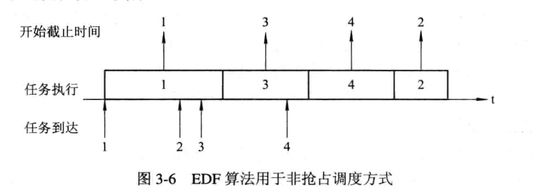
2. 抢占式调度方式用于周期实时任务
  
#### 最低松弛度（紧急）有限LLF算法

根据任务的紧急（松弛）程度。任务紧急度越高，优先级就越高。

#### 优先级倒置
1. 优先级倒置的形成
  存在是三个进程P1、P2、P3,优先级依次升高，P1和P3共享临界区
    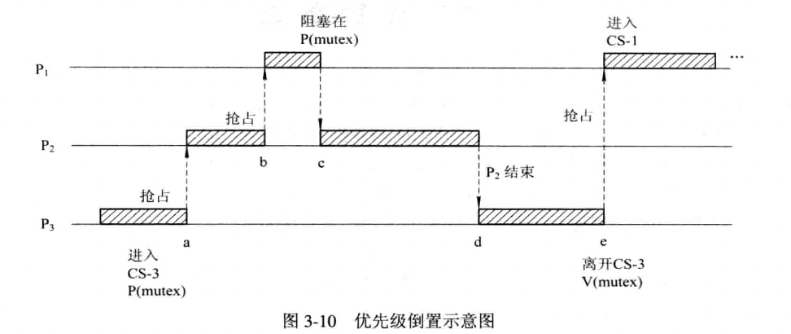
2. 优先级倒置的解决方法
   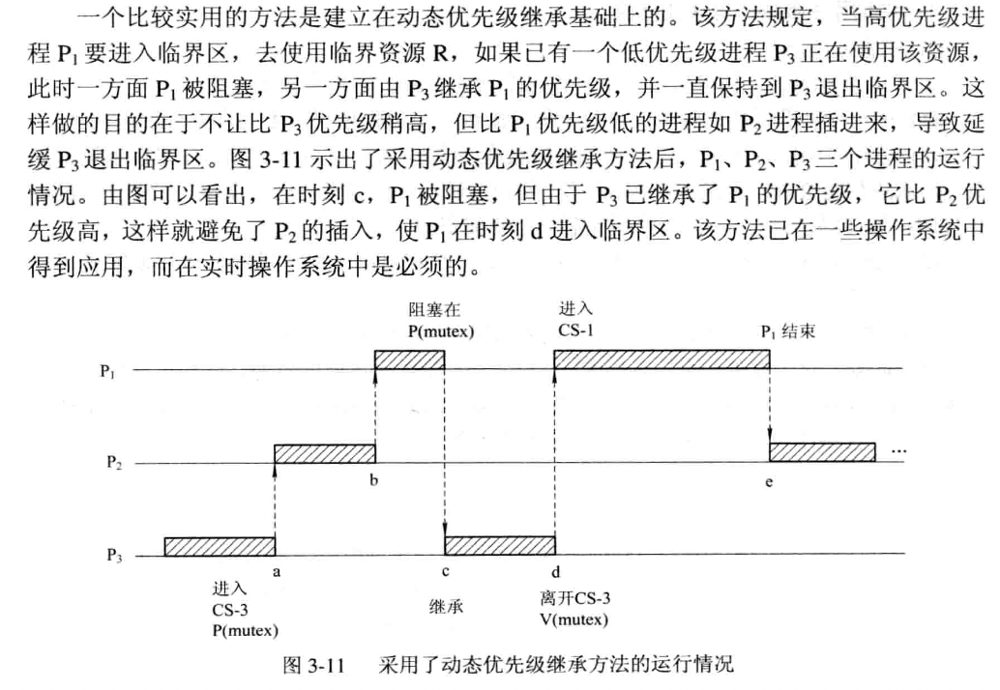

### 死锁概述

引起死锁的主要是，需要采用互斥访问方式的，不可以被抢占的资源，比如打印机、数据文件、队列、信号量

1. 可重用性资源的消耗性资源 
  1）可重用性资源
  是一种可供用户重复使用多次的资源，对资源的请求和释放都是利用系统调用来实现的

  2）可消耗性资源
  又称为临时资源，在进程运行期间，又进程动态地创建和消耗的
2. 可抢占式资源和不可抢占性资源
  1）可抢占性资源
  指某进程获得该资源后，该资源可以再被其它进程或系统抢占。CPU和主存均属于可抢占性资源，不会发生死锁。
  2）不可抢占性资源
  一旦系统把某资源分配给该进程后，就不能将它强行收回，只能在进程用完之后自行释放。例如磁带机、打印机、刻光盘

  #### 计算机系统中的死锁

    死锁的起因，通常是源于多个进程对资源的争夺，不仅对不可抢占式资源进行争夺时会引起死锁，而且对可消耗资源进行争夺时，也会引起死锁。

1. 竞争不可抢占性资源引起死锁
  资源分配图：用方块代表可重用的资源，用圆圈代表进程。箭头从进程指向文件，表示进程请求资源（打开文件）；当箭头从资源指向进程时，表示该资源已被分配给该进程（已被进程打开）。如果形成一个环路，说明已进入死锁状态。
  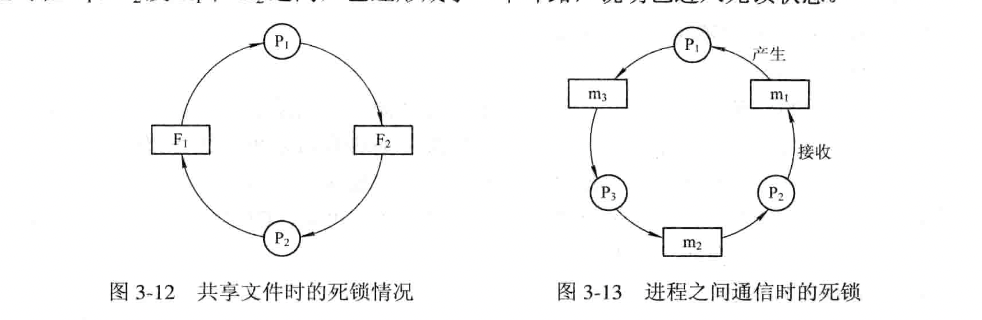

2. 竞争可消耗资源引起死锁
  如图3-13

3. 进程推进顺序不当引起死锁
  
#### 死锁的定义、必要条件和处理方法

1. 死锁的定义
  如果一组进程中的每个进程都在等待仅由该组进程中的其它进程才能引发的事件，那么该组进程是死锁。
  这组死锁进程中的每个进程都在等待另一个死锁进程所占用的资源
2. 产生死锁的必要条件
  必须同时具备以下条件：
  （1）互斥条件。
  进程对所分配的资源进行排他使用，即在一段时间内，某资源只能被一个进程占用。
  （2）请求和保持条件
  进程已经保持了一个资源，但又提出了新的资源请求，而该资源已被其它进程占用，此时请求进程被阻塞，但对自己已获得的资源保持不放
  （3）不可抢占条件
  进程已获得的资源在未使用完之前不能被抢占，只能在进程使用完时由自己释放。
  （4）循环等待条件
  在发生死锁时，必然存在一个进程-资源的循环链，即进程集合，p1等待p2...

3. 处理死锁的方式
   （1）预防死锁 
   事先预防策略，破坏产生死锁四个必要条件中的一个或几个来预防死锁
   （2）避免死锁
   事先预防策略，在进行资源分配时，使用某种方法防止系统进入不安全状态，从而避免死锁。
   （3）检测死锁
   允许在运行过程中发生死锁，但可通过检测机构及时地检测出死锁的发生，然后采用适当的措施，把进程从死锁中解脱出来。
   （4）解除死锁
   当检测到系统中已发生死锁时，就采用相应措施，将进程从死锁中解脱出来，例如撤销一些进程、回收它们的资源。

### 预防死锁

#### 破坏“请求和保持”条件

1. 第一种协议 
  该协议规定，所有进程在开始运行之前，必须一次性地申请其在整个运行过程中所需的全部资源。此时若系统有足够的资源分配给某进程，便可把其需要的所有资源分配给它。该进程在整个运行期间，便不会再提出资源要求，从而破坏了“请求”条件。在分配资源时，只要有一种资源不满足进程的要求，即使其它所需的各个资源都空闲也不分配给该进程，而让进程等待。由于该进程在等待期间未占用任何资源，于是破坏了“保持”条件。
  优点：简单，易行且安全。
  缺点：
  （1）资源被严重浪费，严重恶化了资源的利用率。
  （2）使进程经常会发生饥饿现象。

2. 第二种协议
  对第一种协议的改进，它允许一个进程只获得运行期间所需的资源后，便开始运行。运行过程中再逐步释放已分配给自己、且已用毕的资源，再请求新的资源。

#### 破坏“不可抢占”条件

协议中规定，当一个已经保持了某些不可被抢占资源的进程，提出新的资源请求而不能得到满足时，它必须释放已经保持的所有资源，待需要时再重新申请。这就意味着进程已占用的资源被暂时释放，或是被抢占了，从而破坏了“不可抢占”条件。

#### 破坏“循环等待”条件 

 对系统的资源进行编号，规定每个进程必须按序号递增的顺序请求资源。

### 预防死锁

 事先预防策略，在进行资源分配时，使用某种方法防止系统进入不安全状态，从而避免死锁。

 #### 系统安全状态

 1. 安全状态
   在该方法中，允许进程动态地申请资源，但系统在进行资源分配之前，应先计算此次资源分配的安全性。
   无法找到安全序列，则称为系统处于不安全状态，**有可能**会进入死锁状态，只要系统处于安全状态，系统便不会进入死锁状态。避免死锁的实质在于，系统在进行资源分配时，应使系统不进入不安全状态。
2. 安全状态之例
  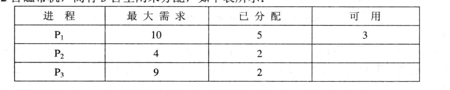
3. 由安全状态向不安全状态的转换
  
#### 利用银行家算法避免死锁 

1. 银行家算法中国呢的数据结构
  （1）可利用资源向量Available。这是一个含有m个元素的数组，其中每一元素代表一类可利用的资源数目，其初始值时系统中所配置的该类资源全部可用资源的数目，其数值随该类资源的分配和回收而动态地改变。如果Available[j] = K，则表示系统中现有Rj类资源K个。
  （2）最大需求矩阵Max。这是一个n✖️m的矩阵，它定义了系统中n个进程中的每个进程对m类资源的最大需求。如果Max[i,j] = K,则表示系统中现有Rj类资源K个。
  （3）分配矩阵Allocation。这也是一个n✖️m的矩阵，它定义了系统中每一类资源当前已分配给一个进程的资源数。如果Allocation【i，j】 = K，则表示进程当前已分得Rj类资源的数目为K。
  （4）需求矩阵Need。这也是一个n✖️m的矩阵，用以表示每个进程尚需要的各类资源数目。如果Need[i,j]= k ,则表示进程i还需要Rj类资源K个方能完成其任务。
            Need[i,j] = Max[i,j] - Allocation[i,j]
2. 银行家算法

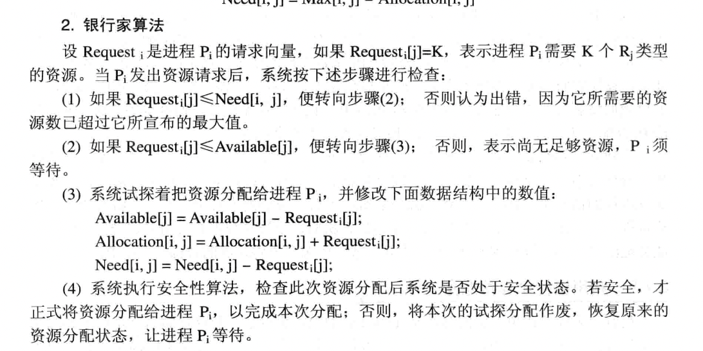

3. 安全行算法

4. 银行家算法之例

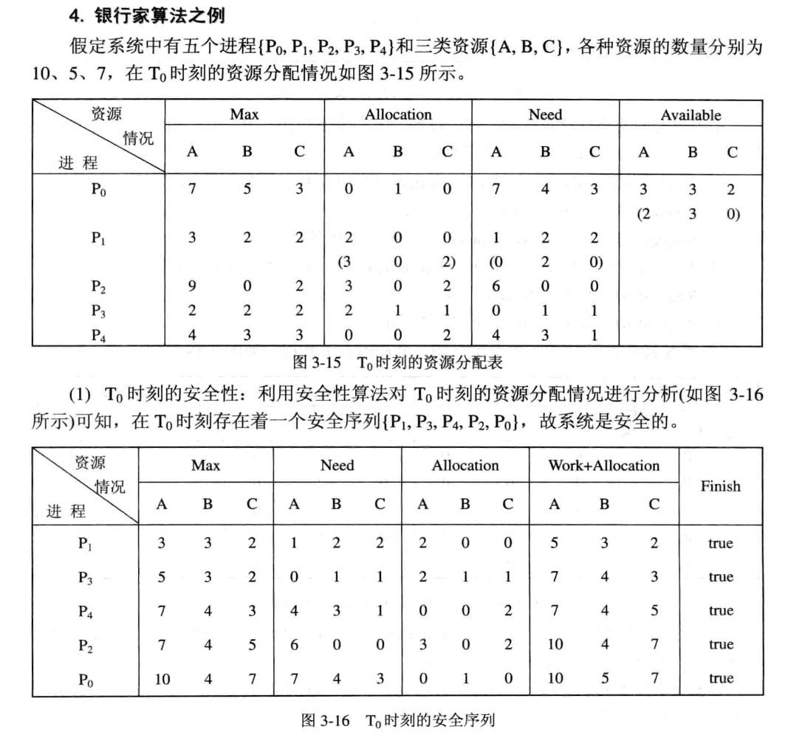

### 死锁的检测与解除

#### 死锁的检测

1. 资源分配图
  进程Pi指向资源Rj，它表示进程Pi请求一个单位的Rj资源，也就是请求边
  资源Rj指向进程Pi，它表示把一个单位的资源Rj分配给进程Pi，也就是分配边
2. 死锁定理
  将资源分配图进行简化，去除一个进程的请求边和分配边，剩余进程得到资源执行之后同样去掉请求边和分配边，再经过一系列的简化后，若能消去图中所有的边，使所有进程都称为孤立结点，则称为该图时可完全简化的，否则不完全简化
  S为死锁状态的充分条件时：当且仅当S状态的资源分配图是不可完全简化的。该充分条件称为死锁定理。

#### 死锁的解除 

常见的解除死锁的方法：
（1）抢占资源：从一个或多个进程中抢占足够数量的资源，分配给死锁进程，以解除死锁状态。
（2）终止（或撤销）进程。终止（或撤销）系统中的一个或多个死锁进程，直至打破循环环路，使系统从死锁状态中解脱出来

1. 终止进程的方法
   1）终止所有死锁进程
   2）逐个终止进程

2. 付出代价最小的死锁解除算法

## 存储器管理 

#### 存储器的层次结构

1. 存储器的多层结构
2. 可执行存储器
   寄存器和主存储器称为可执行存储器
#### 主存储器与寄存器

1. 主存储器
简称内存或主存，是计算机系统中的主要部件，用于保存进程运行时的程序和数据
2. 寄存器

#### 高速缓存和磁盘缓存 

1. 高速缓存
  介于寄存器和存储器之间（cache）
2. 磁盘缓存
  介于磁盘I/O与主存之间

### 程序的装入和链接

（1）编译，有编译程序对用户源程序进行编译，形成若干目标模块
（2）链接，由链接程序将编译后形成的一组目标模块以及它们所需要的库函数链接在一起，形成一个完整的装入模块。
（3）装入，由装入程序将装入模块装入内存
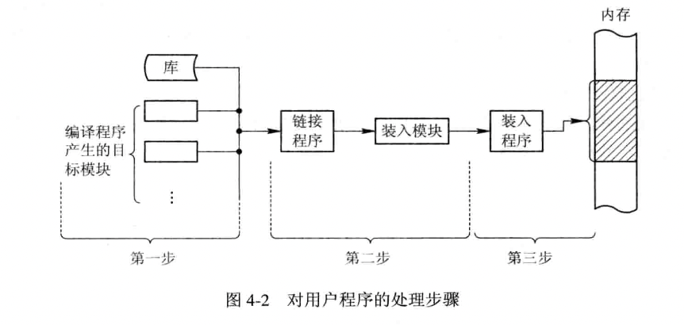

#### 程序的装入

1. 绝对装入方式
  将物理地址装入该进程的内存起始位置，也就是装入到内存中事先指定的位置，适合单道程序环境
2. 可重定位装入方式
  根据内存的具体情况将装入模块装入到内存的适当位置，逻辑地址与实际装入内存后的物理地址不同。允许装入到内存中任何允许的位置
  必须执行时分配其要求的全部内存空间，运行期间不能再移动
  重定位：把在装入时对目标程序中指令和数据地址的修改过程称为重定位。
  静态重定位：装入之后不在改变
3. 动态运行时的装入方式
  动态运行时的装入程序在把装入模块装入内存后，并不立即把装入模块中的逻辑地址转换为物理地址，而是把这种地址转换推迟到程序真正要执行时才运行。所以装入内存后的所有地址都是逻辑地址。

#### 程序的链接

  源程序经过编译后，可得到一组目标模块。链接程序的功能就是把这组目标模块以及它们所需要的库函数装配成一个完整的装入模块。在进行链接时，根据链接的时间不同，分以下三种情况：
  1. 静态链接方式
   在程序运行之前，先将各模块以及它们所需的库函数链接成一个完整的装配模块，以后不再拆开。事先链接方式
  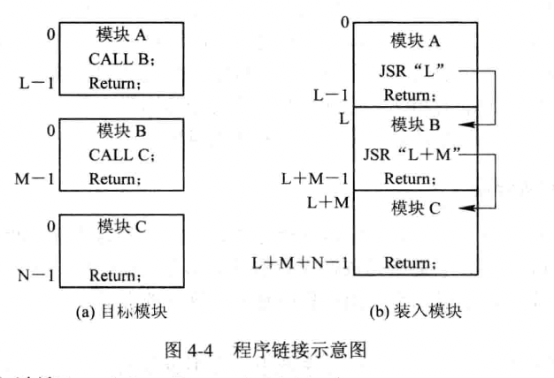

  2. 装入时动态链接 
   指将用户源程序编译后所得到的一组目标模块，在装入内存时，采用边装入边链接的链接方式。即在装入一个目标模块时，若发生一个外部模块调用时间，将引起装入程序去找出相应的外部目标模块，并将它装入内存
  3. 运行时动态链接
   将对某些模块的链接推迟到程序执行时才进行，当执行过程总发现一个被调用的模块尚未装入内存时，立即由OS去找到该模块，并将之装入内存，将其链接到调用者模块上，凡事未被使用的模块都不会被装入到内存和被链接到装入模块上。
  
### 连续分配存储管理方式

#### 单一连续分配

用户程序独占用户空间

#### 固定分区分配

将用户空间划分成若干个固定大小的区域，在每个分区装入一道作业
1. 划分分区的方法
  （1）分区大小相等
  （2）分区大小不等。
2. 内存分配
建立分区使用表管理分区

#### 动态分区分配

又称为可变分区分配，它是根据进程的实际需要，动态地为之分配内存空间
  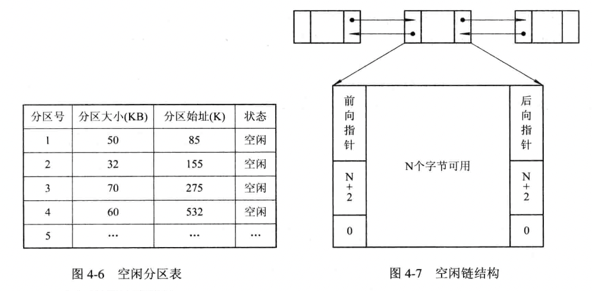

#### 动态分区分配算法

#### 分区分配操作

在动态分区存储管理方式中，主要的操作是分配内存和回收内存

1）分配内存
系统利用某种分配算法，从空闲分区表中找到所需大小的分区。
2）回收内存

内部碎片：分配给进程的内存区域中，如果有些部分没有用上
外部碎片：指内存中的某些空闲分区太小而难以利用

#### 基于顺序搜索的动态分区分配算法

为了实现动态分区分配，通常是将系统中的空闲分区链接成一个链。所谓顺序搜索，是指一次搜索空闲分区链上的空闲分区，去寻找一个其大小满足要求的分区。
1. 首次适应（FF）算法
  FF要求空闲分区链以**地址递增**的次序链接，再分配内存时，从链首开始顺序查找，直至找到一个大小能满足要求的空闲分区。优先利用内存中低地址部分，保留高地址的大空闲区，缺点就是低址部分不断被划分，会留下许多难以利用的、很小的空闲分区，称为碎片。而每次又是头开始查找。
2. 循环首次适应（NF）算法（邻近适应算法）
  在FF算法上改进，不是每次都是从链首开始查找，而是从上次找到的空闲分区的下**一个空闲分区开始查找**。
  优点：能使内存中的空闲分区分布更加均匀，从而减少了查找空闲分区时的开销，
  缺点：会缺乏大的空闲分区
3. 最佳适应（BF）算法
  所谓“最佳”是指，每次为作业分配内存时，总是把能满足要求、又是最小的空闲分区分配给作业，避免大材小用。要求所有空闲分区按其容量以从小到大的顺序形成-空闲分区链。会存在碎片问题。
4. 最坏适应算法（WF）
  与最佳适应相反，总是挑选一个最大的空闲区，从中分割一部分存储空间给作业使用，以至于存储器中缺乏大的空闲分区，故把它称为是最坏适应算法。
  要求按容量的从大到小的顺序排列。
  优点：可使剩下的空闲区不至于太小，产生碎片的可能性最小，对中、小作业有利。
  
#### 基于索引搜索的动态分区分配算法

1. 快速适应算法
  又称为分类搜索算法，将空闲分区根据其容量大小进行分类，对于每一类具有相同容量的所有空闲分区，单独设立一个空闲分区链表，内存中设立一个管理索引表，其中的每一个索引项对应了一种空闲分区类型，并记录了该类型空闲分区链表表头的指针。空闲分区的分类是按照进程常用的空间大小进行划分的。分配时，不会对分区进行分割。不会产生碎片
  缺点：为了有效合并分区，在分区归还主存时的算法复杂，系统开销大。
2. 伙伴系统
   
3. 哈希算法
  利用哈希快速查找的优点，以及空闲分区在可利用空闲区标中的分布规律，建立哈希函数，构造一张以空闲分区大小为关键字的哈希表，该表的每一个表项记录了一个对应的空闲分区链表表头指针。
当进行空闲分区分配时，根据所需空闲分区大小，通过哈希函数计算，即得到在哈希表中的位置，从中得到相应的空闲分区链表，实现最佳分配策略。

#### 动态可重定位分区分配

1. 紧凑
  将原来多个分散的小分区拼接成一个大分区的方法，称为“拼接”或“紧凑”
  问题：紧凑后的用户程序在内存中的位置发生了变化，必须对移动了的程序或数据进行重定位。

2. 动态重定位
重定位寄存器，用来存放程序在内存中的起始地址，真正访问的地址是相对地址与重定位寄存器中的地址想加而形成的。
 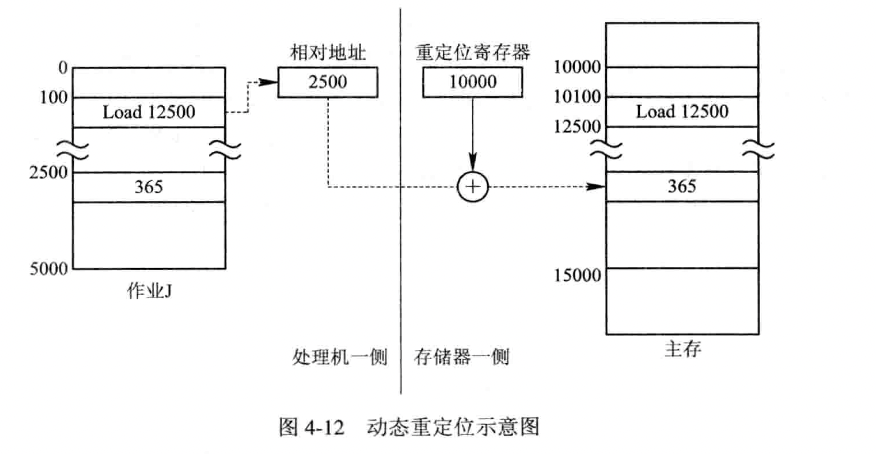

3. 动态重定位分区分配算法
  与动态分区分配算法基本相同，只是增加紧凑功能。

## 对换技术 

内存紧张时，换出某些进程以腾出内存空间，再换入某些进程
磁盘分为文件区和对换区，换出的进程放在对换区
#### 多道程序环境下的对换技术

1. 对换的引入
  兑换：指把内存中暂时不能运行的进程或者暂时不用的程序和数据换出到外存上，以便腾出足够的内存空间，再把已具备运行条件的进程或进程所需的程序和数据换入内存。改善内存利用率的有效措施，它可以直接提高处理机的利用率和系统的吞吐量。
2. 对换的类型
  （1）整体对换
  （2）页面（分段）对换

#### 对换空间的管理

1. 兑换空间管理的主要目标
  磁盘空间分为：文件区和对换区
  1）对文件区的管理和目标
  2）对对换区空间的管理的主要目标
2. 对换区空闲盘块管理中的数据结构
3. 对换空间的分配与回收

#### 覆盖技术 

1. 一个固定区
  存放最活跃的程序段
  固定区中的程序段在运行过程中不会调入调出
2. 若干覆盖区
  不可能同时被访问程序段可共享一个覆盖区
  覆盖区中的程序段在运行过程中会根据需要调入调出

必须由程序猿声明覆盖结构，OS完成自动覆盖
缺点：对用户不透明，增加了用户编程负担

#### 覆盖与对换的区别

覆盖是在同一个程序或进程中
交换是在不同进程（或作业）之间的

#### 进程的换出与换入

## 分页存储管理方式

对内存进行离散分配

#### 分页存储管理的基本方法

1. 页面和物理快
  （1）页面。
  将进程的逻辑地址空间分成若干个页，并为各页加以编号，内存的物理地址空间分成若干块，在进程分配内存时，以块为单位，将进程中的若干页分别装入到多个可以不相邻的物理块中
  页内碎片：由于进程的最后一页经常装不满一块，而形成了不可利用的碎片，称为页内碎片。
  （2）页面大小
  页面的大小应适当选择，太小，可以减少内存碎片，提高内存利用率，但会导致进程的页表过长，占用大量内存。太大，可以减少页表的长度，提高页面换入换出的速度，但会使页内碎片增大。通常为2的幂。
2. 地址结构
    页号P 位移量W（页内地址）
3. 页表
  页号与物理块号的映射表

#### 地址变化机构

将用户地址空间中的逻辑地址转为内存空间中的物理地址
页内地址和物理地址是一一对应的，无需转换，所以地址变换机构的任务实际上只是将逻辑地址中页号变换为内存中的物理块号，可以借助页表来实现。

1. 基本的地址变换机构
  页表寄存器：存放页表再内存的**起始地址**和**页表的长度**
  逻辑地址-》物理地址：将逻辑地址中的页号取出，将页号与页表寄存器中的页表长度进行比较，检测是否越界，将页号*页表项长度 + 页表起始地址  = 该页表项在页表中的位置，读出页表项的数据，取物理块号，再拼接上页内地址，得到物理地址。
   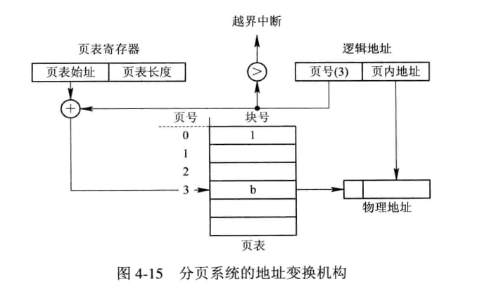
2. 具有快表的地址变换机构
  由于页表是存放在内存中的，这使得CPU在每存取一次数据，都要访问两次内存。第一次，将逻辑地址转为物理地址。第二次，从第一次得到的地址中获取所需数据（或写入数据）。快表（TLB）就是为了解决这个问题，快表位于CPU中，用以存放当前访问的那些页表项。
  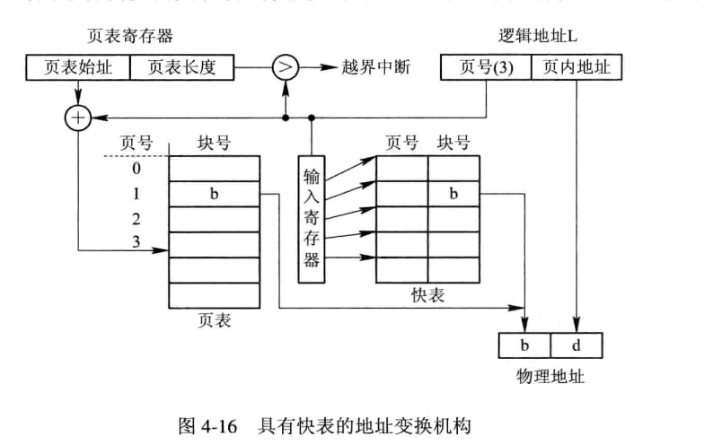

#### 访问内存的有效时间

有效访问时间：从进程发出指定逻辑地址的访问请求，经过地址变化，到在内存中找到对应的物理地址单元并取出数据，所需要花费的总时间。

#### 两级和多级页表

1. 两级页表
2. 多级页表
#### 反置页表

## 分段存储管理方式

#### 分段存储管理方式的引入

1. 方便编程
2. 信息共享
3. 信息保护
4. 动态增长
5. 动态链接
  
#### 分段系统的基本原理

1. 分段
  作业的地址空间被划分为若干个段，每个段定义了一组逻辑信息。
2. 段表
  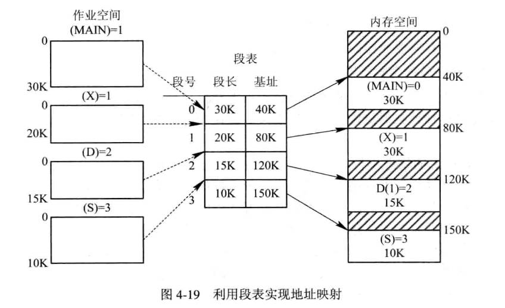

3. 地址变化机构
  段表放在内存中，每访问一个数据，都须访问两次内存
   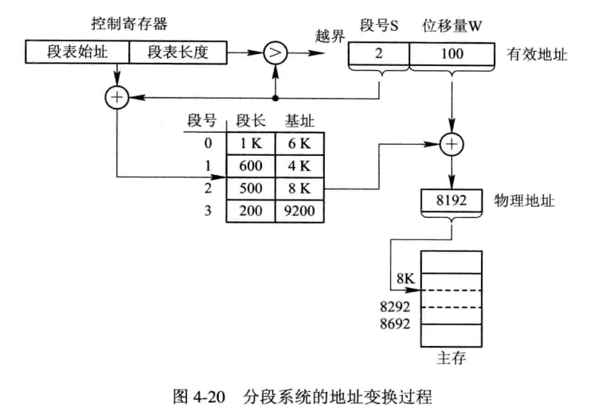
4. 分页和分段的主要区别
  （1）页是信息的物理单位。
  （2）页的大小固定且由系统决定。
  （3）分页的用户程序地址空间是一维的。

#### 信息共享

1. 分页系统中对程序和数据的共享
2. 分段系统中程序和数据的共享
  

#### 段页式存储管理方式

结合分页系统和分段系统的优点
1. 基本原理
  将用户程序进行分段，再把每个段分成若干页，并为每个段赋予一个段名。
  地址结构 段号 段内页号 页内地址
   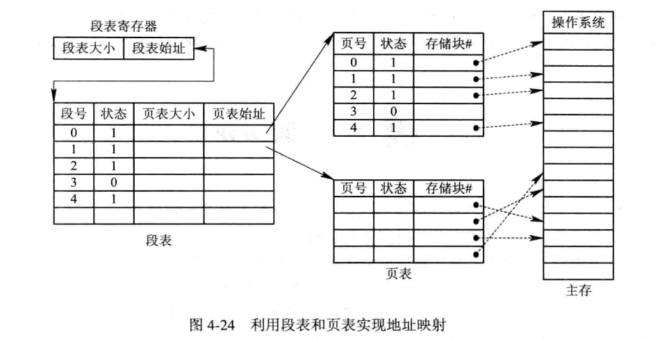
2. 地址变换过程
  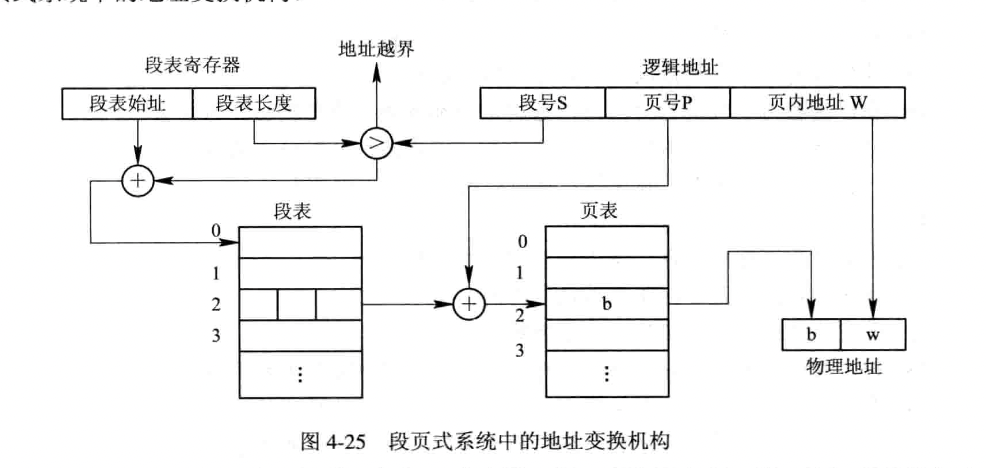

## 虚拟存储区概述

从逻辑上实现对内存容量的扩充

#### 常规存储管理方式的特征和局部性原理

1. 常规存储器管理方式的特征
  （1）一次性，指作业必须一次性地全部装入内存后方能开始运行。
  （2）驻留性，装入之后，一直停留在内存中，任何部分都不会被换出，直到作业运行结束
2. 局部性原理
  在很短时间内，程序的执行仅限于某个部分。
  （1）程序顺序执行，除开少数转移和过程调用指令
  （2）过程调用
  （3）程序中存在许多的循环结构
  （4）对数数组的处理
（1）时间局部性：程序中的某条指令被执行，则不久以后该指令可能再次执行。（循环结构）
（2）空间局部性：一旦程序访问了某个存储单元，在不久之后，其附近的存储单元也将被访问到（程序的顺序执行）
3. 虚拟存储器的基本工作情况
   由局部性原理可知，程序在执行的时候，没有必要全部装入内存，而是仅将那些当前需要运行的少数页面或段先装入内存便可执行，其余部分停留在盘上。如果访问的页或段不再内存中，便发出缺页中断，如果内存已满，通过页面置换算法，换入换出一些页面

#### 虚拟存储器的定义和特征

1. 虚拟存储器的定义
  用户感觉到的内存容量比实际内存容量大得多
  指具有请求调入功能和置换功能，能从逻辑上对内存容量进行扩充的一种存储器系统。
2. 虚拟存储器的特征
  （1）多次性。一个作业无需全部装入内存，而是分为多次调入，只将当前运行需要的那部分程序和数据装入内存即可开始运行。
  （2）对换性。一个作业中的程序和数据无需一直常驻内存，允许在作业运行过程中进行对换。
  （3）虚拟性。从逻辑上进行扩充内存容量，使用户看到的内存容量远大于实际内存容量。

#### 虚拟存储器的实现方法

1. 分页请求系统
  在分页系统的基础上增加了请求调页功能和页面置换功能所形成的页式虚拟系统。
2. 请求分段系统 

## 请求分页存储管理方式

#### 请求分页中的硬件支持 

1.  请求页表机制
   页表项： 页号 物理块号 状态为P 访问字段A 修改为M 外存地址 
   状态位：是否已调入内存
   访问字段A：用于记录在一段时间内被访问的次数（页面置换算法需要）
   修改位M：标识该页在调入内存之后是否被修改过。（写入写出时需要）
   外存地址：用于指出该页在外存上的地址，通常是物理块号，（调入该页时需要）
2. 缺页中断机构
  缺页中断和一般中断的区别：
  （1）在指令执行期间产生和处理中断信号。
  （2）一条指令在执行期间可能产生多次缺页中断。
3. 地址变换机构
  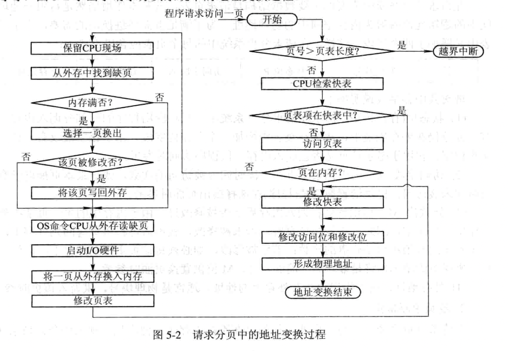

#### 请求分页中的内存分配 

1. 最小物理块数的确定
  指能保证进程正常执行所需的最小物理块数
2. 内存分配策略
  （1）固定分配局部置换
  固定分配：为每个进程分配一组固定数目的物理块，在进程运行期间不再改变
  局部置换：如果进程在运行过程中发现缺页，则只能从分配给该进程的n个页面中选出一页换出，然后再调入一页，以保证分配给该进程的内存空间不变。
  （2）可变分配全局置换
  可变分配：指先为每个进程分配一定数目的物理块，在运行期间，可根据情况适当的增加或减少。
  全局置换：如果发现缺页，从空闲物理块中选出一块分配给该进程。
  （3）可变分配局部置换

3. 物理块分配算法
  （1）平均分配算法。将系统中所有可供分配的物理块平均分配给各个进程
  （2）按比例分配算法。根据进程的大小按比例分配物理块。
  （3）考虑优先权的分配算法。
