# 计算机组成原理

1.6、2.3、2.10、3.5、4.3-4.8、5.2-5.8

mooc上青岛大学周强老师的计算机组成与设计的网课

## 计算机的发展历程

第一代计算机：电子管计算机 其逻辑元件采用电子管，存储器为声延迟线或磁鼓，典型逻辑结构为定点运算。
冯诺依曼提出“存储程序”，其基本思想是：必须将事先编好的程序和原始数据送入主存后才能执行程序，一旦程序被启动执行，计算机在不需要操作人员干预自动完成逐条指令并执行的任务。
IAS计算机：
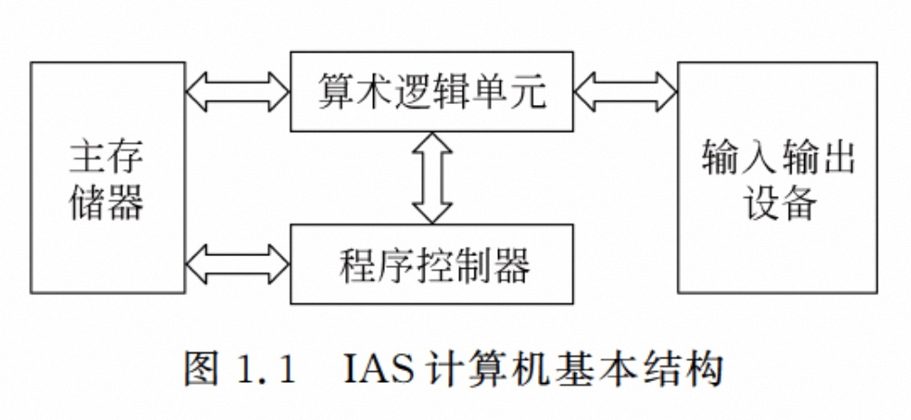

第二代计算机：晶体管计算机 逻辑元件采用晶体管，其内存采用磁芯存储器，外存采用磁鼓与磁带存储器，实现了浮点数运算，并在系统结构方面提出了变址、中断、I/O处理器等新概念。

第三代计算机：集成电路计算机 集成电路的应用时微电子与计算机技术相结合的一大突破，为构建运算速度快、价格低、容量大、可靠性高、体积小、功耗低的各类计算机提供了技术条件。

第四代计算机： 超大规模集成电路计算机

## 计算机系统的基本组成

计算机系统由硬件和软件两部分组成。

#### 计算机硬件

冯诺依曼计算机的基本特征：
(1) 采用“存储程序”工作方式
(2) 计算机由运算器、控制器、存储器、输入/输出设备 5部分组成。
(3) 存储器不仅能存储数据，还能存放指令，形式上数据和指令没有区别，但计算机能区分它们。控制器应能控制指令的自动执行。运算器应能进行加、减、乘、除4种基本运算，并且能进行逻辑运算。操作人员可以通过输入/输出设备操作计算机。
(4) 计算机内部以二进制形式表示指令和数据，每条指令由操作吗和地址吗两部分组成，操作码指出操作类型，地址码指出操作数的地址，由一串指令组成程序。

计算机的硬件主要包括：中央处理器，存储器，I/O控制器，外部设备和各类总线
中央处理器(CPU)：简称处理器，是整个计算机的核心部件 ，主要用于指令的执行。CPU包括两种基本部件：数据通路和控制器。数据通路主要包括算数逻辑部件和通用寄存器等，其功能是用来执行算术和逻辑运算等操作。控制器 用来对指令进行译码，生成相应的控制信号，以控制数据通路正确的操作。
存储器：外存和内存。内存：主存储器和高速缓存cache 外存：辅助存储器和海量后备存储器
外部设备：外设 也称为I/O设备 I/O是输入输出的缩写。外设由机械部分和电子部分组成，机械部分是外部设备本身，电子部分是控制外部设备的I/O控制器或I/O适配器
总线：传输信息的介质，用于在部件之间传输信息，CPU、主存和I/O模块通过总线互连，在CPU和I/O模块中都含有相应的存储部件，即缓存器。

#### 计算机软件

根据用途分：系统软件和应用软件
系统软件：操作系统、语言处理系统(如C语言编译器)、数据库管理系统(如Oracle)和各类实用程序(如磁盘碎片整理程序、备份程序)
应用软件：专门为处理数据处理、科学计算、事务管理、多媒体处理、工程设计以及过程控制等应用所编写的各类程序

## 计算机系统的层次结构

向上层用户提供一个抽象的简洁接口而将较低层次的实现细节隐藏起来

#### 计算机系统抽象层的转换

高级语言和低级语言(机器级语言)
机器级语言：机器语言（可读性差 由 0 1 组成）和汇编语言（由英文符号和二进制代码）；
高级语言 -> 机器语言
转换过程需要 “程序设计语言处理系统” 其包含翻译程序（将一种编程语言转换成另一种编程语言）
翻译程序：
(1) 汇编程序：也成汇编器 将汇编语言源程序翻译为机器语言目标程序
(2) 解释程序：解释器 将源程序中的语句将其执行顺序逐条翻译为机器指令并立即执行。
(3) 编译程序：编译器 将高级语言源程序翻译成汇编语言或机器语言目标程序

透明：一个存在的事物或概念从某个角度看似乎不存在，即，对实际存在事物或概念感觉不到，则称为透明 对用户透明 指用户看不见

## 程序开发与执行过程

#### 从源程序到可执行程序

(1) 通过程序编辑软件(vscode)的到hello.c文件,hello.c文件在计算机中以ASCII字符方式存放 这样的文件称为文本文件，源程序文件都是文本文件，是可显示和可读的
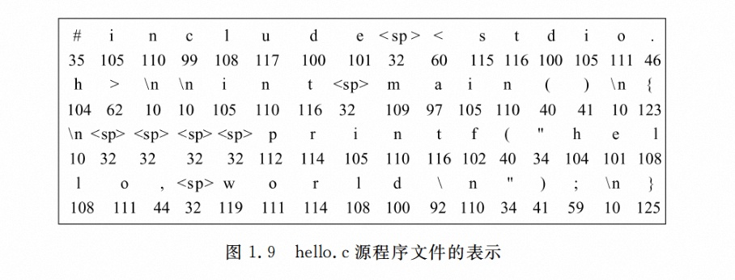
(2)预处理阶段：预处理程序 do...
(3)编译阶段:编译程序 do...
(4)汇编阶段:汇编程序 do...
(5)链接阶段:链接程序 do...
最终生成的可执行文件被保存在磁盘上，可以通过某种方式启动一个磁盘上的可执行文件

#### 可执行文件的启动和执行

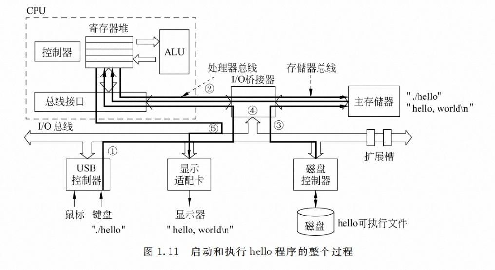

#### 程序与指令的关系

#### 指令执行的过程

第一步：根据Pc取指令到IR
第二步：指令译码并送出控制信号。
第三步：取操作数。
第四步：指令执行。
第五步：回写结果。

## 计算机系统性能评价

#### 计算机性能的定义

吞吐率和响应时间是考量一个计算机系统性能的两个基本指标。
吞吐率：也称为带宽 表示在单位时间内所完成的工作量。
响应时间：也称为执行时间或等待时间，指从作业提交开始到作业完成所用的时间。

MAR位数反应存储单元的个数（最多支持多少个）

MDR位数 = 存储字长 = 每个存储单元的大小

总容量 = 存储单元个数 ✖️ 存储字长

#### 计算机性能的测试

CPU时间：CPU用于程序执行的时间，包含两部分
(1)用户CPU时间，指真正用于运行用户程序代码的时间
(2)系统CPU时间，指为了执行用户程序而需要CPU运行操作系统的时间。
其他时间：I/O操作，CPU执行其他用户程序的时间

CPU时间的衡量:
(1)时钟周期：计算机执行一条指令的过程被分成若干步骤和相应的动作来完成，每个动作都要由响应的控制信号进行控制，控制信号都要由定时信号进行同步，定时信号就是CPU的主脉冲信号，其宽度称为时钟周期。
(2)时钟频率：CPU的主频就是CPU中的主脉冲信号的时钟频率，是CPU时钟周期的倒数。
(3)CPI：表示执行一条指令所需的时钟周期数。
        CPU执行时间 = 程序所含时钟周期数 ➗ 时钟频率
                  = 程序所含时钟周期数 ✖️ 时钟周期
        程序总时钟周期数 = 程序所含指令条数 ✖️ CPI
        n种不同类型的指令，第i种指令的条数和CPI分别为Ci和CPIi
        程序总时钟周期数 = C1*CPI1 + C2*CPI2+ C3*CPI3 + ... + Cn*CPIn
        平均CPI = 程序总时钟周期数 ➗ 程序所含指令条数
例1:

例2:

#### 用指令执行速度进行评估

MIPS：平均每秒钟执行多少百万条指令
MIPS = 1/一条指令的平均执行时间
MFLOPS：每秒所执行的浮点运算有多少百万次
GFLOPS：10^9
TFLPOS:10^12
PFLOPS:10^15

#### 用基准程序进行性能评估

基准程序：
课后习题：

#### 计算机性能指标

**存储器容量**

MAR的位数反应存储单元数量

MDR的位数反应每个存储单元大小

**CPU**

时钟周期：CPU中国呢最小的时间单位，每个动作至少一个时钟周期

主频（时钟频率）：1/时钟周期，单位Hz

CPI：执行一条指令所需的时钟周期数

CPU执行时间：运行一个程序所花的时间 = （指令条数 * CPI）/ 主频

IPS：每秒执行多少条指令 = 主频 / 平均CPI

FLOPS：每秒执行多少次浮点数运算

数据通路宽度、吞吐量、响应时间、基准程序

**常用数量单位**

描述存储容量、文件大小：K = 2^10 ,M = 2^20, G = 2^30,T = 2^40

描述速率、频率：K = 10^3  M = 10^6. G = 10^9   T = 10 ^ 12 P = 2^15  E = 2^18  Z = 2^21

亿 = 10^8

## 第二章 数据的机器级表示

### 数制和编码

#### 信息的二进制编码

#### 进位记数制

R进制转十进制
按权展开：数位i*该位上的权R^i 再进行累加 R称为基数

十进制转R进制
要将整数和小数分别进行转换 。
(1) 整数部分的转换
“除基取余，上右下左”
(2)小数部分的转换
“乘基取整，上左下右”
(3)含整数和小数部分的数转换
分别对整数和小数进行转换，再组合起来

二、八、十六进制数的相互转换
(1)八进制转二进制
将八进制的每一位改成等值的3位二进制数
(2)十六进制转二进制
将十六进制的每一位改成等值的4位二进制数
(3)二进制转八进制
整数部分：从低位到高位每3位用等值的八进制数来替换，最后高位不满3位时补0凑满3位
小数：从高位向低位每3位用等值的八进制数来替换，最后低位不满3位时补0凑满3位
(4)二进制转十六进制
整数部分：从低位到高位每4位用等值的八进制数来替换，最后高位不满4位时补0凑满4位
小数：从高位向低位每4位用等值的八进制数来替换，最后低位不满4位时补0凑满4位

#### 定点与浮点表示

小数点位置约定在固定位置的数称为定点数，小数点位置约定为可浮动的数称为浮点数
1.定点表示
定点表示法用来对定点小数和定点整数进行表示。
定点小数：小数点总是固定在数的最左边，一般用来表示浮点数的尾数部分。
定点整数：小数点总是固定在数的最右边，因此可以用"定点整数"来表示整数。
2.浮点表示
   X = (-1)^S ✖️ M ✖️ R^E
S:取值为0或1 M:二进制定点小数 反应X的有效位数 R:基数 E:二进制定点整数，称为数X的阶或指数 其位数决定X的表示范围，其值确定了小数点的位置

#### 定点数的编码表示

定点数的编码表示方法有4种：原码、补码、反码和移码。
机器数：数值数据在计算机内部编码表示的数称为机器数
真值：机器数真正的值(现实世界带有正负号的数)称为机器数的真值。
1.原码表示法
定义：由符号位直接后跟数值位构成，也称为“符号-数值”表示法。正数和负数的编码表示仅符号位不同，数值位完全相同
       [ +0 ]原 = 000...0
       [ -0 ]原 = 100...0
优点：与真值的对应关系直观、方便 实现乘除运算比较简便
缺点：0的表示不唯一，原码加减运算规则复杂
2.补码表示法
实现加减运算的统一，即用加法来实现减法运算。也称为“2-补码”表示法，由符号位后跟真值的模2^n补码构成
(1)模运算
       A = B + K ✖️ M 记为 A = B (mod M)
A、B各除以M后的余数相同，故称为B和A为模M同余，也就是说 一个数与它除以“模”后得到的余数是等价的
时钟 ：
(2)补码的定义

真值->补码：各位取反，末位加1 （写出二进制 从右向左找到第一个1，1左边的数按位取反，符号位不参与）

补码->真值：各位取反，末位加1

正数的补码：符号位取0，其余不变
负数的补码等于模与该负数绝对值之差-> 写出二进制 从右向左找到第一个1，1左边的数按位取反，符号位不参与。

使用10...000表示最大负数

使用01...111表示最大正数

正数和负数的数量相同，一个正零00000和一个负零111111
(3)特殊数据的补码表示
补码0的表示是唯一的
(1)减少了 +0和-0之间的转换
(4)补码与真值之间的转换方法
正数：正号转换位0，数值部分不变
负数：做减法运算，“各位取反，末位加1”。
注意：最小负数取负后的补码表示是不存在的

3.反码表示法
各位取反
优点：
缺点：

4.移码表示法
浮点数的指数都是用一种移码表示
指数的阶：真值
阶码：机器数
定义：[E]移 = 2^n-1 + E (2^n-1为偏置常数)
主要用来表示浮点数的指数，移码只能用来表示定点整数

#### 带标志位的加法器

OF：有符号数的加减运算是否发生了溢出。OF = 1 ，说明发生了溢出

SF：有符号数加减运算结果的正负性。SF = 0 ，表示运算结果为正

ZF：加减运算结果是否为0。ZF = 1 表示运算结果为0

CF：无符号数加减法是否发生了溢出。当CF  = 1说明发生了溢出

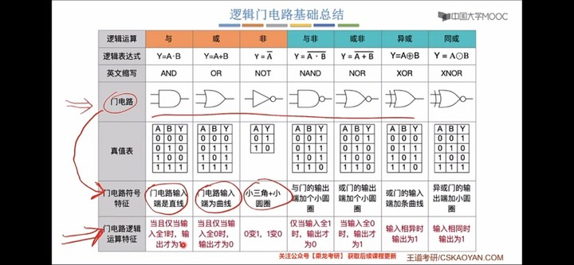

### 整数的表示

#### 无符号整数的表示

#### 带符号整数的表示

补码的优点：

#### C语言中的整数类型

c语言中，一个运算同时有无符号数和有符号整数参加，C编译器会隐含地将带符号整数强制类型转换为无符号数。
-2147483648 二进制 真值：1 1000……000 补码：1 1000……000
-2147483647 二进制 真值：1 0111……111 补码：1 1000……001
-2147483648  < -2147483647

### 实数的表示

计算机中用专门用浮点数来表示实数

#### 浮点数的表示格式

X = (-1)^S ✖️ M ✖️ R^E
S：取值为0或1 0为正数 1为负数
M：表示定点小数 称为X的尾数 原码小数表示
E：是一个二进制定点整数，称为数X的阶或指数 用移码表示
R：基数 2、4、16

**IBM370**

#### 浮点数的规格化

浮点数尾数的位数决定浮点数的有效位数，有效位数越多，数据的精度越高。
规格化操作：“左归”和“右归”，当有效位进到小数点前面时，需要进行右归，右归时，尾数每右移一位，阶码加1，直到尾数变成规格化的形式，形如0.0000bbb✖️2^E，需要左归，尾数每前进一位，阶码减1，直到尾数变成规格化的形式为止。

#### IEEE 754浮点数标准

几乎所有计算机都采用IEEE754标准制定浮点数。这个标准提供了两种基本浮点格式：32位单精度和64位双精度格式。
32位单精度：1位    8位      23位
          符号位  阶码     尾数
64位双精度：1位    11位     52位
          符号位  阶码     尾数
32位单精度包含1位符号位s，8位阶码e和23位尾数f；
64位双精度格式包含1位符号位s，11位阶码和52位尾数f;
尾数用**原码**表示，第一位总为1，因此可在尾数中省略第一位的1，称为隐藏位，使得单精度格式的23位尾数实际上表示了24位有效数字，双精度格式的52位尾数实际上表示了53位有效数字。隐藏位1的位置在小数点之前
指数用**移码**表示，偏置常数并不是通常n位移码所用的2^n-1，而是**2^n-1 - 1**,因此单精度和双精度的偏执常数分别位127和1023
优点：
（1）尾数可表示的位数多一位，因而使浮点数的精度更高
（2）指数的可表示范围更大，因而使浮点数范围更大。

1.全0阶码全0尾数：+0 / -0
IEEE754的零有两种表示：+0 和 -0 零的符号取决于数符s。一般情况下+0和-0是等效的
2.全0阶码非0尾数：非规格化数
非规格化数的特点：阶码全为0，尾数高位有一个或几个连续的0，但不全为0，非规格化数的隐藏位位0，并且单精度和双精度浮点数的指数分别为-126和-1022 (-1)^s ✖️ 0.f ✖️2^-126和(-1)^s ✖️ 0.f ✖️ 2^-1022
3.全1阶码全0尾数：+∞ / -∞
4.全1阶码非0尾数：NAN
5.阶码非全0且非全1:规格化非0数

例题：

IEEE754标准的单精度和双精度格式的特征参数：

### C语言中的浮点数类型

整数数据类型：
char：通常是8位，但可能是16位或32位。
short：通常是16位。
int：通常是32位。
long：通常是32位，但有时也可能是64位。
long long：通常是64位。

浮点数类型：
float：通常是32位，其中1位表示符号，8位表示指数，23位表示尾数。
double：通常是64位，其中1位表示符号，11位表示指数，52位表示尾数。
long double：位数因编译器和操作系统而异，通常是80位或128位。

C语言中有float和double两种不同的浮点数类型，分别对应IEEE754单精度浮点数格式和双精度格式，相应的十进制有效数字分别为7位和17位
int、float和double类型转换
（1）从int转换为float，不会发生溢出，但可能有数据被舍入
（2）从int或float转换为double，因为double的有效位更多，故能保留精确值
（3）从double转为float，因为float表示范围更小，故可能发生溢出，此外，有效位数表少，故可能被舍入
（4）从float或double转位int时，因为int没有小数部分，所以数据有可能会向0方向截断，例如1.99999999截断为1 因为int的表示范围更小，故可能发生溢出

### 十进制数的表示

#### 用ASCII码字符表示

#### 用BCD码表示

### 非数值数据的编码表示

#### 逻辑值

逻辑数据只能参加逻辑运算，并且是按位进行的，如按位“与”，按位“或”，逻辑左移，逻辑右移等。

### 西文字符

### 数据的宽度和存储

#### 数据的宽度和单位

二进制数据的每一位（0或1）是组成二进制信息的最小单位，称为一个比特（bit），或称为位元，简称位。比特是计算机处理、存储后劲儿传输信息的最小单位。
西文字符需用8个bit表示，汉字需用16个比特才能表示。在计算机内部，二进制信息的计量单位是字节（byte），也称为位组，一个字节等于8个比特。
还经常使用字（word）作为单位，不同的计算机，字的长度和组成不完全相同，一个字可能由2个字节，4个字节，8个字节甚至16个字节组成
机器字长：指CPU内部用于整数运算的数据通路的宽度。
CPU数据通路：指CPU内部数据流经的路径以及路径上的部件，主要是CPU内部进行数据运算、存储和传送的部件，这些部件的宽度基本一致，才能互相匹配，因此CPU内部用于整数运算的运算器位数和通用寄存器宽度一致。

表示容量：
1KB = 2^10B = 1024B
1MB = 2^20B = 1058576B
1GB = 2^30B = 1073741824B
1TB = 2^40B
1PB = 2^50B
1EB = 2^60B
1ZB = 2^70B
1YB = 2^80B

表示距离、频率 速率 ：
比特/秒(b/s) bps
1kb/s = 10^3b/s = 1000b/s
1Mb/s = 10^6b/s
1Gb/s = 10^9b/s
1Tb/s = 10^12b/s

C语言数值类型的宽度

#### 数据的存储和排列顺序

最低有效位：LSB 最高位
最高有效位：MSB 最低位
带符号数：最高位就是符号位 6
现代计算机采用字节编址方式，即对存储空间上的存储单元进行编号时，每个地址编号中存放一个字节。换而言之，采用字节编址，对存储空间进行按字节分组，并对每个分组进行编号。
假定int型变量i的地址为0800H,i的机器数为01 23 45 67H
大端方式：     0800H  0801H  0802H  0803H
              01H    23H    45H    67H
小端方式：     0800H  0801H  0802H  0803H
              67H    45H    23H    01H
大端方式将数据的最高有效字节MSB存放在低地址单元中，将最低有效字节LSB存放在最高地址单元中，即数据的地址就是MSB所在的地址
小端方式将数据的最高有效字节MSB放在高地址中，将最低有效字节LSB放在低地址中，即数据的地址就是LSB所在地址。

### 数据校验码

#### 奇偶校验码

只能发现奇数位的错位，不能发现偶数位的错位。不提供纠错功能

#### 海明码

将数据按某种规律分成若干组，对每组进行相应的奇偶检测，以提供多位校验信息，从而可对错误位置进行定位，并将其纠正。实质上就是一种多重奇偶校验码
1.校验位的位数的确定
2.分组方式的确定
3.校验位的生成和检错、纠错

#### 循环冗余码(CRC)

具有较强检错、纠错能力的校验码，常用于外存储器的数据校验。
1.CRC码的检错方式
一个CRC码一定能被生成多项式整除，所以当数据和校验位一起送到接收端后，只要接受到的数据和校验位用同样的生成多项式相除，如果正好除尽，表示没有发生错误，若除不尽，则表示某些数据位发生了错误。
2.校验位的生成
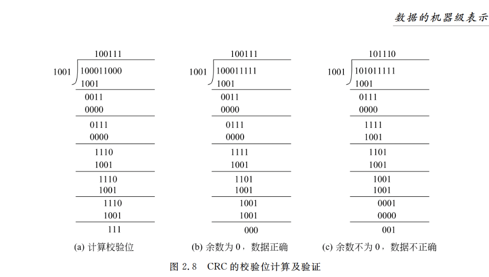
3.CRC码的纠错
余数是否为0

## 第3章 运算方法和运算部件

### 高级语言和机器指令的运算

#### C语言中涉及的运算

加、减、乘、除等运算，可以有无符号、带符号整数和浮点数运算
按位运算、逻辑运算、移位运算、位运算和位截断运算

1.按位运算
C语言中的按位运算：符号｜ 表示按位OR运算；符号&表示按位AND运算；符号～表示按位NOT运算；符号^表示按位XOR运算；
按位运算一个最重要的运用就是实现掩码(子网掩码)，可以进行“置1”、“清0”、“1测试”或“0测试”。
按位与（&）：对两个数值的二进制位进行与运算，只有两位都是 1 时，结果才是 1，否则为 0。

按位或（|）：对两个数值的二进制位进行或运算，只要两位中有任意一位是 1，结果就是 1，否则为 0。

按位异或（^）（同0异1）：对两个数值的二进制位进行异或运算，如果两位不同，则结果为 1，否则为 0。

2.逻辑运算
符号||表示OR运算
符号&&表示AND运算
符号!表示NOT运算
逻辑运算是非数值运算

3.移位运算
移位操作：逻辑移位和算术移位
逻辑移位：不考虑符号位，总是把高（低）位移出，低（高）位补0。对无符号整数的逻辑左移，如果高位是1，则发生溢出。
算术移位：带符号数在计算机内部采用补码表示的，所以对于带符号整数的移位操作应采用补码算术移位方式，左移时，高位移出，低位补0，每移一位，如果移出的高位不同于移位后符号位，即左移前、后符号位不同，则发生溢出；右移时，低位移出，高位补符号位。
x<<k 表示对数x左移k位
每左移一位，相当于数值扩大一倍，所以左移可能会发生溢出，左移k位，相当于数值乘2^k；每右移一位，相当于数值缩小一半，右移k位，相当于数值除以2^k
左移位（<<）：将一个数值的二进制位向左移动指定的位数，空出的位用 0 填充。
无符号数进行逻辑移位，带符号数进行算术移位
有符号右移位（>>）：将一个数值的二进制位向右移动指定的位数，空出的位用符号位（即最高位）填充。
无符号右移位（>>>）：将一个数值的二进制位向右移动指定的位数，空出的位用 0 填充。

例题

4.位拓展和位截断运算
数据类型进行转换时，如果遇到一个短数向长数转换，就要进行位拓展运算了。
拓展方式：0拓展和符号拓展。0拓展用于无符号数，只要在短的无符号数前添加足够多的0即可。符号拓展用于补码表示的带符号整数，通过在短的带符号数前添加足够多的符号位来拓展。
长数向短数转换，就要进行截断运算。
截断一个数可能会因为溢出而改变它的值。因为长数的表示范围远远大于短数的表示范围，所以当一个长数足够大到短数无法表示的程度，则截断时就会发生溢出。

#### MIPS指令中涉及的运算

### 基本运算部件(？？？)

#### 串行进位加法器

#### 并行进位加法器

#### 带标志加法器

溢出标志位：OF 符号标志位：SF 零标志位：ZF 进位/借位：CF

#### 算术逻辑部件

ALU时一种能进行多种算术运算与逻辑运算的组合逻辑电路，其核心部件是带标志加法器，采用先行进位方式。

##### 看懂ALU图标

输入：

两个n比特云算数A、B（与机器字长相同）

m比特的控制信号（由控制器经过指令译码产生、控制信号位数 m> = log2 k ）

输出：

nbit运算结果（与机器字长相同）

OF/ZF/SF/CF标志信息 （标志信息送入PSW寄存器 又称FR）

ALU是运算器的核心、加法器是ALu的核心（加减乘除都是通过加法器实现的）

### 定点数运算

#### 补码加减运算

零标志ZF=1表示结果F为0，不管作为无符号数还是带符号数整数运算，ZF都有意义
符号标志SF表示结果的符号，即F的最高位，对于无符号数运算，SF没有意义
进/借位标志CF表示无符号数加/减运算时的进/借位。加法时，CF=1表示无符号数加法溢出；减法时，若CF=1表示有借位，不够减。对于带符号整数运算，CF没有意义。
溢出标志OF=1表示带符号整数运算时发生了溢出，对无符号整数运算，OF没有意义
减法变加法 原码转补码 进行加法运算

#### 原码加减运算

浮点数采用IEEE754标准，其尾数采用原码表示，故在浮点数加减运算中涉及原码加减运算。
原码加减运算规则如下：
(1) 比较两个操作数的符号，对加法实行“同号求和，异号求差”，对减法实行“异号求和，同号求差”
(2)求和时，

#### 移码加减运算

移码的和、差等于和、差的补码

#### 原码乘法运算

1.原码一位乘法
(1) 确定乘积的符号位，由两个乘数的符号异或得到。
(2)计算乘积的数值位。乘积的数值部分分为两个乘数的数值部分之积

2.原码二位乘法

#### 补码乘法运算

1.补码一位乘法
符号位与数值位一起参与运算，直接得出补码表示的乘积，且正数和负数同等对待，这种算法被称为布斯乘法

2.补码两位乘法

#### 补码除法运算

1.补码恢复余数除法
2.补码不恢复余数除法

### 浮点数运算

#### 浮点数加减运算

对阶、尾数加减、规格化和舍入。还必须考虑溢出判断和溢出处理问题

1.对阶
对阶原则是：小阶向大阶看齐，阶小的那个数的尾数右移，右移的位数等于两个阶(指数)的差的绝对值
2.尾数加减
原码小数加减运算，注意隐藏位
3.尾数规格化
4.尾数的舍入处理
5.溢出判断
(1)右归和尾数舍入
(2)左归

#### 浮点数乘法运算

### 运算部件的组成

#### 定点数运算部件

#### 浮点数运算部件

### 小结

## 指令系统

### 指令格式设计

#### 指令地址码的个数

一条指令中必须明确地(显示)或隐含地包含以下信息。
(1)操作码。指定操作类型，如移位、加、减、乘、除、传送等
(2)源操作数或其地址。指出一个或多个源操作数或其所在地址，可能是主(虚)存地址，寄存器编号或I/O端口，也可以在指令中直接给出一个立即数。
(3)结果的地址。结果所存放的地址，可以是主存地址、寄存器编号或I/O端口。
(4)下一条指令地址。一般隐含在PC中，指令按顺序执行时，只要自动将PC的值加上指令的长度，就可以得出下一条指令的地址，如果遇到转移指令，则需要由指令给出转移到的目标地址。

#### 指令格式设计原则

(1)指令应尽量短。降低开销
(2)要有足够的操作码位数。向后兼容
(3)操作码的编码必须有唯一的解释。
(4)指令长度应是字节的整数倍。指令存放在内存中，而内存往往按字节编址，指令的长度为字节的整数倍，便于指令的读取和指令地址的计算。
(5)合理选择地址字段的个数。
(6)指令应尽量规整。

### 指令系统设计

#### 基本设计问题

#### 操作数类型

(1)指针或地址
(2)数值数据。
(3)位、位串、字符和字符串。
(4)逻辑(布尔)数据

#### 寻址方式

通常把指令中给出的操作数所在的存储单元的地址称为有效地址，存储单元地址可能是主存物理地址，也可能是虚拟地址。
常见的寻址方式：
1.立即寻址
指令中直接给出操作数本身，这种操作数称为立即数。

op rs rt immediate
2.直接寻址
指令中给出的地址码是操作数的有效地址，这种地址称为直接地址或绝对地址。
3.间接寻址
指令中给出的地址码是存放操作数有效地址的主存单元地址。
4.寄存器寻址
指令中给出的地址码是操作数所在的寄存器编号，操作数在寄存器中。
优点：
(1)寄存器数量远小于内存单元数，故寄存器编号和存储地址短，因而寄存器寻址方式的指令较短。
(2)操作数已在CPU中，不用访存，因而指令执行的速度快。
5.寄存器间接寻址
指令中给出的地址码是一个寄存器编号，该寄存器中存放的是操作数的有效地址。指令长度和寄存器寻址指令差不多，但由于要访存，所以寄存器间接寻址指令的执行时间比寄存器寻址指令的执行时间更长。
6.变址寻址
变址寻址方式主要是用于对线性表之类的数组元素进行方便的访问。
采用变址寻址方式时，指令中的地址码字段A给出的是一个基准地址，例如数组的起始地址，而数组元素相对于基准地址的偏移量在指令中明显或隐含地由变址寄存器I给出，这样变址寄存器(简称变址器)的内容实际上就相当于数组元素的下标，每个元素的有效地址为基准地址加变址寄存器的内容，即操作数的有效地址EA = (I) + A 其中I表示变址寄存器I的内容
7.相对寻址
如果某指令的操作数的有效地址或转移目标地址位于该指令所在位置的钱、后某个固定位置上，则该操作数或转移目标可用相对寻址方式。采用相对寻址方式时，指令中的地址码字段A给出一个偏移量，基准地址隐含由PC给出，即操作数有效地址或目标地址EA = (PC) + A
相对寻址方式可用来实现公共子程序的浮动或实现相对转移。
8.基址寻址
基址寻址方式下，指令中的地址码字段A给出一个偏移量，基准地址可以明显或隐含地由基址寄存器B给出。
操作数有效地址EA = (B)+A

变址、基址和相对3中寻址方式，都是将某个寄存器的内容与一个形式地址相加来生成操作数的有效地址。统称为偏移寻址。
9.其他寻址方式
为了缩短指令字长度，有些指令采用隐含地址码方式。即在指令中不明显给出操作数地址或变址寄存器和基址寄存器编号，而是由操作码隐含给出。

#### 操作类型

1.算术和逻辑运算指令
加(ADD)、减(SUB)、比较(CMP)、乘(MUL)、除(DIV)、与(AND)、或(OR)、取反(NOT)、取负(NEG)、异或(XOR)、加1(INC)、减1(DEC)等。
2.移位指令
算术移位、逻辑移位、循环移位、半字交换。
算术左移：操作数的各位依次向左移，低位补零。有些机器将最高位移入进位标志CF位，这样可以通过判断符号标志和进位标志是否相等就可以判断是否发生了溢出。
算术右移：各位依次向右移，高位补符号。有些机器将最低位移入进位标志位。
逻辑左移：同算术左移。
逻辑右移：各位依次向右移，高位补零。
小循环左移：最高位移入进位标志位，同时也移入最低位。
小循环右移：最低位移入进位标志位，同时也移入最高位。
大循环左移：最高位移入进位标志位，而进位标志位移入最低位。
大循环右移：最低位移入进位标志位，而进位标志位移入最高位。
3.传送指令
传送指令通常有寄存器之间的传送MOV、从内存单元读取数据到CPU寄存器LOAD、从CPU寄存器写数据到内存单元STORE等。
4.串指令
串指令是对字符串进行操作的指令。如串传送，串比较，检索和传送出转换等指令。
5.顺序控制指令
顺序控制指令用来控制程序执行的顺序。有条件转移BRANCH、无条件转移JMP、跳步SKIP、调用CALL、返回RET等指令。
顺序控制类指令的功能通过将转移目标地址送到PC中来实现。
无条件转移指令在任何情况下都执行转移操作，而条件转移指令(分支指令)仅仅在特定条件满足时才执行转移操作。
调用指令也称为转子指令，和转移指令的根本区别在于执行调用指令时必须保存下一条指令的地址（返回地址）。调用指令用于子程序调用(即过程调用或函数调用)，当子程序执行结束时，根据返回地址回到主程序继续执行；而转移指令则不返回执行，因而无法保存返回地址。
返回指令的功能是在子程序执行完毕时，将事先保存的返回地址送到PC，这样处理器就能回到原来的主程序继续执行。
6.CPU控制指令
停机、开中断、关中断】系统模式切换以及进入特殊处理程序等指令。大多数机器将这类指令划为“特权”指令(也称为管态指令)，只能在内核代码执行时使用。
7.输入输出指令
这类指令用户完成CPU与外部设备交换数据或传送控制指令及状态信息。

#### 操作码编码

指令的操作码字段可以是固定长度，也可以是可变长度。
1.定长操作码编码
指令的操作码部分采用固定长度编码，这种译码方式方便，指令执行速度更快，但信息冗余。
2.拓展操作码编码
拓展操作码编码方式将操作码的编码长度分成几种固定长度的格式。操作码长度不固定，是可变的。

#### 标志信息的生成和使用

常用的条件转移指令：
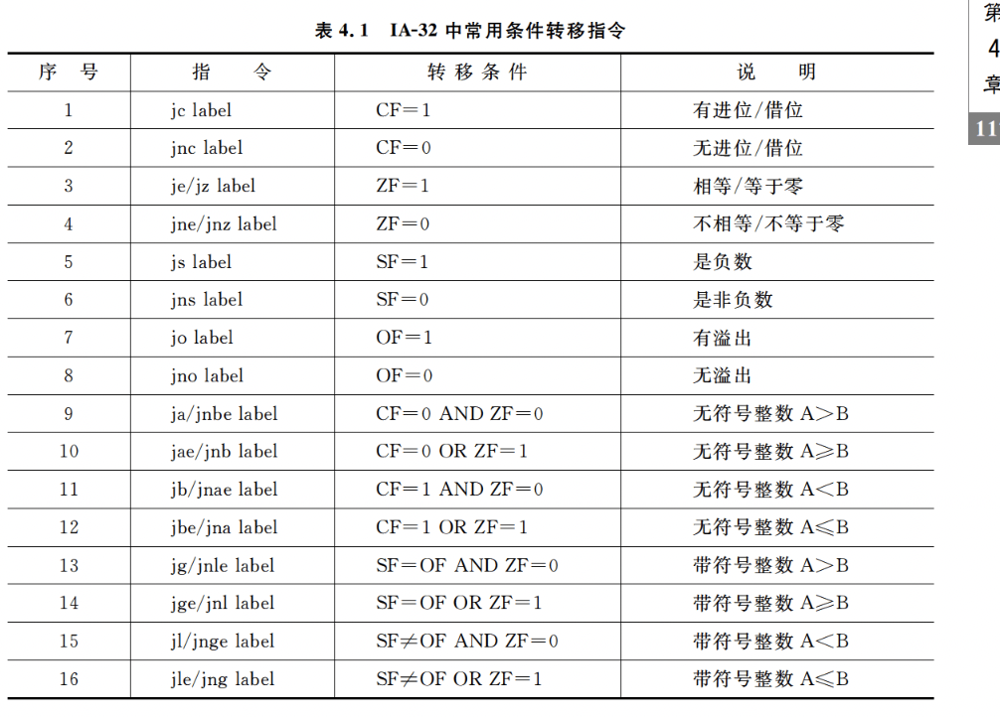
CF = Count 异或 Sub

#### 指令系统设计风格

1.按操作数位置指定风格来分
1） 累加器型指令系统
总是把其中一个操作数隐含在累加器(一般用AC表示)中，指令执行的结果也总是送到累加器中。
2） 栈型指令系统
JAVA虚拟机采用的是栈型指令系统。FILO。操作数总是来自栈顶。通常是零地址或异地址指令。
3）通用寄存器型指令系统
使用通用寄存器而不是累加寄存器。其指令的操作数可以是立即数，或来自通用寄存器(R)，或来自存储单元(S)。
4）load/Store型指令系统
也是通过使用通用寄存器来来存放运算过程中的临时数据。只有取数指令和存数指令才可以访问存储器，运算类指令不能访存。

2.指令格式的复杂程度来分
1）CISC风格指令系统(complex Instruction Set Computer )
特点：
（1）指令系统复杂。指令多，寻址方式多，指令格式多。
（2）指令周期长。绝大多数指令需要多个时钟周期才能完成。
（3）指令周期差距大。各种指令都能访问存储器，使得简单指令和复杂指令所用的时钟周期数相差很大，不利于指令流水线。
（4）采用微程序控制。
（5）难以进行编译优化。

2）RISC风格指令系统 (Reduced Instruction Set Computer)
（1）指令数目少，只包含使用频度高的简单指令。
（2）指令格式规整。寻址方式少，指令格式少，指令长度一致
（3）采用Load/Store型指令设计风格。
（4）采用流水线方式执行指令。
（5）采用大量通用寄存器。
（6）采用硬连线控制器。
（7）采用优化的编译系统。

## 程序的机器及表示

### MISPS汇编语言和机器语言

1.MIPS指令中数据的表示
2.MIPS指令格式和寻址方式
3.MIPS汇编语言

从汇编转为机器代码的过程称为汇编，从机器代码转为汇编表示的过程称为反汇编。

## 第五章中央处理器

### CPU概述

#### 指令执行过程

指令按顺序存放在内存连续单元中，指令地址由PC给出。CPU取出并执行一条指令称为指令周期，不同指令的指令周期可能不同。
CPU执行一条指令的大致过程如下
（1）取指令并计算下一条指令地址。
（2）对指令操作码译码。
（3）计算源操作数地址并取源操作数。
（4）数据操作。
（5）目的操作数地址计算并存结果。
每条指令指令的功能总是由以下4种基本操作来实现。
（1）读取某个存储单元内容（可能是指令或操作数或操作数地址），并将其装入某个寄存器。
（2）把一个数据从某个寄存器存入给定的寄存器单元中。
（3）把一个数据从某个寄存器送到另一个寄存器或者ALU输入端。
（4）进行某种算术运算或逻辑运算，将结果送入某个寄存器。

寄存器传送语言（RTL）
（1）用R[r] 表示寄存器堆中寄存器r的内容
（2）用M[addr] 表示读取存储单元addr的内容。
（3）传送方向用〈- 表示，传送源在右，传送目的在左。
（4）程序计数器PC直接用PC表示内容。

#### CPU的基本功能和基本组成

CPU由数据通路和控制部件两大部分组成。
数据通路：将指令执行过程中数据所经过的路径，包括路径上的部件称为数据通路。ALU、通用寄存器、状态寄存器、cache、MMU、浮点运算逻辑、异常和中断处理逻辑等都是指令执行过程中数据流经的部件，都属于数据通路的一部分。通常将数据通路中专门进行数据运算的部件称为执行部件或功能部件。
控制部件：数据通路由控制部件进行控制。控制部件根据每条指令功能的不同生成对数据通路的控制信号，并正确控制指令的执行过程。

CPU基本组成原理图：

（1）程序计数器（PC）：又称指令计数器或指令指针（IP），用来存放指令的地址。顺序执行pc+1，需要改变执行顺序的时，由转移类指令形成转移地址送到PC，作为下一条指令地址。
（2）指令寄存器（IR）：用以存放现行指令。上文提到，每条指令总是先从存储器去除后才能在CPU中执行，指令取出后存放在指令寄存器中，以便送指令译码器进行译码。
（3）指令译码器。对指令寄存器中的操作码部分进行分析解释，产生相应的译码信号，提供给操作控制信号形成部件。
（4）脉冲源及起停控制线路。脉冲源产生一定频率的脉冲信号作为整个机器的时钟脉冲，是CPU时序的基准信号。启停线路在需要时能保证可靠地开放或封锁时钟脉冲，控制时序信号的发生与停止，并实现对机器的启动与停机。
（5）时序信号产生部件。以时钟脉冲为基础，产生不同指令对应的周期、节拍、工作脉冲等信号、实现机器指令执行过程的时许控制。
（6）操作控制信号形成部件。综合时序信号、指令译码信号和执行部件反馈的状态标志等，形成不同指令所需要的操作控制信号序列。
（7）总线控制逻辑。实现对总线传输的控制，包括数据、地址信息和缓冲与三态控制。
（8）中断机构。实现对异常情况和某些外部中断请求的处理。

#### 数据通路的基本结构

指令执行所用到的元件有两类：组合逻辑元件（也称为操作元件）和存储元件（也称为状态元件）。连接这些元件的方式有两种：总线方式和分散连接方式。数据通路就是由操作元件和存储元件通过总线或分散方式连接而成的进行数据存储、处理和传送的路径。
1.组合逻辑元件
组合逻辑元件的输入只决定于当前的输入。常用的组合逻辑元件有多路选择器（MUX）、加法器（Adder）、算术逻辑部件（ALU）、译码器（Decoder）等。
2.状态元件
状态元件具有存储功能，输入状态在时钟控制下被写到电路中，并保持电路的输出值不变，直到下一个时钟到达。例如D触发器。

数据通路中的寄存器是一种典型的状态存储元件，由n个D触发器可构成一个n位寄存器。根据功能和实现方式的不同，有各种不同类型的寄存器。
例如：
1）带“写使能”输入信号的触发器构成的寄存器，通常这类触发器位锁存器，所组成的寄存器称为暂存器，通常用来实现指令寄存器IR，通用寄存器
2）输出端带一个三态门的寄存器，通常用来于总线相连的寄存器，可以通过三态门来控制信息是否打到总线上。
3）带复位（清零）功能的寄存器
4）带计数（自增）功能的寄存器
5）带移位功能的寄存器

3.数据通路与时序控制

1）早期计算的三级时序系统
机器周期、节拍和脉冲三级时序对数据通路进行定时控制。
2）现代计算机的时钟信号
整个数据通路中的定时信号就是时钟，一个时钟周期就是一个节拍。

4.单总线数据通路
CPU内部的部件之间通过总线方式连接。将ALU及所有寄存器通过一条内部的公共总线连接起来，构成单总线结构的数据通路。因为此总线在CPU内部，所以称为CPU内部总线。

通用寄存器对程序员是可见的 而CPU临时存储数据的寄存器对程序员不可见。
单总线CPU结构中，完成指令执行的4种基本操作
1）在通用寄存器之间传送数据
总线是一组共享的传输信号线，它不能存储信息，某一时刻也只能有一个部件能把信息送到总线上。
2）完成算术、逻辑运算
ALU是一个没有记忆功能的组合逻辑电路，若要进行正确的运算，必须将两个操作数都送到ALU的输入端。
3）从内存中读取一个字（指令或数据或数据的地址）
4）把一个字（数据）写入主存
5.三总线数据通路

### 单周期处理器设计

#### 指令功能的描述

#### 数据通路的设计

 理想存储器有一个32位数据输入端DataIn；一个32位数据输出端DataOut；还有一个读写公用的地址输入端Address。控制信号有一个写使能信号WE，写操作受时钟信号Clk的控制。
 1.算术逻辑部件的设计

2.取指令部件的设计
每条指令的第一步都是去指令并计算下一条指令地址的功能。

3.R-型指令的数据通路

4.立即数运算指令的数据通路

5.Load/Store指令的数据通路

6.分支指令的数据通路

7.无条件转移指令的数据通路

8.综合11条指令的完整数据通路

#### 控制逻辑单元的设计

控制单元只要包含指令译码器，其输入的是指令操作码op，输出的是控制信号。控制单元设计过程如下：
（1）根据每条指令的功能，分析控制信号的取值，并在表中列出。
（2）根据列出的指令和控制信号的关系，写出每个控制信号的逻辑表达式。

1.控制信号取值分析

2.控制单元设计

#### 时钟周期的确定

计算机性能（即程序执行速度）由3个关键因素决定：指令树木、时钟周期和CPI。其中指令数目由编译器和指令集决定，而时钟周期和CPI由处理器的设计与实现决定。

### 多周期处理器设计

多周期处理的基本思想为：把每条指令的执行分成多个大致相等的阶段，每个阶段在一个时钟周期内完成；各个阶段最多完成一次访存或一次寄存器读写或一次ALU操作；个阶段的执行结果在下一个时钟到来时保存到相应的存储单元或稳定地保持在组合电路中；
时钟周期的宽度以最复杂阶段所用时间为准，通常取一次存储器读写的时间。

#### 信号竞争问题

#### 指令执行状态分析

1. 取指令、指令译码/取数阶段
   1）取指令状态
   IR<-M[PC] PC<-PC+4，将PC的值作为地址来度存储器，并将读出指令送到IR输入端，使得下一个时钟到来时，读出指令送到IR，同时，PC将送到ALU的A口，并选择4送到ALU的B口，控制ALU不做判溢出的加法操作，得到PC+4，
   送PC输入端，使得下一个时钟到来时，PC+4送PC。

2）译码/取数状态

2. R-型指令运算阶段
3. I-型指令立即数运算阶段
4. lw指令执行阶段
5. sw指令执行阶段
6. 分支指令执行阶段
7. 无条件转移指令执行阶段

#### 硬连线路控制器设计

硬连线路控制器速度快，适合简单或规整的指令系统，例如MIPS指令集。但是，由于它是一个多输入/多输出的巨大逻辑网络，对于复杂指令系统来说，则对应的硬连线路控制器结构庞杂，实现困难，维护不易，扩充和修改指令相当困难。

### 微程序控制器设计

复杂指令采用微程序方式来设计控制器
基本思想：仿照程序设计方法，将每条指令的执行过程用一个微程序来表示，每个微程序由若干微指令组成，每条为指令相当于有限状态机中的一个状态。所有指令对应的微程序都存放在爱一个ROM中，这个ROM称为控制存储器，简称控存。在微程序控制器下执行指令，CPU从控存中取出每条指令对应的微程序，在时钟的控制下，按照一定的顺序执行微程序中的每条指令。通常一个时钟周期执行一条微指令。

#### 微程序控制器的结构

微操作：一条指令的功能通过执行一系列基本操作来完成，这些基本操作称为微操作。
每个微操作在相应控制信号的控制下执行，这些控制信号在微程序中称为微命令。

#### 微指令编码

1.直接控制法
2.字段直接编码法
3.字段间接编码法
4.最少（最短、垂直）编码法

#### 微指令地址的确定

1.计数器法

2.断定法

### 异常和中断

#### 基本概念

1. 内部异常
   ˙指由处理器内部异常引起的意外事件。分为硬故障中断和程序性异常。故障中断是由硬连线路出现异常引起的，如电源掉电，存储器线路错等。程序性异常也称为软中断，是由CPU执行某条指令而引起的发生在处理器内部的异常事件，也称为例外。如整除0、溢出、断点、单步跟踪、访问超时、非法操作码、栈溢出、缺页、地址越界等。
   内部异常分为故障、自陷和终止。
   1）故障
   也称为失效，它是在引起故障后的指令启动后，执行结束前被剪检测到的一类异常事件。
   2）自陷
   自陷也称为陷阱或陷入，与故障等其他意外发生的异常事件不同，是预先安排的一种“异常”时间，就像预先设定的“陷阱”一样，首先通过某种方式将CPU设定位处于某个特定状态，在程序执行过程中，一旦某条指令的执行发生了相应状态所满足的条件，则CPU调用特定的程序进行相应的处理。
   通常的做法是：事先在程序中用一条特殊指令或通过某种方式设定特殊控制标志来认为设置一个“陷阱”，当执行到被设置了“陷阱”的指令时，CPU在执行完自陷指令后，自动根据不同“陷阱”类型进行相应的处理，然后返回到自陷指令的下一条指令执行。注意，当自陷指令是转移指令时，并不能返回到下一条指令执行，而是返回到转移目标指令执行。
   系统调用指令、条件自陷指令都属于陷阱指令，执行到这些指令时，无条件或有条件地自动调出操作系统内核程序进行执行。
   3）终止
   如果在执行指令过程中发生了使机器无法继续执行的硬件故障，如电源掉线、线路故障等，则程序将无法继续执行，只好终止，此时，调出中断服务程序来重启系统。这种异常与故障和自陷不同，不是由特定指令产生的，而是随机发生的。
2. 外部中断
   程序执行过程中，若外设完成任务或发生呕血特殊事件（如打印机缺纸，定时采样计数时间到，键盘缓冲满等），会向CPU发生中断请求，要求CPU对这些情况进行处理，通常，每条指令执行完后，CPU都会主动查询有没有中断请求，有的话，则下一条指令地址作为断点保存，然后转到相应的中断服务程序执行，结束后回到断电继续执行。
   这种事件与执行的指令无关，由CPU外部的I/O发出，所以，称为I/O中断或外部中断，需要通过外部中断请求线向CPU请求。

CPU内部事件称为异常，而将外部中断事件称为中断。

### 异常处理过程

保存断点和程序状态，识别异常事件并转异常处理。

1. 保存断点和程序状态
   大多数处理器将断点保存在栈中，也可以保存在特定的寄存器中。
   因为异常处理后可能还要回到原被中断的程序继续执行，所以，被中断时原程序的状态（如产生的各种标志信息、允许自陷标志等）都必须保存起来。通常为每个正在运行程序的状态信息存放在一个专门的寄存器中，这个专门寄存器统称为程序状态字寄存器（PSWR），存放在PSWR中的信息称为程序状态字（PSW）
2. 识别异常事件并转异常处理
   在调出异常处理程序前，必须知道发生了什么异常。一般来说，内部异常事件和外部中断源的识别方式不同，大多数处理器会将两者分开来处理。内部异常事件的识别大多采用软件识别方式，而外部中断源则可以采用软件识别或硬件识别方式。

软件识别方式：CPU设置一个异常状态寄存器，用于记录异常原因。操作系统使用一个统一的异常查询程序，该程序按一定的优先级顺序查询异常状态寄存器，先查询到的异常先被处理。

由于外部中断的发生与CPU正在执行的指令没有必然联系，相对于指令来说，外部中断是随机的，与当前执行指令无关的，所以并不能根据指令执行过程中的某些现象来判断是否发生了中断请求。因此，对于外部中断，只能在每条指令执行完后，取下一条指令之前取查询是否有中断请求。通常CPU通过采样对应的中断请求引脚线来进行查询

#### 带异常处理的处理器设计

## 指令流水线

### 流水线概述

#### 流水线的执行效率

一条指令流水线由如下五个流水线组成
（1）取指令（IF）：从cache或主存取指令。
（2）指令译码（ID）：产生指令执行所需的控制信号。
（3）取操作数（OF）：度存储器操作数或寄存器操作数。
（4）执行（EX）：对操作数完成指定操作。
（5）写回（WB）：将操作数写回存储器或寄存器。

流水线设计的原则是：指令流水段个数以最复杂指令所用的功能段个数为准；流水段的长度以最复杂的操作所花时间为准。

#### 适合流水线的指令集特征

（1）指令长度尽量一致。
（2）指令格式尽量规整，尽量保证源寄存器的位置相同。
（3）采用装入/存储型指令风格。

### 流水线处理器的实现

#### 每条指令的流水线分析

1. R-型指令功能段划分
2. I-型运算类指令功能段划分
3. lw指令功能段划分
4. sw指令功能划分
5. beq指令功能段划分
6. j指令功能段划分

#### 流水线数据通路的设计

#### 流水线控制器的设计

### 流水线冒险及其处理

指令流水线中，可能会遇到一些情况使得流水线无法正确执行后续指令而引起流水线阻塞或停顿，这种现象称为流水线冒险。根据原因的不同分为，结构冒险、数据冒险和控制冒险。

#### 结构冒险

结构冒险也称为硬件资源冲突，引起结构冒险的原因在于同一个部件同时被不同指令所用，也就是说它是由硬件资源竞争造成的。

#### 数据冒险

数据冒险也称为数据相关。引起数据冒险的原因在于后面指令用到前面指令结果时前面指令结果还没有产生。
所有的数据冒险都是由前面指令写结果之前后面指令就需要读取而造成的，这种数据冒险称为写后读数据冒险。在非“乱序”执行的基本流水线中，所有数据冒险都属于RAW数据冒险。

1. 插入空操作指令
   在软件上采取措施，是相关指令延迟执行。例如，在编译时预先插入空操作指令nop
2. 插入旗袍
   在硬件上采取措施，使相关指令延迟执行，通过硬件阻塞方式组织后续指令执行。这种组件阻塞的方式称为“插入气泡”。
3. 采用转发技术
   将数据通路中生成的中间数据直接转发到ALU的输入端。
4. Load-use数据冒险的检测和处理
   由编译器在load指令之前插入nop指令来解决，这样无序硬件来处理数据冒险问题。

#### 控制冒险

当遇到改变指令执行顺序的情况，流水线中指令的正常执行会被阻塞。这种由于发挥说呢跪了指令执行顺序改变而引起的流水线阻塞称为控制冒险。各类转移指令（包括调用、返回指令等）的执行，以及异常和中断的出现都会改变指令执行顺序，因而都可能会引发控制冒险。

1. 转移指令引起的控制冒险
2. 异常或中断引起的控制冒险

## 高级流水线技术

高级流水线利用指令级来提高流水线的性能。有两种增加指令级并行的策略
超流水线：通过增加流水线级数来使更多的指令同时在流水线中重叠执行。
多发射流水线（超标量）：通过同时启动多条指令独立运行来提高指令并行性。

## 存储器分层体系结构

### 存储器概述

#### 存储器的分类

1. 按存储元件分类
   存储元件必须具有两个截然不同的物理状态，才能被用来表示二进制0和1.目前使用的存储元件主要有半导体器件、磁性材料和光介质。用半导体器件构成的存储器称为半导体存储器；磁性材料存储器主要是磁表面存储器，如磁盘存储器和磁带存储器；光介质存储器称为光盘存储器
2. 按存取方式分类
   1）随机存取存储器
   随机存取存储器的特点是按地址访问存储单元，因为每个地址译码时间相同，所以，在不考虑内部缓冲的前提下，每个单元的访问时间是一个常数，与地址无关。丹半导体存储器属于随机存取存储器，可用作cache和主存储器。
   2）顺序存取存储器
   特点是信息按顺序存放和读出，其存取时间取决于信息存放位置，以纪录块单位编址。磁带存储器就是一种顺序存取存储器，其存储容量大，但存取速度慢。
   3）直接存取存储器
   兼有随机访问和顺序访问的特点。首先可直接选取所需信息所在区域，然后按顺序方式存取，磁盘存储器就是如此。
   4）相联存储器
   按内容检索到存储位置进行读写。例如快表
3. 按信息的可更改性分类
   按信息的可更改性分类分为读写存储器和只读存储器。读写存储器的信息可以读出和写入，RAM芯片是一种读写存储器；只读存储器用ROM表示，ROM芯片中的信息一旦确定，通常情况下只读不写，但在某些情况下可以重新写入。
   RAM芯片和ROM芯片都采用随机存取访问方式进行信息的访问
4. 按断电后信息的可保存性分类
   按断电后信息的可保存性分成非易失性（不挥发）存储器和易失性存储器。非易失性存储器的信息一直可保留，不需要电源维持。如ROM、磁表面存储器、光存储器；易失性存储器在电源关闭时信息自动丢失。如RAM，cache等。
5. 按功能分类
   1）高速缓冲存储器
   目前高速缓存由静态RAM芯片组成，位于主存和CPU之间，存取速度接近CPU的工作速度，用来存放当前CPU经常使用到的指令和数据。
   2）主存储器
   指令直接面向的存储器时主存储器，简称主存。CPU执行指令时给出的存储器地址是主存地址（在虚拟存储系统中，需要将指令给出逻辑地址转换成主存地址）。主存是存储器分层体系结构中的核心存储器，用来存放系统中被启动后运行的程序及其数据，主存目前一般用MOS管半导体存储器构成。
   3）辅助存储器
   系统运行时直接和主存交换信息的存储器称为辅助存储器，简称辅存。磁盘存储器相对于磁带和光盘存储器速度快，因此，目前大多用磁盘存储器作为辅存，辅存的内容需要调入主存后才能被CPU访问。
   4）海量后备存储器
   磁带存储器和光盘存储器的容量大、速度快，主要用于信息的备份和脱机存档，因此被用作海量后备存储器。
   辅存和海量后备存储器统称为外部存储器，简称外存。

#### 主存储器的组成和基本操作

其中由一个个存储0或1的记忆单元构成的存储阵列是存储器的核心部分。这种记忆单元也称为存储元、位元，它是具有两个稳态的能表示二进制0和1的物理器件。存储阵列也称为存储体、存储矩阵。为了存取存储体中的信息，必须对存储单元编号，所以编码号码就是地址。编址单元是字。对各存储单元进行编号的方式称为编址方式，可以按字节编址，也可以按字编址。大多数采用字节编址方式，此时，存储体内一个地址中有一个字节。

指令执行过程中需要访问主存时，CPU首先把被访问单元的地址送到主存地址寄存器（MAR）中，然后通过地址线将主存地址送到主存中的地址寄存器，以便地址译码器进行译码选中相应的单元，同时CPU将读写信号通过控制线送到主存的读写控制电路。
如果是写操作，CPU同时将要写的信息送到主存数据寄存器（MDR）中，在读写控制电路的控制下，经数据线将信息写入选中的单元；
如果是读操作，则主存读出选中单元的内容送数据线，然后被送到MDR中。
数据线的宽度与MDR的宽度相同，地址线的宽度和MAR的宽度相同。
64位数据线，在字节编址方式下，每次最多可以存取8个单元的内容。
地址线的位数决定了主存地址空间的最大可寻址范围，例如 36位地址的最大寻址范围位0～2^36 - 1  即地址从0开始编号

#### 存储器的主要性能指标

主要指标仍然是容量、价格和速度。
存储器容量指它能存放二进制位数或字（字节）数。
访问时间一般用读出时间Ta及写入时间Tw来描述。Ta是指存储器接到读命令开始至信息被送到数据线上所需时间，Tw是指存储器接到写命令开始至信息被写入存储器所需的时间。
存储周期是指存储器进行一次读写操作所需要的全部时间，也就是存储器进行连续读写操作所允许的最短间隔时间。
存储器的带宽B表示存储器被连续访问时可以提供的数据传送速率，通常用每秒钟传送的信息的位数来衡量。

#### 存储器的层次化结构

速度快则容量小，越靠近CPU。CPU可以直接访问内存存储器，而外部存储器的信息则要先取到主存，然后才能被CPU访问。
数据一般只在相邻之间复制传送，而且总是从慢速存储器复制到快读存储器被使用。传送的单位时一个定长块，并在相邻两层之间建立块映射关系。
CPU执行命令时，需要的操作数大部分来自寄存器。如果需要从存储器中取数据（或向其中存数据）时，先访问cache；如果不在cache，则访问主存；如果不在主存，则访问硬盘，操作数从硬盘中读出送到主存，然后从主存送到cache。

### 半导体随机存取存储器

半导体读写存储器简称RWM，习惯上多称为RAM。半导体RAM具有体积小、存取速度快等优点，因而适合作为内部存储器使用。按工艺不同可将半导体RAM分为双极型RAM和MOS型RAM两大类，MOS型RAM又分为静态RAM（SRAM）和动态RAM（DRAM）。

#### 基本存储元件

基本存储元件用来存储一位二进制信息，是组成存储器的最基本的电路。

1. 六管静态MOS管存储元件
   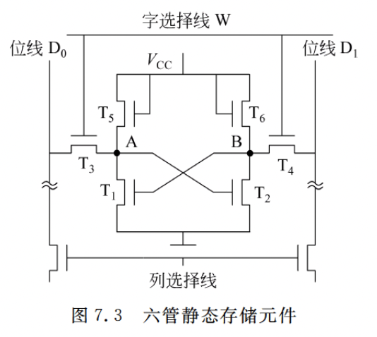

1）信息的保持
2）读出
3）写入
2. 单管动态MOS管存储元件
动态RAM利用MOS管的栅极电容Cs来保存信息，在信息保持状态下，存储元件中没有电流流动，因而大大降低了功耗。
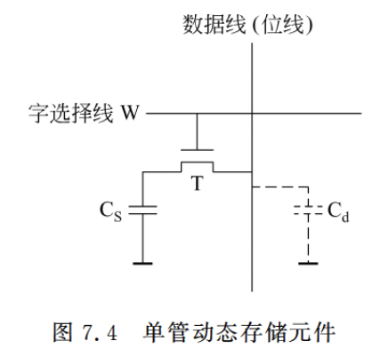
（1）读出。
（2）写入
（3）刷新。由于MOS管上存储的电荷会缓慢放电，超过一段时间，就会丢失信息。因此必须定时给栅极电容充电，这一过程称为刷新。

3. 静态存储元件和动态存储元件的比较
   SRAM存储元件所用MOS管多，占硅片面积大，因而功耗大，集成度低；但因为采用一个正负反馈触发器来存储信息，所以，只要直流供电电源一直加在电路上，就能一直保存记忆状态不变，所以无需刷新；也不会因为读操作而使状态发生改变，故无需读后再生；特别是它的读写速度快，其存储原理可看作是对带时钟的RS出发的读写过程，由于SRAM价格比较贵，适合做高速小容量的半导体存储器，如cache。
   DRAM存储元件所用MOS管少，占硅片面积小，因而功耗低，集成度高；但是因为采用电容储存电荷来存储信息，会发生漏电现象，所以要使状态保持不变，必须定时刷新；因为读操作会使状态发生改变，故需读后再生；特别是它的读写速度相对于SRAM元件要慢很多，其存储原理可看作是对电容重、放点的过程。相比较SRAM、DRAM价格较低，因而适合做慢速大容量的半导体存储器，如主存。

#### SRAM芯片和DRAM芯片

1. 存储器芯片的内部结构
   存储芯片由存储体、I/O读写电路、地址译码和控制电路等部分组成。
   （1）存储体（存储矩阵）。存储体是存储单元的集合。4096个存储单元被排成64✖️64的存储阵列，称为位平面，这样8个位平面构成4096字节的存储体。由X选择线（行选择线）和Y选择线（列选择线）来选择所需单元，不同位平面的相同行、列上的位同时被读出或读入。
   （2）地址译码器。用来将地址转换为译码输出线上的高低平，以便驱动相应的读写电路。地址译码有一维译码和二维译码两种方式。一维方式也称为线选法或单译码法，适用于小容量的静态存储器；二维方式也称为重合法或双译码法，适用于较大的动态存储器
   

（3）驱动器：在双译码结构中，一条X方向的选择线要控制在其上的各个存储单元的字选择线，所以负载较大，因此需要控制在译码器输出后加驱动器。
（4）I/O控制电路。用以控制被选中的单元的读出与写入，具有放大信息的作用。
（5）片选控制信号。单个芯片容量太小，往往满足不了计算机对存储器容量的要求，因此需将一定数量的芯片按特定方式连接成一个完成的存储器。芯片上除了有地址线和数据线，还应有片选控制信号。在地址选择时，由芯片外的地址译码器的输入信号以及控制信号来产生片选控制信号，选中要访问的存储字所在的芯片。
（6）读/写控制信号。根据CPU给出的是读命令还是写命令，控制被选中的存储单元进行读或写。
DRAM芯片容量较大，因此地址位数较多，为了减少芯片的地址引脚数，从而减少体积，大多采用地址引脚服用技术，行地址和列地址通过相同的管脚分先后两次输入，这样地址引脚数可减少一半

2. DRAM芯片的刷新
   DRAM芯片的存储阵列中所有存储电容必须周期性地重新充电，这一过程称为刷新。刷新可以采用“读出”的方法进行，根据读出内容对相应单元进行“重写”，即读后再生。刷新时只给各芯片送行地址和RAS信号，这样芯片中一行的所有元素就被选中并进行“读出操作”，因此，刷新操作按行进行，一次可刷新一行所有元素。
   刷新不需要外部提供行地址信息，这是一个内部的自动操作。DRAM芯片内部有一个行地址生成器（也称为刷新计数器），由它自动生成行地址。由于刷新时正对一行中所有存储单元进行，所以无需进行行列寻址。
   刷新周期定义为上次对整个存储器刷新结束时作为开始点到下次对整个存储器全部刷新一遍为止的时间间隔，也就是对某一个特定的行进行相邻两次刷新的时间间隔。
   有3种刷新方式：集中、分散和异步
   （1）集中刷新。在整个刷新间隔内，前一段时间用于正常的读写操作。而在后一段时间停止读写操作，集中逐行进行刷新。因为刷新操作同时对所有芯片进行，所以刷新期间整个存储器都不能进行正常的读写操作。由于集中刷新时间较长，因此处于这种非正常工作状态的时间较长，影响系统执行效率。
   （2）分散刷新。讲一个存储周期分为两段，前一段时间用于正常读写操作，后一段时间用于刷新。这样，不存在死时间区，但是每个存储周期的时间被加长。
   （3）异步刷新。结合以上两种方式，将一个刷新周期分配给所有行，使得在一个刷新周期内每一行都至少被刷新一次，且仅被刷新一次。
3. DRAM芯片读写周期
   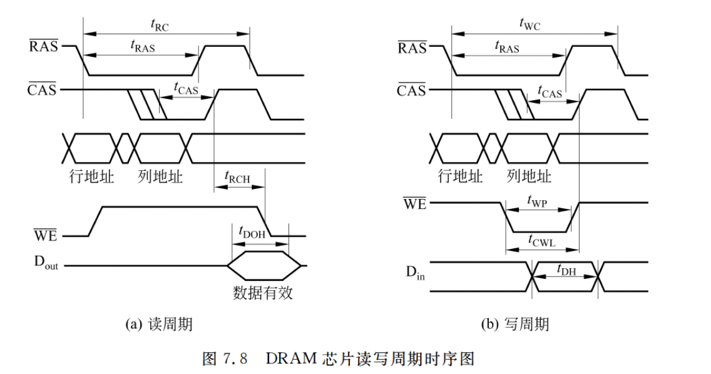
   （1）行地址必须在RAS信号有效之前送到芯片的地址输入端。
   （2）CAS信号应滞后RAS一段时间，并滞后列地址送到芯片地址输入端的时间。
   （3）RAS、CAS的时延分别为Tras和Tcas，它们应有足够的宽度。
   （4）WE信号为高电平，并在CAS有效之前建立
   （5）每次读后要再生，即重新写入一次。
   写周期

#### SDRAM芯片技术

目前常用的是基于SDRAM芯片技术的内存条，包括DDR SDRAM 、DDR2 SDRAM 和DDR3 SDRAM。

### 存储器芯片的拓展及其与CPU的连接

#### 内存条和内存条插槽

CPU通过其芯片内的总线接口部件（即总线控制逻辑）与系统总线相连，然后再通过总线之间的I/O桥接器、存储器总线连接到主存。
总线是连接其上的各部件共享的传输介质，通常总线由控制总线、数据线和地址线构成。
在CPU和主存之间交换信息时，CPU通过总线接口部件把地址信息和总线控制信息分别送到地址线和控制线，CPU和主存之间交换的数据则通过数据线传输，每根数据线传送一位数据，因为数据线的条数就是数据线位宽。
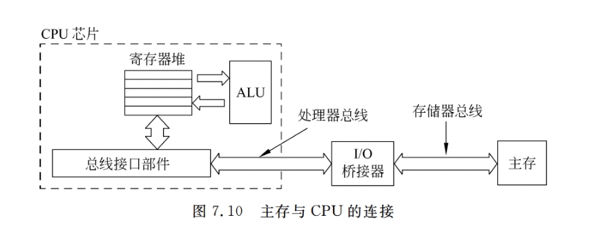

内存条插槽就是存储器总线，内存条中的信息通过内存条的引脚，再通过插槽内的引线连接到主板上，通过主板上的导线连接到北桥芯片或CPU芯片。
现在计算机中可以有多条存储器总线同时进行数据传输，支持两条总线同时进行传输的内存条插槽位双通道内存插槽，还有三通道、四通道内存插槽，其总线的传输带宽可以分别提高单通道的两倍、三倍和四倍。例如，内存条插槽支持双通道内存条，共可插入4个内存条，其中相同颜色的插槽可以并行传输，其带宽可以增加一倍。

#### 存储器芯片的拓展

由若干存储器芯片可构成一个内存条，此时，需要在字方向上和位方向上进行拓展。

1. 位拓展
   用若干片位数较少的存储器芯片构成给定字长的内存条时，需要进行位拓展。例如8片4096✖️1位的芯片构成4K✖️8位的内存条，需要在位方向上拓展8倍，而字方向上无需拓展。位拓展时，各芯片上的地址线及读写控制线对应相接，而数据线单独引出
2. 字拓展
   子拓展时容量的扩充，位数不变。例如用16K✖️8位的存储芯片在字方向上拓展4倍，可构成一个64K✖️8位的内存条。字拓展时，芯片的地址线、读写控制线等引脚对应相接，片选信号则分别与外部译码器的各个译码输出端相连。
3. 字、位同时拓展
   当芯片在容量和位数都不满足存储器要求的情况下，需要对字和位同时拓展。例如，用16K✖️4位的存储芯片在字方向上拓展4倍，位方向上拓展2 倍，可构成一个64K✖️8位的内存条。

16K x 4位的存储芯片可以存储16K个4位的二进制数。其中，“16K”表示**存储器单元**（Memory Cell）的数目，即存储芯片中存储的二进制数的数量。K是计算机存储容量的单位，等于1024，因此16K等于16 x 1024 = 16384。**由于每个存储器单元可以存储4位的二进制数**，因此该存储芯片的总存储容量为16384 x 4位 = 65536位，或者8192个字节。

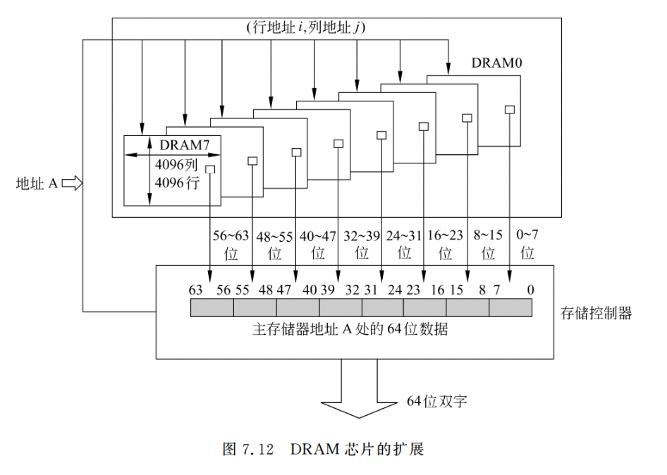

### 半导体只读存储器和Flash存储器

#### 半导体只读存储器

半导体只读存储器根据只读存储器的工艺可分为ROM、PROM、EPROM和EEPROM等类型。

1. 掩膜只读存储器
   掩膜只读存储器（MROM）中存储的信息由生产厂家在掩膜工艺过程中“写入”，用户不能修改。MROM有双极型和MOS型两种。MROM存储内容固定，所以可靠性高；
2. 可编程只读存储器
   可编程只读存储器（PROM）芯片出厂时内容全部为0，用户可用专门的PROM写入器将信息写入，所以称为可编程型ROM，但写入不可逆，某位写入1后，就不能再变为0，因此称为一次编程型只读存储器。
   PROM有两种工艺：熔丝型和反向二极管型。
3. 可擦出可编程只读存储器（EPROM）
   允许用户通过某种编程器向ROM芯片中写入信息，并可擦除所有信息后重新写入。可反复擦除一次-写入多次。
4. 电擦除电改只读存储器（EEPROM）
   在读数据的方式上和EPROM完全一样，但它有一个明显优点，即可用电来擦除和重编程。因此，可以选择只删除个别字，而不像EPROM那样每次都要抹除芯片上的全部信息。

#### 半导体Flash存储器

Flash存储器也称为闪存，是高密度非易失性读写存储器，它兼有RAM和ROM的优点，而且功耗低、集成度高，不需要后备能源。目前广泛使用的U盘和存储卡都属于Flash存储器

1. Flash存储元
   沿用了EPROM的简单结构和浮栅/热电子注入的编程写入方式。
2. Flash存储器的基本操作
   编程（充电）、擦除（放电）、读取

### 并行存储器结构技术

盖上主存速度的方法从3个方面考虑
（1）提高DRAM芯片本身的速度，如前述的各种基于SDRAM技术。
（2）采用并行结构技术，本节介绍的双口存储器和多模块存储器就是利用事件并行和空间并行在结构上进行优化的技术
（3）在CPU和主存之间增加高速缓冲器

#### 双口存储器

双口存储器在一个存储器中提供两组独立的读写控制电路和两个读写端口，因而可以同时提供两个数据的并行读写，是一种空间并行技术。

#### 多模块存储器

多模块存储器是一种空间并行技术，利用多个结构完全相同的存储模块工作来提高存储器的吞吐率。每个存储模块具有相同的容量和存取速度，并各自具有独立的地址寄存器MAR、数据存储器MDR、地址译码器、驱动电路和读写电路。
根据不同的编址方式，多模块存储器分为连续编址和交叉编址两只结构。

1. 连续编址方式
   连续编址的多模块主存储器，主存地址的高位表示模块号（或低位），低位表示模块内地址（体内地址），因此，也称为按高位地址划分方式，地址在模块内连续。
   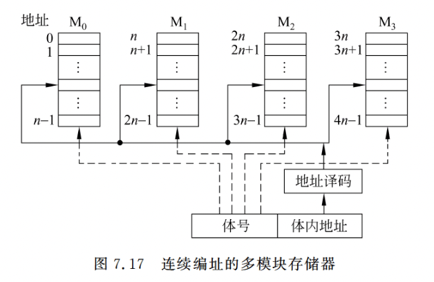
   对于连续编址的多模块主存储器，当访问一个连续主存块时，总是先在一个模块内访问，等到该模块全部单元访问完才赚到下一个模块访问。
   现代计算机采用层次化存储体系结构，在CPU和主存之间加入了高速缓存，因而CPU总是先访问cache，在访问cache失效时，再去访问主存，将一个主存块内连续单元中的信息取到cache。
2. 交叉编址方式
   交叉编址存储器中，主存地址的低位表示模块号，高位表示模块内地址，因此，也称为按低位地址划分方式。每个模块按“模m”交叉方式编址。为了减少存储器冲突，采用质数个模块。

交叉编址多模块存储器可以采用轮流启动或同时启动两种方式。
1）轮流启动
按每隔1/m个存储周期轮流启动各模块进行读写。如果**每个存储模块**一次读写的位数（即存储字）正好等于系统总线中的数据线数（即总线传输单位），则采用轮流启动方式。
2）同时启动
同时启动所有模块进行读写。如果**所有存储模块**一次并行读写的总位数正好等于系统总线中的数据线数，则可采用同时启动方式。

### 高速缓冲存储器

#### 程序访问的局部性

在较短时间间隔内，程序产生的地址往往集中在存储器的一个很小的范围，这种现象称为程序访问的局部性，可细分为时间局部性和空间局部性。
时间局部性：指被访问的某个存储单元在一个较短的时间间隔内很有可能又被再次访问。
空间局部性：指被访问的某个存储单元的邻近单元在一个较短时间间隔内很有可能也被访问。

**例题1**
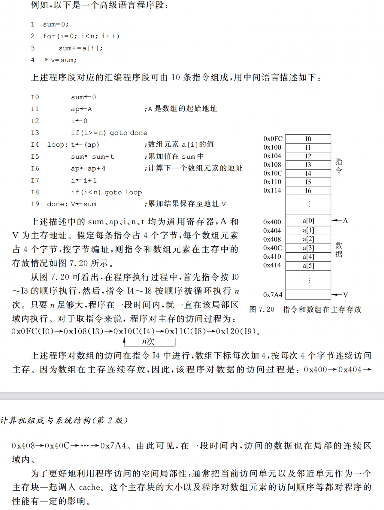

**例题2**
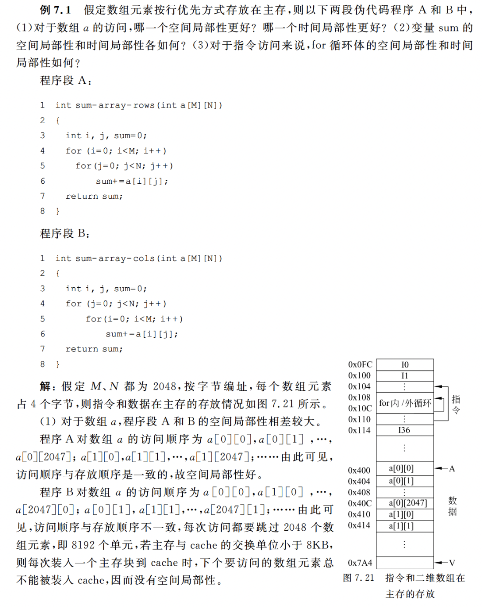
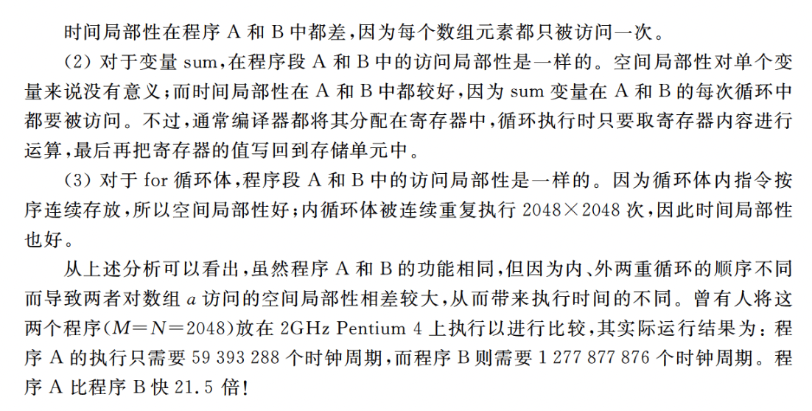

#### cache的基本工作原理

cache是一种小容量高速缓冲存储器，由快速的SRAM组成，直接制作在CPU芯片内，速度几乎与CPU一样快。在CPU和主存之间设置cache，总是把主存中被频繁访问的活跃程序块和数据块复制到cache中。由于程序访问的局部性，大多数情况下，CPU能直接从cache中取得指令和数据，而不必访问主存。
为便于cache和主存之间交换信息，cache和主存空间都被划分为相等的区域。主存中的区域称为块，也称为主存块，它是cache和主存之间交换单位。cache中存放一个主存块的区域称为行或槽。因此，主存块大小等于cache行数据区大小。

1. cache有效位
   在系统启动或复位时，每个cache行都为空，其中的信息无效，只有装入主存块后信息才有效。为了说明cache行中的信息是否有效，每个cache行需要一个有效位。
   有了有效位，就可以通过将有效位清零来淘汰某一行中的主存块，称为冲刷，装入一个新主存块时，再使有效位置1.
2. CPU在cache中的访问过程
   CPU执行程序过程中，需要从主存中取指令或访问数据时，先检查cache中有没有要访问的信息，若有，就直接从cache中读取，而不用访问主存储器；若没有，再从主存把当前要访问信息所在的一个主存块复制到cache中，因此，cache中的内容就是主存中部分内容的副本。
   cache对程序员是透明的，程序员编程时不用考虑信息存放在主存还是cache中。
   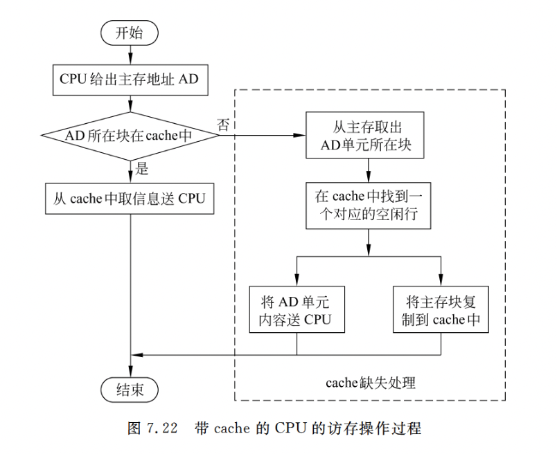
3. cache-主存层次的平均访问时间
   cache命中率p = 命中次数 / 访问总次数
   cache缺失率 = 不命中次数 / 访问总次数
   cache访问时间Tc 主存访问时间Tm
   命中时，访问时间为Tc，不命中时，访问时间为Tm+Tc

CPU在cache-主存层次的平均访问时间 Ta = p ✖️ Tc + （1-p）✖️ （Tm+Tc）= Tc + （1-p）✖️Tm；
例题：
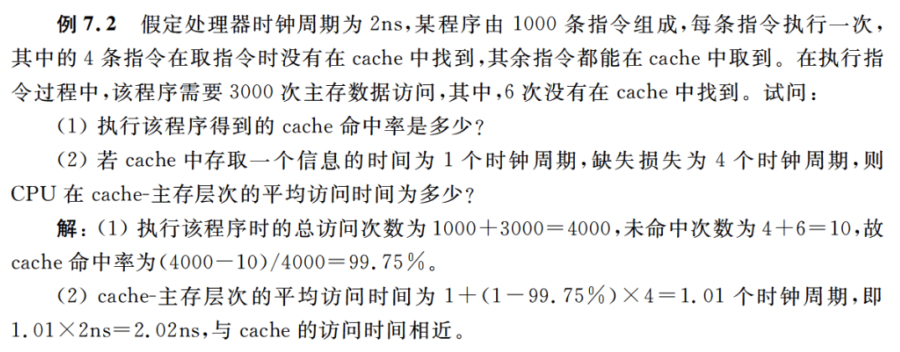

#### cache行和主存块之间的映射方式

cache行中的信息取自主存中的某个块。在将主存块复制到cache行时，主存块和cache行之间必须遵循一定的映射规则，这样，CPU要访问某个主存单元时，可以根据映射规则，到cache对应的行中查找到要访问的信息，而不是在整个cache中查找
根据不同的映射规则，主存块和cache行之间有一下3中映射方式：
（1）直接映射：每个主存块映射到cache的固定行中。
（2）全相联映射：每个主存块映射到cache的任意行中。
（3）组相联映射：每个主存块映射到cache的固定组的任意一行中。

1. 直接映射
   直接映射的基本思想是把主存的每一块映射到固定的一个cache中，也称为模映射，其映射关系如下：
   **cache行号 = 主存块号 mod cache行数**
   映射很直观，m位主存块号中后c位来作为对应cache行号来进行映射。也就是说，m位块号低c位相同的那些内存块，即“同余”内存块，将被映射到同一个cache行，形成一个“多对一”的映射关系。
   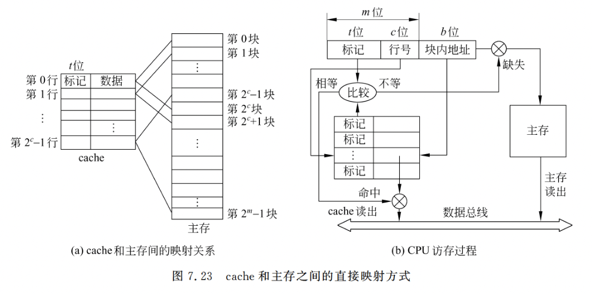
   主存地址分为
   标记           cache行号                     块内地址
   其中，高t位位标记位，中间c位为cache行号（也称为行索引），剩余的低位地址为块内地址。

访问过程如下：首先根据访问地址中间的c位行号，直接找到对应的cache行，将对应cache行中的标记和主存地址的高t位标记进行比较，若相等并有效位为1，则访问cache“命中”，此时，根据主存地址中的低位的块内地址，在对应的cache行中存取信息；若不相等或有效位为0，则“不命中”（缺失），此时，CPU从主存中读出该地址所在的一块信息送到对应的cache行中，将有效位置1，并将标记设置为地址中的高t位，同时将该地址中的内容送CPU。
CPU访问时，读操作和写操作的过程有一些不同，相对来说，读操作比写操作简单。因为cache行中信息时主存某块的副本，所以在写操作时会出现cache行和主存块数据的一致性问题。
例题：
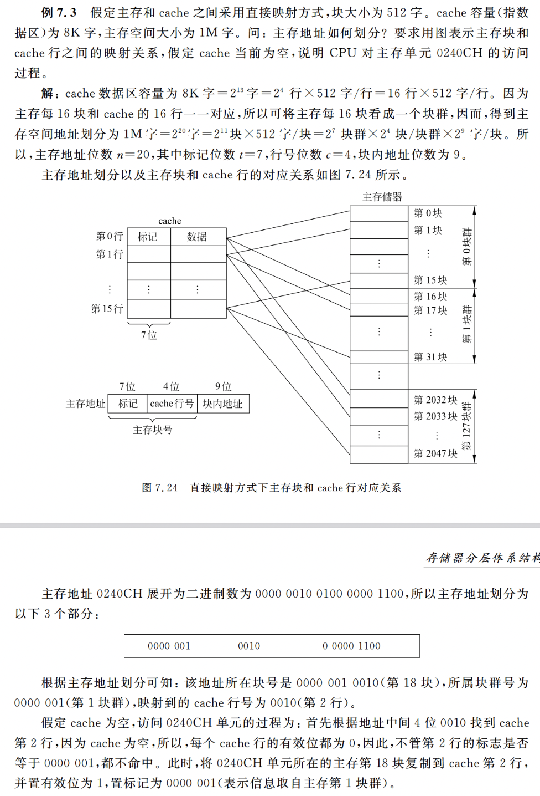

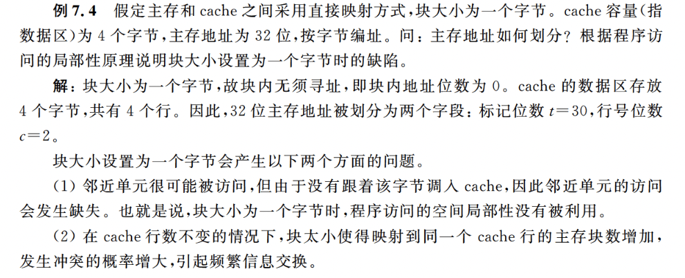

2. 全相联映射
   全相联映射的基本思想是一个主存块可装入cache任意一行。全相联映射cache中，每行的标记用于指出该行取自主存块的哪一块。因为一个主存块可能在任意一行中，所以需要比较cache行的标记，因此，主存地址中无须cache行索引，只有标记和块内地址两个字段。全相联映射方式下，只要有空闲cache行，就不会发生冲突，因而块冲突概率低。
   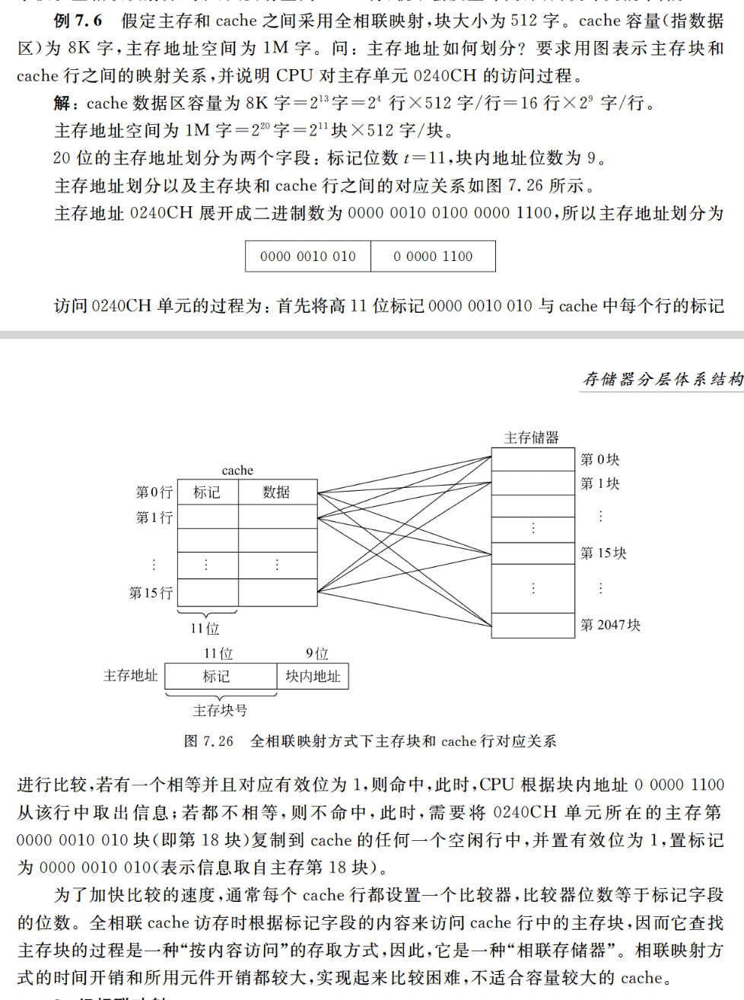
3. 组相联映射
   将前面两种方式结合起来产生了组相联映射方式。
   主要思想就是：将cache所有行分成2^q个大小相等的组，每组有2^s行。每个主存块被映射cache固定组中的任意一行，即组相联采用组间模映射、组内全相联的方式，映射关系如下：
   **cache组号 = 主存块号 mod cache组数**
   主存地址被划分为以下3个字段：
   **标记  cache组号  块内地址**
   其中 ，高m位为标记，中间q位为组号（也称为组索引），剩余的k位低位地址部分为块内地址。标记字段的含义表示当前地址所在的主存块位于主存的哪个组群。

  对于组相联cache，CPU访存过程如下：首先根据访存地址中间的q位cache组号，直接找到对应的cache组；将对应cache组中的每一行的标记与主存地址的高m位标记进行比较；若有一个相等并有效位为1，则访问cache“命中”，此时，根据主存地址中的块内地址，在对应cache行中存取信息；若都不相等或虽相等但有效位为0，则“不命中”，此时，CPU从主存中读出该地址所在的一块信息送到cache对应组的任意一个空闲行中，将有效位置1，并设置标记，同时将该地址的内容送到CPU。实现组相联映射的硬件线路如下。
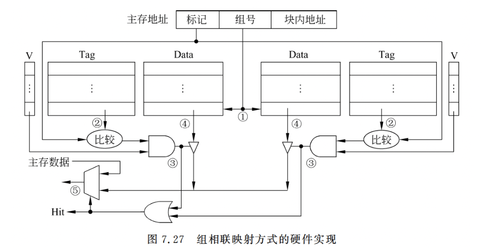
  如图所示是采用2路组相联映射的cache，整个访存过程如下：
  （1）根据主存地址中的cache组号找到对应组；
  （2）将地址中的标记与对应组中的每个行的标记Tag进行比较；
  （3）将比较结果和有效位V相与
  （4）若有一路比较相等并有效位为1，则输出Hit位1，并选中这一路cache行中的主存块；
  （5）在Hit为1的情况下，根据主存地址中的块内地址从选中的一块内取出对应单元的信息；若Hit不为1，则CPU要到主存去读一块信息到cache行中。
  **例题**
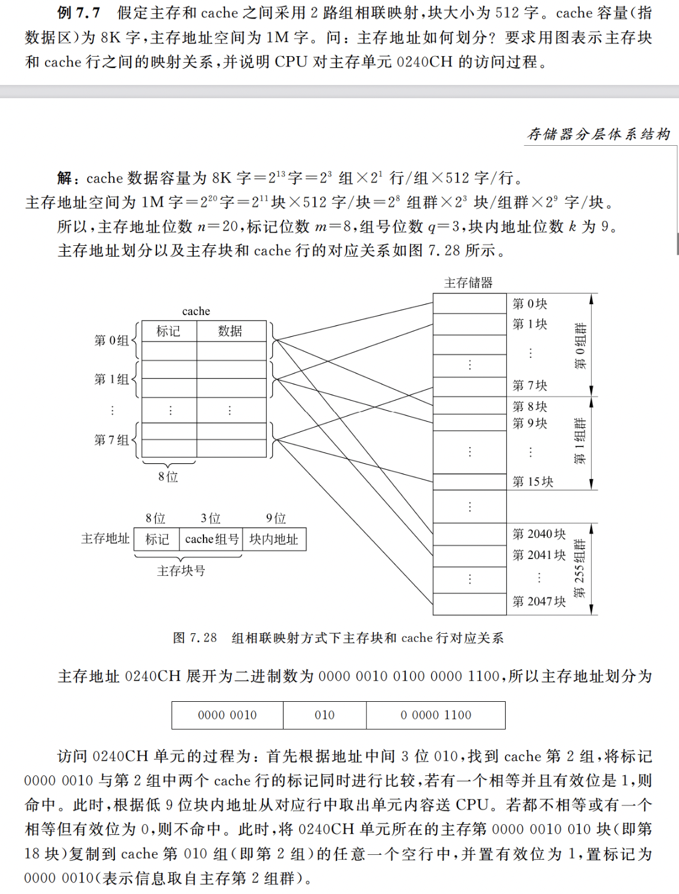
  组相联映射方式结合了直接映射和全相联映射的优点。当cache的组数为1时，变为全相联映射；当每组只有一个cache行时，则变为直接映射。组相联映射的冲突概率比直接映射概率低，由于只有组内各行采用全相联映射，所以比较器的位数和个数都比全相联映射少，易于实现，查找速度也快的多。
4. 三种映射方式比较
  对于一个主存块说，3中映射方式下对应cache行的个数不同。直接映射时唯一映射，每个主存块只有一个固定行与之对应；全相联映射时任意映射，每行都可对应；N路组相联映射有N行对应。这种特性可用“关联度”来度量，即关联度指一个主存块映射到cache中时可能存放的位置数。因此，直接相联的关联度最低，为1；全相联映射的关联度最高，为cache总行数；N路组相联的关联度居中，为N；
  当cache大小、主存块大小一定时，关联度和命中率、命中事件、标记所占额外开销等有如下关系：
  （1）关联度越低，命中率越低。因此直接映射命中率最低，全相联命中率最高
  （2）关联度越低，判断是否命中的开销越小，命中时间越短，因此直接映射的命中时间最短，全相联映射的命中时间最长。
  （3）关联度越低，标记所占的额外空间开销越少。因此，直接映射额外空间开销最少，全相联映射额外空间开销最大。
   **关联度例题**
  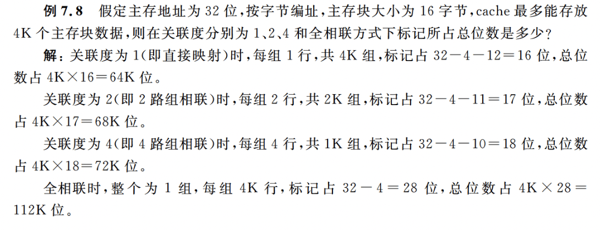

#### cache中主存块的替换算法

常用的替换算法有先进先出（FIFO），最近最少使用（LRU），最不经常用（LFU）和随机替换算法。

1. 先进先出算法（FIFO）
   FIFO基本思想：总是选择最早装入cache的主存块被替换。这种算法实现起来比较方便，但不能正确反映程序的访问局部性，因为最先进入的主存块也可能是目前经常要用的，因此，这种算法有可能产生比较大的缺失率
2. 最近最少使用（LRU）
   LRU基本思想：总是选择近期最少使用的主存块被替换。这种算法能比较正确反映程序的访问局部性，因为当前最少使用的块一般来说也是最少被访问的。但是，它的实现算法比FIFO算法要复杂一些。
   **LRU栈算法**：
   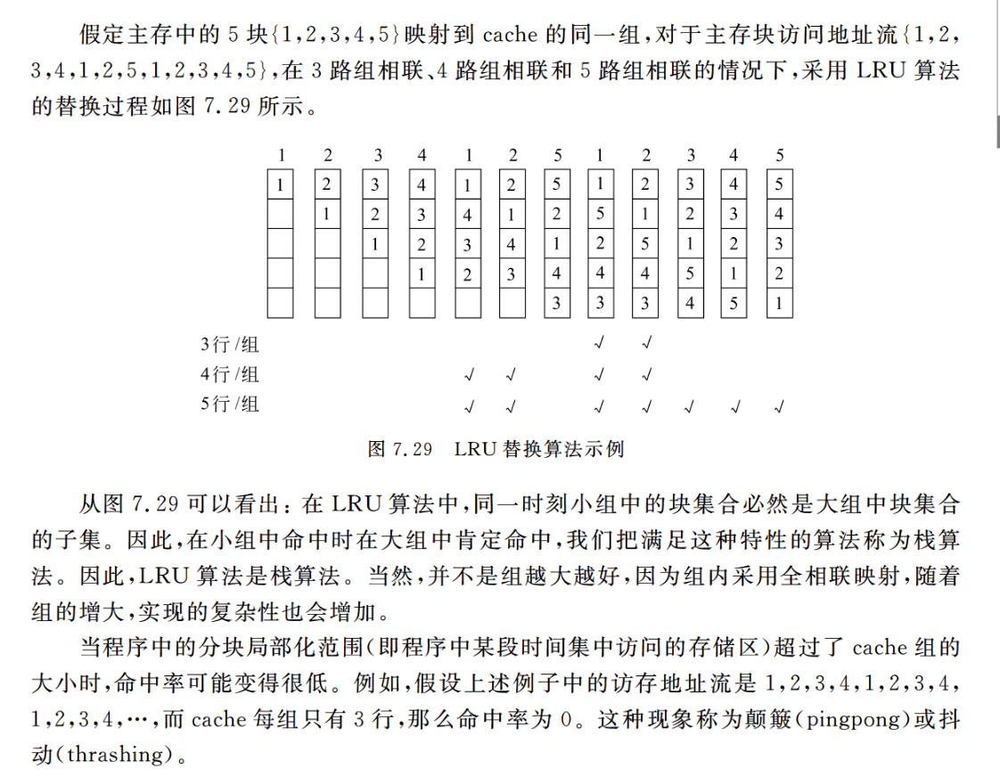

**LRU计数器算法**
 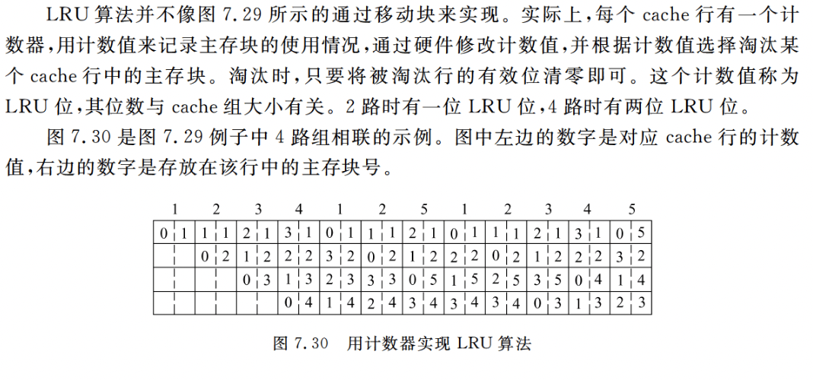
 计数器的变化规则如下：
 （1）命中时，被访问的行的计数器清零，比其低的计数器加1，其余不变。
 （2）未命中且该组还有空闲行时，则新装入的行的计数器设为0，其余全部加1.
 （3）未命中且该组无空闲行时，计数值为3（最大）的那一行中的主存块被淘汰，新装入的行的计数器设为0，其余加1.从计数器变化规则可以看出，计数值越高的行中的主存块越是最近最少用。
3. 最不经常用算法（LFU）
LFU算法的基本思想：替换cache中引用次数最少的块。LFU也用与每个行相关的计数器来实现，这种算法与LRU类似，但不全相同。
4. 随机替换算法
从候选行的主存块中随机选取一个淘汰，与使用情况无关。模拟试验表明，随机替换算法在性能上只稍逊色于给予使用情况的算法，而且代价低。

**替换例题**

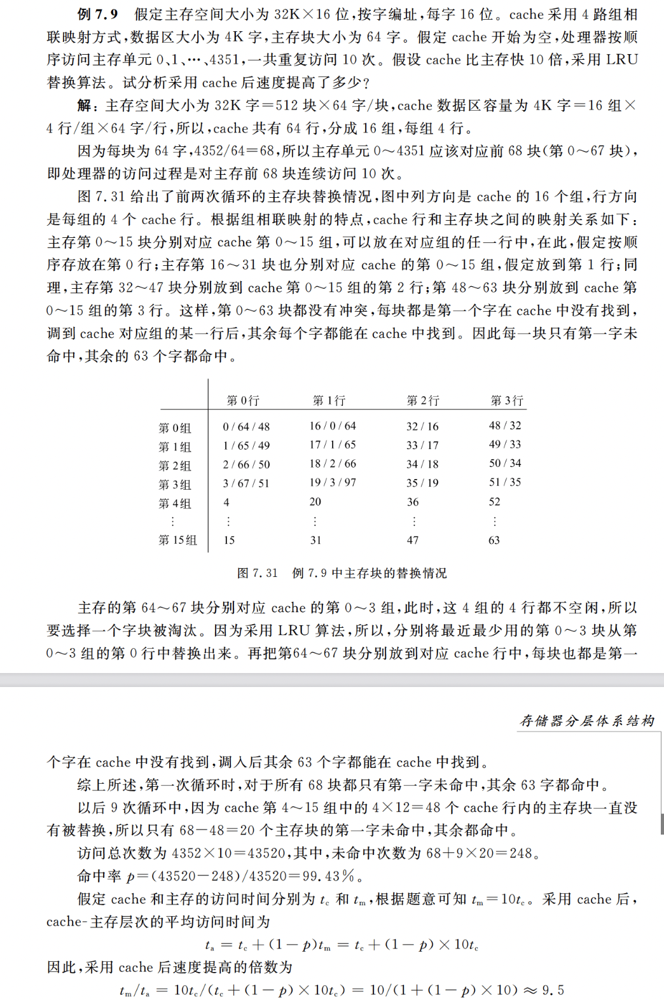

#### cache的一致性问题

  因为cache中的内容是主存块副本，当对cache中的内容进行更新时，就存在cache和主存如何保持一致性的问题。除此之外，一下情况也会出现cache一致性问题：
  （1）当多个设备允许访问主存时。例如，像磁盘这类高速I/O设备可通过DMA方式直接读写主存，如果cache中的内容被CPU修改而主存块没有更新，则从主存传送到I/O设备的内容就无效；若I/O设备修改了主存块的内容，则对应cache行中的内容就无效；
  （2）当多个CPU都带有各自的cache而共享主存时。在多CPU系统中，若某个CPU修改了自身cache中的内容，则对应的主存块和其他CPU中对应的cache行的内容都变味无效。

1. 全写法
   全写法的基本做法：写操作时，若写命中，则同时写cache和主存；若写不命中，则有以下两种处理方式：
   （1）写分配法。先在主存块更新相应存储单元，然后分配一个cache行，将更新后的主存块装入分配的cache行中。这种方式可以充分利用空间局部性，但每次写不命中都要从主存读一个块到cache中，增加了读主存块的开销。
   （2）非写分配法。仅更新主存单元而不装入主存块中。这种方式可以减少读入主存块的时间，但没有很好地利用空间局部性。
   由此可见，全写法实际上采用的是对主存块信息及其所有副本信息全部直接同步更新的做法，因此，该方法通常也被称为通写法或直写法，或为写直达法。
   为了减少写主存的开销，通常在cache和主存之间加一个写缓冲。在CPU写cache的同时，也将信息写入写缓冲，然后由存储控制器将写缓冲中的内容写主存。写缓冲是一个FIFO队列，一般有四项，在写操作频率不是很高的情况下，因为CPU只需将信息写入快速的写缓冲而无须写慢速的主存，因而效果较好。但是，如果写操作频繁发生，则会使写缓冲饱和而发生阻塞。
2. 回写法
   回写法的基本做法是：当CPU执行写操作时，若写命中，则信息只被写入cache而不被写入主存；写写不命中，则在cache中分配一行，将主存块调用该cache中并更新相应单元的内容。因此，在写不命中时，通常采用写分配法进行写操作。
   由此可见，回写法实际上采用的是回头再写或最后一次性写的做法，因此，访方式通常被称为回写法或一次性写方式，也称为写回法。
   在CPU执行写操作时，回写法不会更新主存单元，只有当cache行中的主存块被替换时，才将该内容一次性写回主存。这种方式的好处在于减少了写主存的次数，因而大大降低了主存带宽需求。为了减少写回主存块的开销，每个cache行设置了一个修改位（脏位），若修改位为1，则说明对应cache行中的主存块被修改过，替换时需要写回主存；若修改为为0，则说明对应主存块未被修改过，替换时无须写回主存。
   由于回写法没有同步更新cache和内存内容，所以存在cache和主存内容不一致而带来的潜在隐患，通常需要其他的同步机制来保证存储信息的一致性。

#### cache性能评估

  计算机性能最直接的度量方式就是CPU时间，执行一个程序所花的CPU时间应该等于CPU执行时间和等待主存访问时间之和。当发生cache缺失时，需要等待主存访问，此时，CPU处于阻塞状态，因此：
    CPU时间 = （CPU执行时钟数 + cache缺失引起阻塞的时钟数）✖️ 时钟周期
    cache缺失引起阻塞的时钟数 = 读操作阻塞时钟数 + 写操作阻塞时钟数
    读操作阻塞时钟数 = 程序中读操作次数 ✖️ 读缺失率 ✖️ 读缺失损失
  对于写操作来说，情况比较复杂。根据不同的写策略，其阻塞时钟数的计算方式不同。
  （1）回写方式下，替换时需要一次性写回一个块，故会产生一些附加写回阻塞
   写操作阻塞时钟数 = 程序中写操作数次数 ✖️ 写缺失率 ✖️ 写缺失损失 + 写回阻塞
  （2）全写方式下，包括写缺失阻塞和写缓冲阻塞两部分。
  写操作阻塞时钟数 = 程序中写操作数次数 ✖️ 写缺失率 ✖️ 写缺失损失 + 写缓冲阻塞
  假定写回阻塞和写缓冲阻塞忽略不计，则可将读操作和写操作综合考虑，得到如下公式：
  cache缺失引起阻塞的时钟数 = 程序中访存次数 ✖️ 缺失率 ✖️ 缺失损失
                         = 程序的指令条数 ✖️ （缺失率/指令）✖️ 缺失损失
**CPI越小，cahche缺失引起的阻塞对系统总体性能的影响就越大**
**CPU时钟频率越高，cache缺失损失就越大**
例题：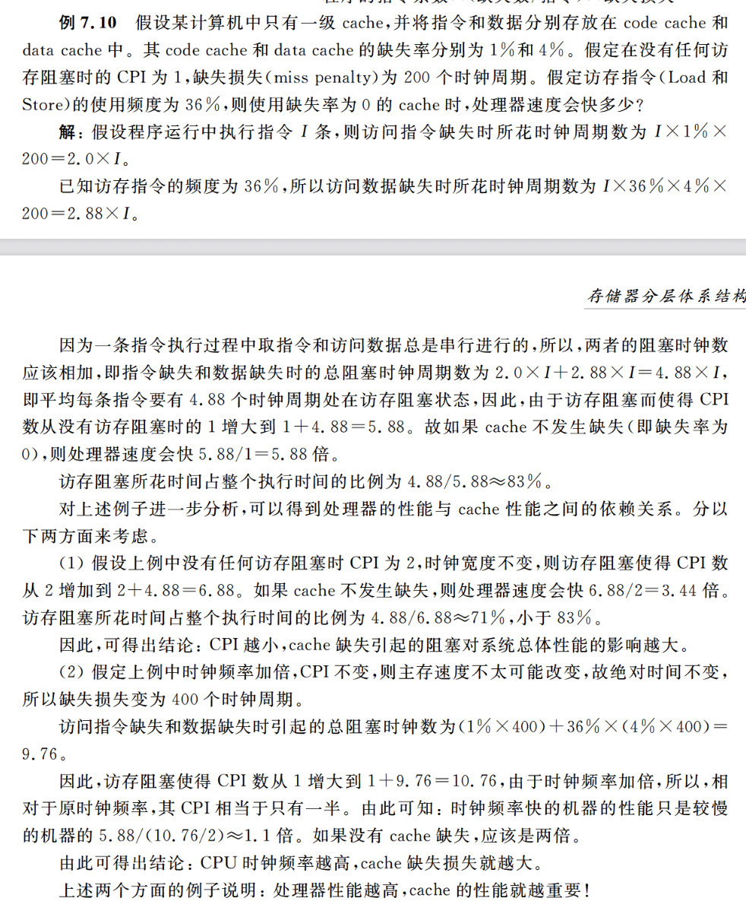

#### 影响cache性能的因素

决定系统访存性能的重要因素之一时cache命中率，与关联度，cache容量，主存块大小等。还需要考虑采用单级cache还是多级cache，数据cache和指令cache时分开还是合在一起，主存-总线-CPU之间采用什么架构等，甚至主存DRAM芯片的内部结构、存储器总线的总线事务类型也都与cache设计有关，都会影响系统总体性能。

1. 单级/多级cache、联合/分离cache的选择问题
   目前cache基本上都在CPU芯片内，且使用L1cache和L2cache，甚至L3cache。通常L1cache采用分离cache，即数据cache和指令cache分开设置。L2cache和L3cache通常为联合cache方式，即数据和指令存放在一个cache中。
   在一个采用两级cache的系统中，CPu总是先访问L1cache，若访问缺失，再访问L2cache。若L2cache包含所请求信息，则缺失损失为L2cache的访问时间，这比访问主存要快得多；若L2cache访问缺失，则需从主存取信息同时送L1cache和L2cache，此时缺失损失较大。
   在多级cache中，有全局缺失率和局部缺失率两种不同的概念。全局缺失率是指所有级cache中都缺失的访问次数占总访问次数的比率；局部缺失是指在某级cache中缺失的访问次数占对该级cache的总访问次数的比率。
2. 主存-总线-cache间的连接结构问题
   （1）窄形结构：即在主存、总线和cache之间每次按一个字的宽度进行传送
   （2）宽形结构：即在它们之间每次传送多个字
   （3）交叉存储器结构：主存采用多模块交叉存取方式，总线和cache之间每次按一个字的宽度进行传送。性价比最好。
3. DRAM结构、总线事务类型与cache的配合问题
4. cache结构举例

### 虚拟存储器

  虚拟存储技术：程序员在一个不受物理内存空间限制并且比物理内存空间大得多的虚拟的逻辑地址空间中编写程序，就好像每个程序都独立拥有一个巨大的存储空间一样。程序执行过程中，把当前执行到的一部分程序和相应的数据调入主存，其他暂不用的部分在那时存放在磁盘上。这种借用外存为程序提供的很大的虚拟存储空间称为虚拟存储器。
  执行执行时，通过硬件将指令中的逻辑地址（也称为虚拟地址或虚地址）转化为主存的物理地址（也称为主存地址或实地址），在地址转换过程中检查是否发生访问信息缺失、地址越界或访问越权，则由操作系统进行存储访问的异常处理。虚拟存储技术既解决了编程空间受限的问题，又解决了多道程序共享主存带来的安全等问题。

#### 进程与进程的上下文切换

  操作系统通过处理器调度让处理器交替执行进程中的指令，实现不同进程中指令交替执行的机制称为上下文切换。进程的实体（如代码和数据等）和支持进程运行的环境合称为进程的上下文。由用户进程的程序块、数据块和对战等组成的用户区地址空间，被称为用户级上下文；由进程标识信息、现场信息、控制信息和系统内核栈等组成的系统区地址空间，被称为系统级上下文；此外，还包括处理器中各个寄存器的内容，被称为寄存器上下文。在进行进程上下文切换时，操作系统把换下进程的寄存器上下文保存到系统级上下文的现场信息位置。用户级上下文地址空间和系统级上下文地址空间一起构成了一个进程的整个存储器映像。
  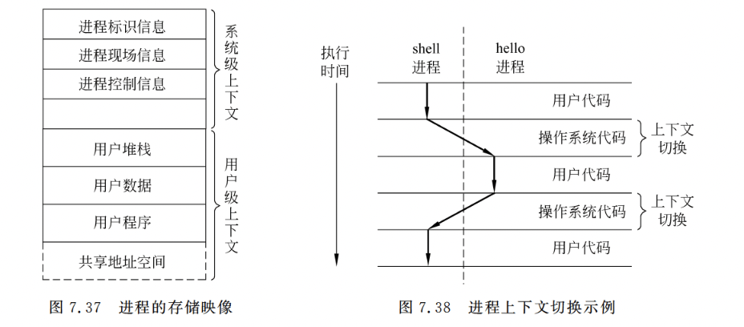

#### 存储器管理

  现代计算机采用多道程序执行方式，系统的主存中包含操作系统和若干个用户程序。在多道程序系统中，主存储器的“用户”区需进一步划分给多个进程。划分的任务由操作系统动态执行，被称为存储器管理。早起进场采用交换技术来使系统中尽量多地掉入用户程序。其基本思想是：当主存中没有处于就绪状态的进程（例如等待I/O），操作系统将一些进程调出写回到磁盘，然后再掉入其他进程来执行。
**分区**和**分页**是交换技术的两种实现方式

1. 分区方式
   分区方式将主存分为两大区域：系统区固定在一个地址范围内，存放操作系统；用户区用于存放所有用户程序。对于用户区的分配有简单固定分区和可变长分区两种方式。
   简单固定分区的基本思想：使用长度不等的固定长分区，当一个进程掉入主存时，分配给一个能容纳它的最小分区给它。多数情况下，进程对分区大小的需求不可能和提供的分区大小一样，因而，采用固定长度分区会大大浪费主存空间。
   动态可变长分区：其分配的分区大小与进程所需大小一样。可遍尝分区方式开始时情况较好，但最后在存储器中可能会有许多小空块出现。时间越长，存储器中的碎片就会越多，因而存储器的利用率下降。

  不管是固定分区还是可变长分区，都会在主存形成不能被利用的“碎片”。固定分区方式在分区内产生“内碎片”，而可变长分区方式在分区之间产生“外部碎片”。通过移动进程将“碎片”合并可提高主存利用率，但会带来处理器的额外时间开销，并且，进程移动时要进程重定位，增加了重定位硬件开销。
    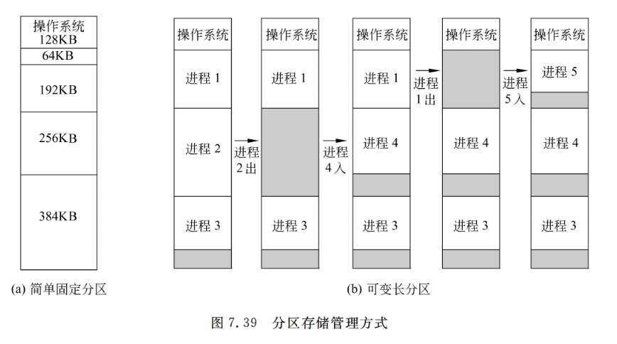
2. 分页方式
  基本思想：把主存分成固定比较小的存储块，称为页框，每个进程也被划分为固定长的程序块，称为页，程序块被装到可用的存储块中，并且无需用连续页框来存放一个进程。程序运行时装入内存页框的过程对程序员时透明的，因为程序员不需要知道程序运行时具体会装到哪些页框，因而程序给出的指令和数据的地址不是真正的主存物理地址，程序员是在一个虚拟的逻辑地址空间中编写程序，通常把程序中所用的地址称为虚拟地址或逻辑地址，而真正访问的主存地址称为物理地址或实地址。操作系统在进行存储器分配时，通过页表建立页和页框之间的映射关系，每个进程都有一个页表，通过页表实现虚拟地址向物理地址的转换。
  现代操作系统总采用了“请求分页”的分页式虚拟存储管理方式，所谓“请求分页”就是只将当前需要的页面装入主存页框中，而不需要的页面则存放在外存中。这就是现代计算机采用虚拟存储存储管理的基本思想。

#### 虚拟地址空间

  虚拟存储器管理管理方式采用“请求分页”思想，每次访问仅将当前需要的页面调入内存，而进程中其他不活跃的页面放在外存磁盘上。当访问某个信息所在页不在主存时发生缺页，此时，从磁盘将缺失页面掉入主存。
   虚拟存储器机制为程序员提供了一个极大的虚拟（逻辑）地址空间，它是主存和磁盘I/O设备的抽象。虚拟机制给每个进程带来了一个假象，好像每个进程都独占使用主存，并且主存空间极大。它带来了3个好处：
   （1）每个进程具有一致的虚拟地址空间，从而可以简化存储管理。
   （2）它把主存看成是磁盘存储器的一个缓存，在主存中仅保存当前活动的程序段和数据区，并根据需要在磁盘和主存之间进行信息交换，通过这种方式，使有限的主存空间得到了有效利用。
   （3）每个进程的虚拟地址空间是私有的，因此，可以保护各自进程不被其他进程破坏。
   虚拟存储器机制中，每个源程序经编译、汇编、链接等处理生成可执行的二进制机器目标代码时，每个程序的目标代码都被映射到同样的虚拟地址空间，因此，所有用户进程的虚拟地址空间是一致的。
   一个hello程序的一个进程对应的虚拟地址空间映像，它分为两大部分：内核区和用户区。
   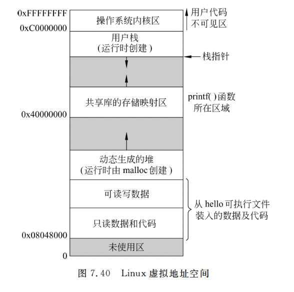
   内核区在0xC000000以上的高端地址上，用来存放操作系统内核代码和数据以及与进程相关的数据结构（如进程标识信息、进程现场信息，页表等进程控制信息以及内核栈等），其中内核代码和数据区在每个进程的地址空间中都相同。用户没有权限访问内核区。
   用户区用来存放用户进程的代码和数据，它又被分为一下几个区域：
   （1）用户栈。用来存放程序运行时过程调用的参数、返回值、返回地址、过程局部变量等，随着程序的执行，该区会不断动态地从高地址向低地址增长或反方向减退。
   （2）共享库。用来存放公共的共享函数库代码，如hello中printf（）函数等。
   （3）堆。用于动态申请存储区，例如，c语言中用malloc()函数分配的存储区或c++中用new操作符分配的存储区。申请一块内存时，动态地从低地址向高地址增长，用free函数或delete操作符释放一块内存时，动态地从高地址向低地址减退。
   （4）可读写数据区。存放用户进程中的代码和只读数据，如hello进程中的程序代码和字符串

#### 虚拟存储器的实现

   缺页处理代价较大，通常将主存和磁盘之间的交换页面设定得比较大，比在cache和主存之间交换的主存块大得多，典型的有4KB和8KB等。提供命中率时关键，因此，在主存页框和虚拟页之间采用全相联映射方式。此外，当进行写操作时，由于磁盘访问速度很慢，所以不能每次写操作都同时写DRAM缓存和磁盘，因而，在处理一致性问题时，采用回写方式，而不用全写方式。
   因为在虚拟存储机制中采用全相联映射，所以每个虚拟页可以存放到对应主存区域的任何一个空闲页位置。因此，与cache一样，虚拟存储器机制必须要有一种方法来确定每个进程的各个页面所存放的对应主存位置或磁盘位置；主存在空间中的页面被称为页框(页帧)、物理页或实页。有时虚拟页简称为CP，物理页简称PF或PP
   1）页表
   为了对每个虚拟页的存放位置、存取权限、使用情况、修改情况等进行说明，操作系统在主存中给每个进程都生成了一个页表，每个虚拟页在页表中都有一个对应表项，表项内容包括该存放位置、装入位、修改位、使用位（替换控制位）、存取权限和禁止缓存位等。
   页表项中的**存放位置**字段用来建立虚拟页和物理页之间的映射，用于进程虚拟地址到物理地址的转换。
   **装入位**也称为有效位或存在位，用来表示对应页面是否在主存，若为1，表示该虚拟页已从外存调入主存，是一个“缓存页”，此时存放位置字段指向主存页框号（即物理页号或实页号）；若为0，则表示没有被调入主存，此时，若存放位置字段为null，则说明是一个“未分配页”，否则是一个“未缓存页”，其存放位置字段给出该虚拟页在磁盘上的起始地址。
   **修改位**用来说明页面是否被修改过，虚存机制中采用回写策略，利用修改为你可判断替换时是否需写回磁盘。
   **使用位**用来说明页面的使用情况，配合替换策略来设置，例如，是否最先调入（FIFO位），是否最近最少用（LRU位）等。
   **存取权限位**用来说明页面是可读可写，只读还是只可执行，用于存储保护。
   **禁止缓存位**用来说明页面是否可以装入cache，通过正确设置该位，可以保证磁盘、主存和cahe数据的一致性
    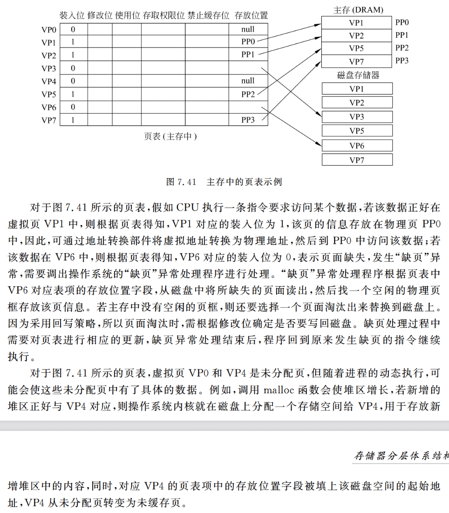

   系统中每个进程都有一个页表，页表属于进程控制信息，存放在进程地址空间的内核区，页表在主存的首地址记录在页表基址寄存器中。页表的项数由虚拟空间大小决定，因此，页表项数会很多，因而会带来页表过大的问题。解决页表过大的方法有很多，可以采用限制大小的一级页表、二级货多级页表，倒置页表等方案

   2）地址转换
   对于采用虚存机制的系统，指令中给出的地址是虚拟地址，所以，CPU执行指令时，首先要将虚拟地址转换为主存物理地址，才能到主存取指令和数据。地址转换工作由CPU中的存储器管理部件（MMU）来完成。
   **虚拟地址**：高位字段为虚拟页号，低位字段为页内偏移地址。
   **物理地址**：高位字段为物理页号，低位字段为页内偏移地址。
   分页式地址变换-〉 每个进程都有一个页表基址寄存器，存放该进程的页表首地址。首先根据页表基址寄存器的内容，找到对应的页表首地址，然后以虚拟地址高位字段的虚拟页号为索引，找到对应的页表项，若装入位为1，则取出物理页号，和虚拟地址中的页内地址拼接，形成实际主存物理地址；若装入位为0，则说明缺页，需要操作系统进行缺页处理。
   

   3）快表
   在地址转换过程可看出，访存时首先要到主存查页表，然后才能根据主存物理地址再访问主存以存取指令或数据。如果缺页，则还要进行页面替换、页表修改等，访问主存的次数就更多。因此，采用虚拟存储器机制后，使得访存技术增加了。为了减少访存次数，往往把页表中最活跃的几个页表项复制到高速缓存中，这种由高速缓冲中的页表项组成的页表称为后背转换缓冲器，通常简称为快表，相应地称主存中的页表为慢表。
   这样，在地址转换时，首先到快表中查页表项，如果命中，则无需访问主存中的页表。因此，快表时减少访存时间开销的有效方法。
   快表比页表小得多，为提高命中率，快表通常具有较高的关联度，大多采用全相联或组相联方式。每个表项的内容由页表项内容加上一个TLB标记字段组成，TLB标记字段用来表示该表项取自页表中的哪个虚拟页对应的页表项，因此，TLB标记字段的内容在全相联方式下就是该页表项对应的虚拟页号；组相联方式下则是对应虚拟页号中的高位部分，而虚拟页号的低位部分用于选择TLB组的组索引。
    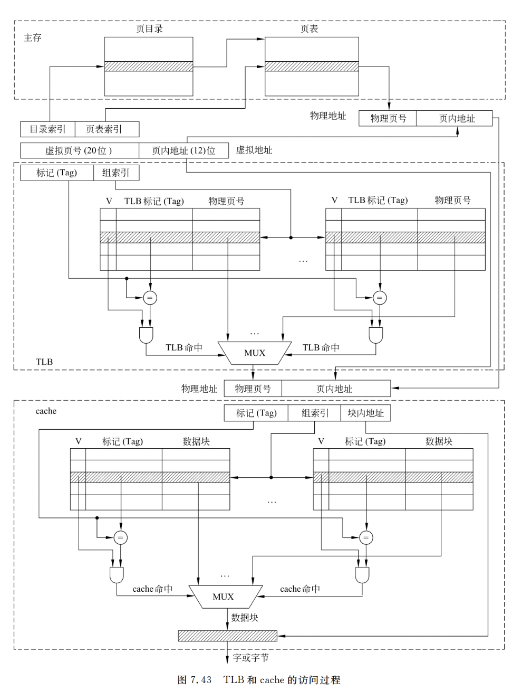
   4) CPU访存过程
   在一个具有cache和虚拟存储器的系统中，CPU的一次访存操作可能涉及TLB、页表、cache、主存和磁盘的访问。访问如下图
    
    TLB、page、cache的3种缺失组合:
   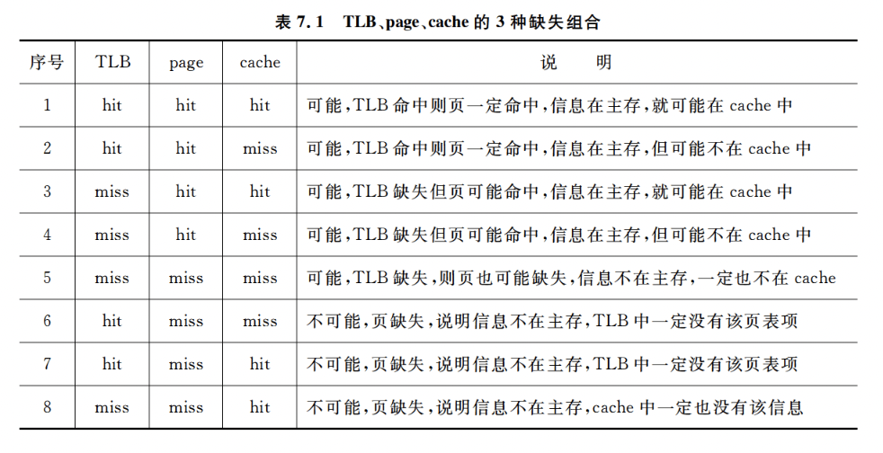

   cache缺失处理由硬件完成；缺页处理由软件完成，OS通过“缺页异常处理程序”来实现；而对于TLB缺失，则既可以用硬件也可以用软件来处理。用软件处理时，OS通过专门的“TLB缺失异常处理程序”来实现。

2. 分段式虚拟存储器
   可以把段作为基本信息单位在主存和辅存之间传送和定位。分段方式下，将主存空间按实际程序中的段来划分，每个段在主存中的位置记录在段表，段的长度可变，所以段表中需有长度指示，即段长。每个进程都有一个段表，每个段在段表中有一个段表项，用来知名对应段在主存中的位置、段长、访问权限、使用和装入情况。段表本身也是一个可再定位段，可以存在外存中，需要时调入主存，但一般驻留在主存中。
   在分段式虚拟存储系统中，虚拟地址由段号和段内地址组成。通过段表把虚拟地址变换成主存物理地址，变化过程如下：
   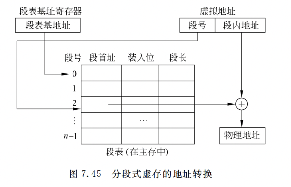
   每个用户进程都有一个段表基址寄存器，存放其段表在内存的首地址。根据虚拟地址中的段号，可找到对应段表项，是否存下一下3中异常情况：
   （1）缺段（段不存在）：装入位 = 0 ；
   （2）地址越界：偏移量超出最大段长。
   （3）保护违例：操作方式与制定访问权限不符
   若发生以上异常，则调出相应的异常处理程序，否则，将段表项中的段首址与虚拟地址中的段内地址相加，生成主存物理地址。
   因为段本身时程序的逻辑结构所决定的一些独立部分，因而分段对程序员来说不是透明的，而分页对程序员来说是透明的，程序员编写程序时不需知道程序将如何分页。
   分段式管理系统的优点是段的分界与程序的自然分界相对应；段的逻辑独立性使它易于变异、管理、修改和保护，也便于多道程序共享；某些类型的段（如堆、栈、队列）具有动态可变长度，允许自由调度以便于有效利用主存空间。但是，由于短的长度各不相同，段的起点和终点不定，给主存空间分配带来麻烦，而且容易在主存中留下许多空白的零碎空间，造成浪费。
   分段式和分页是存储管理各有有优缺点，因此可采用分段和分页相结合的段页式存储管理方式
3. 段页式虚拟存储器
   在段页式虚拟存储器中，程序按模块分段，段内再分页，用段表和页表（每个段一个页表）进程两级定位管理。段表中每个表项对应一个段，每个段表项中包含一个指向该段页起始位置的指针，以及该段其他的控制和存储保护信息；由页表指明该段各页在主存中的位置以及是否装入、修改等状态信息。
   程序的调入调出按页进行，但它又可以按段实现共享和保护。因此，它兼有分页式和分段式存储管理的优点。它的缺点是在地址映像过程中需要多次查表。

#### 存储保护

   为避免主存中多道程序相互干扰，防止某程序出错而破坏其他程序的正确性，或某程序不合法地访问其他程序或数据区 应该对每个程序进程存储保护，包活操作系统程序和用户程序。
   为了对OS存储保护提供支持，硬件必须具有一下3中基本功能
   （1）支持至少两种特权模式
   执行操作系统内核程序时处理器所处的模式称为管理模式、内核模式或称管理程序状态，简称管态、管理态、内核态或核心态；执行用户程序时处理器所处模式称为用户模式、用户状态或目标程序态，简称为目态或用户态。
   （2）使部分CPU状态只能由操作系统内核程序进行读写而用户进程不能读写。
   特权模式位、页表首地址、TLB内容等都只能由OS内核程序通过特殊指令（管态指令或特权指令）进行访问。常用的管态指令包括刷新cache、刷新TLB
   、改变特权模式、输入/输出、停止处理器执行等
   （3）提供让CPU在管理模式和用户模式之间相互转换的机制
   如果用户进行需要访问内核代码和数据，那么，必须通过执行系统调用指令来间接访问。响应异常和中断可使CPU从用户模式转到管理模式；异常处理和中断处理后的“返回”指令使CPU从管理模式转到用户模式。
   硬件通过提供相应的专用寄存器、专门的指令、专门的状态/控制位等，和操作系统一起实现上述3个功能。通过这些功能，并把页表保存在操作系统的地址空间，操作系统就可更新页表，并防止用户进程改变页表，以确保用户进程只能访问操作系统分配给的存储空间。
   存储保护包括以下两种情况：访问方式保护和存储区域保护。

1. 访问方式保护
2. 存储区域保护
   就是看是否发生了“地址越界”，即是否访问了不该访问的区域，通常有以下几种常用的存储区域保护方式。
   （1）加界重定位
   （2）键保护方式
   （3）环保护方式
   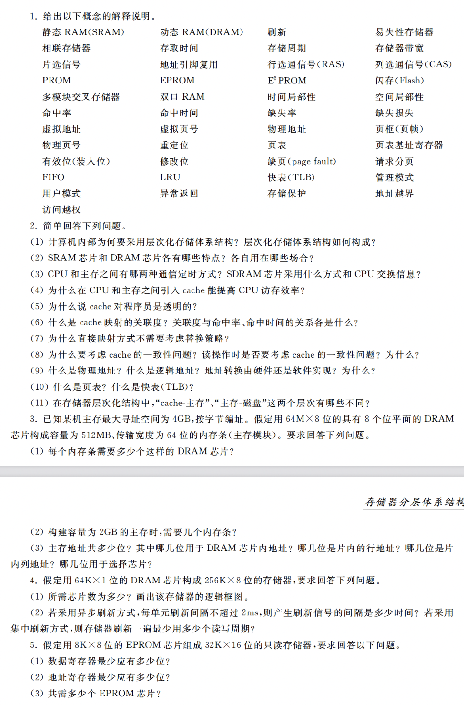

## 第八章 互连及输出组织

### 外部设备的分类与特点

#### 外部设备的分类

  外设按信息的传输方向来分，可分成输入设备、输出设备与输入输出设备3类。
（1）输入设备：包括键盘、鼠标、触摸屏等 。 可再分为媒体输入设备与交互式输入设备。
（2）输出设备：包括显示屏、打印机、绘图仪。将计算机输出的数字信息转换成模拟信息，送往自动控制系统进行过程控制的数模转换设备。
（3）输入输出设备：包括磁盘驱动器、磁带机、光盘驱动器、CRT终端、网卡等通信设备，即可输入又可输出信息。
外设按功能来分，可分为人机交互设备、存储设备和机-机通信设备3种。
（1）人机交互设备：用于用户和计算机之间交互通信的设备，如键盘、鼠标、显示屏，打印机，大多数这类设备与知己交换信息以字符为单位，所以又称为字符型设备或面向字符的设备。
（2）存储设备：这类设备用于存储大容量数据，作为计算机的外存存储器使用，如磁盘驱动器、光盘驱动器，磁带机。属于成块传送设备。
（3）机-机通信设备：主要用于计算机和计算机之间的通信，如网卡、调制解调器，数/模和模/数转换设备。

#### 外设的特点

（1）异步性：外设与CPU之间是完全异步的工作方式，两者之间无统一的时钟，且各类外设之间工作速度相差很大，它们的操作在很大程序上独立于CPU，但又要在某个时刻接受CPU的控制，这就势必造成输入输出操作时相对CPU时间的任意性与异步性。必须保证在连续两次CPU和外设交往之间，CPU仍然高速地运行它自己的程序，以达到CPU与外设之间，外设与外设之间的并行工作
（2）实时性
（3）多样性

### 输入设备和输出设备

#### 键盘

#### 鼠标器

#### 打印机

#### 显示器

### 外部存储设备

#### 磁表面存储原理

磁表面存储器包括磁鼓、磁带、磁盘和磁卡片等。目前，在计算机系统中以磁盘和磁带为主。磁表面存储器主要用作计算机存储系统中的辅存，它可以存储大量的程序和数据。

1. 磁层和磁头
   磁表面存储器中信息的存取主要由磁层和磁头来完成。磁层时存放信息的介质，它由非矩形剩磁特性的导磁材料。
   磁头时实现磁-电和电-磁转换的元件。
2. 磁表面存储器的读写过程
   一般都使磁头固定，而磁层作高速回转或匀速直线运动。在这种相对运动中，通过磁头（其缝隙对准磁层）进行信息存取。
   1）信息写入过程
   2）信息读出过程
3. 磁表面存储器的性能指标
   1）记录密度
   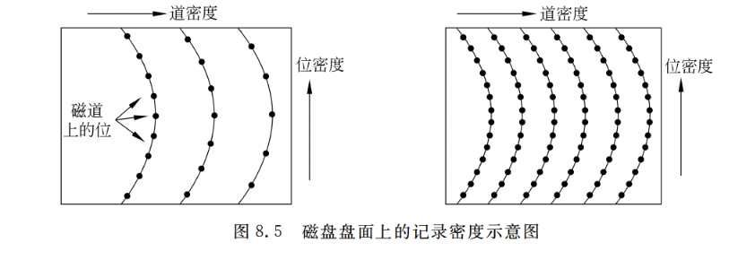
   2）存储容量
   3）平均存取时间
   4）数据传输速率
   指磁表面存储器完成磁头定位和旋转等待以后，单位时间内从存储介质上读出或写入的二进制信息量。
4. 数据记录方式
   数据记录方式是指将数字信息转换成磁层表面的磁化单元所采用的各种方式。

#### 硬盘存储器

  硬盘存储器有硬盘和软盘两种。
  硬盘存储器的逻辑结构：由磁记录介质，硬盘驱动器，硬盘控制器三大部分组成。硬盘控制器包括控制逻辑、时序电路、并/串转换和串/并转换电路。硬盘驱动器包括读写电路、读写转换开关、读写磁头与磁头定位伺服系统
  1）硬盘驱动器
  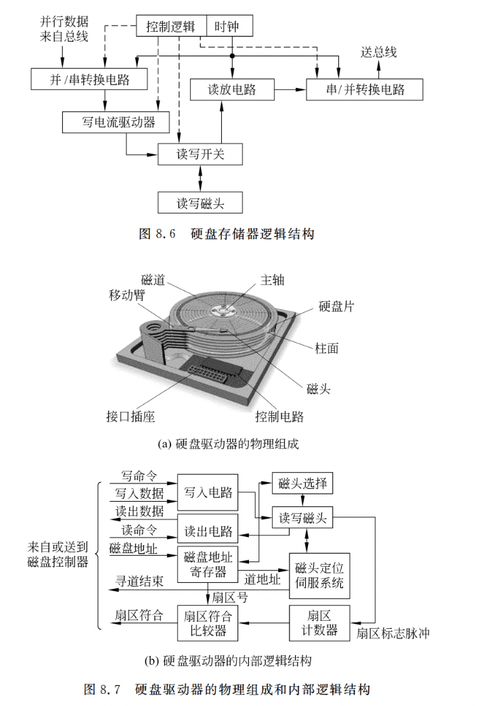
  磁盘读取是根据主机访问控制字中的盘地址（柱面号，磁头号，扇区号）读写目标磁道中的指定扇区。其操作可归纳为：寻道、旋转等待和读写
  （1）寻道操作
  （2）旋转等待操作
  （3）读写操作

  2）硬盘控制器
  硬盘控制器是主机与硬盘驱动去之间的接口。
   
  3）磁盘的记录格式
  数据在磁盘上的记录格式分定长记录格式和不定长记录格式两种。
  4）硬磁盘的主要技术指标
  未格式化容量的计算：
  磁盘总容量 = 记录面数 ✖️ 理论柱面数 ✖️ 内圆周长 ✖️ 位密度
  磁盘世纪数据容量 = 2 ✖️盘片数 ✖️ 磁道数/面 ✖️扇区数/磁道 ✖️ 512B/扇区

  数据传输率 = 每分钟转速 ➗ 60 ✖️ 内圆周长 ✖️ 位密度

  响应时间 = 排队时延 + 控制器时间 + 寻道时间 + 旋转等待时间 + 数据传输时间

  T = 寻道时间 + 旋转等待时间 + 数据传输时间
  寻道时间：磁头移动到指定磁道所需时间
  旋转等待时间：指要读写的扇区旋转道磁头下方所需时间
  数据传输时间：指传输一个扇区的时间

#### 冗余磁盘阵列

#### U盘和固态硬盘

  U盘也称为闪存器，与上述硬磁盘不同，它不是磁表面存储器，而是采用Flash存储器（闪存）做成，属于非易失性半导体存储器。
  固态硬盘：不是磁表面存储器，而是一种使用NAND闪存组成的外部存储系统，和U盘并没有本质区别，只是容量更大，存取性能更好

### 外设与CPU、主存的互连

#### 总线概述

分散连接：各部件之间通过单独的连线互联
总线连接：将多个部件连接到一组公共信息传输线上
总线构成：一组控制线、一组数据线和一组地址线。有些没有单独的地址线，采用地址线和数据线复用的办法。
数据线：用来承载在源部件和目的部件之间传输的信息，这个信息可能是数据、命令或地址（数据和地址线复用）
地址线：用来给出源数据或目的数据所在的主存单元或I/O端口的地址。
控制线：用来控制对数据线和地址线的访问和使用。

1. 总线宽度
   总线中**数据线**的条数称为总线宽度，它决定了每次能同时传输的信息的位数，并行传输总线的总线宽度为16位、32位、64位或128位
2. 总线工作频率
   早期的总线通常一个时钟周期传送一次数据，因此总线工作频率等于总线时钟频率。现在总线一个时钟周期可以传送2次或4次数据，因此，总线工作频率是总线时钟频率的2倍或4倍
3. 总线带宽
   总线带宽指总线的最大数据传输率，即总线在进行数据传输单位时间内最多可传输的数据量，不考虑其他如总线裁决、地址传送等所花的时间。
   B = W ✖️ F / N
   W：总线带宽 即总线能同时并行传送的数据位数，通常以字节为单位
   F：总线的时钟频率
   N：完成一次数据传送所用的时钟周期数
   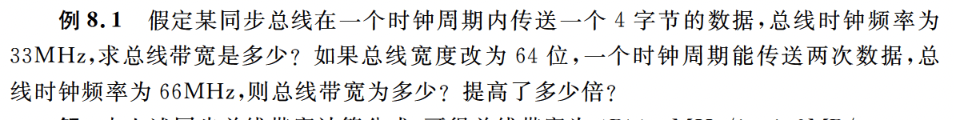
4. 总线寻址能力
   总线的寻址能力主要指由地址线位数所确定的可寻址地址空间的大小。例如地址线16位，可访问存储单元 2^16
5. 总线定时方式
   按照总线上信息传送的定时方式来分，有同步通信、异步通信和半同步通信
   同步通信：总线由时钟信号同步
   异步通信：指前一个信号的结束就是下一个信号的开始，信息的改变是顺序的
   半同步通信：同步和异步两类总线定时方式的结合
6. 总线传送方式
   总线上数据传送分非突发方式和突发方式两种。
   非突发方式：在每个传送周期内部是先传送地址，再传送数据
   突发传送方式：总线能够进行连续的成块数据传送，无需传送地址信息。
7. 总线负载能力
   总线的负载能力指总线上所能挂接的遵循总线电器规范的总线设备和数目。由于总线只能扩展槽能由用户使用，所以总线的负载一般指总线上拓展槽

#### 基于总线的互连结构

北桥芯片：主存控制器集线器芯片，本质上是一个DMA控制器，可通过MCH芯片直接访问主存和显卡中的显存。
南侨：I/O控制器集线器芯片，其中可以集成USB控制器、磁盘控制器、以太网控制器等各种外设控制器，也可以通过南桥芯片引出若干主板扩展槽，用以接插一些I/O控制卡

  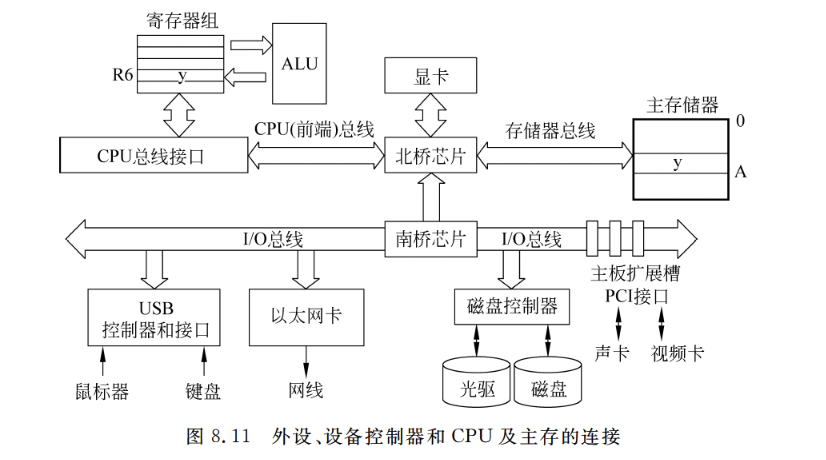

1. 处理器总线
   处理器总线称为前端总线（FSB），它是主板上最快的总线，主要用作处理器与北桥芯片进行信息交换。
2. 存储器总线
3. I/O总线

### I/O接口

#### I/O接口的功能

（1）数据缓冲：由于主存和CPU寄存器的存取速度非常快，而外设速度则较慢，所I/O接口中引入数据缓冲寄存器，以达到主机和外设工作速度的匹配。
（2）错误或状态检测：在I/O接口中提供状态寄存器。以保存各种状态信息，供CPU查用。
（3）控制和定时：提供控制和定时逻辑，以接受从系统总线来的控制命令和定时信号。
（4）数据格式转换：提供数据格式转换部件，使通过外部接口得到的数据转换为内部接口需要的格式，或在相反的方向进行数据格式转换。

#### I/O接口的通用结构

 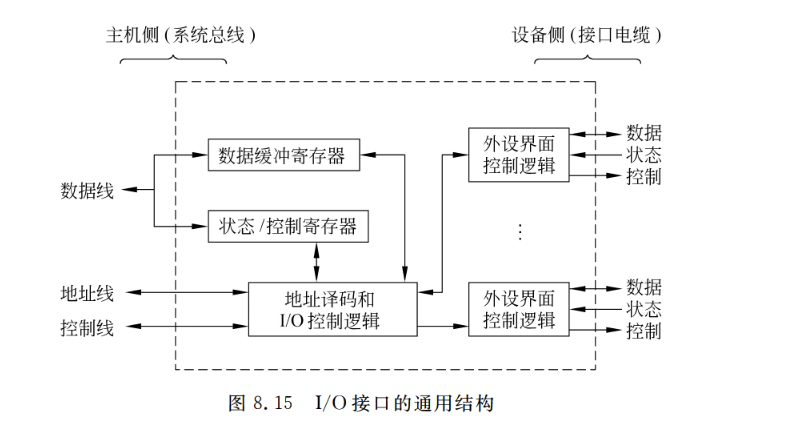

#### I/O端口及其编址

1. 独立编址方式
2. 统一编制方式

### I/O数据传送控制方式

#### 程序直接控制I/O方式

程序直接控制方式直接通过查询程序来控制主机和外设之间的数据交换。

1. 无条件传送方式

  也称为同步传送方式，主要用于对一些简单外设（如开关，继电器、7段显示器或机械式传感器）在规定时间用相应的I/O指令对接口中的寄存器进行信息的输出或输入。其实质就是通过程序来定时，以同步传送数据，适合于各类巡回采样检测或过程控制。

2. 条件传送方式

也称为异步传送方式。

#### 程序中断I/O方式

1. 中断的概念
   中断控制I/O方式的基本思想是：当前进程P1需要进行一个I/O操作时，它会先启动外设进行第一个数据的I/O操作，并挂起执行I/O操作的进程P1，使其被阻塞，然后从就绪队列中选择另一个进程P2执行，此时，外设和CPU并行工作。当外设完成I/O操作，便向CPU发出中断请求。CPU响应请求后，就终止正在执行的用户进程P2；转入一个“中断服务程序”，在“中断服务程序”中再启动随后数据的I/O传送任务。“中断服务程序”执行完后，返回原被中止的进程P2的断点处继续执行。此时，外设和CPU又开始并行工作。

 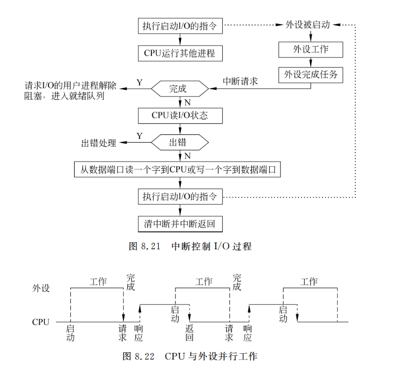

 （1）“缺页”或“溢出”等异常事件是由特定指令在执行过程中产生的，而中断相对于指令的执行也是异步的。中断不和任何指令相关联，也不阻止任何指令的完成。因此，CPU只需要在开始一条指令之前检测是否有外部发来的中断请求即可。
 （2）异常的发生和异常事件的类型是由CPU自身发现和识别的，不必通过外部的某个信号通知CPU，而对于中断，CPU必须通过外部中断请求线进行采样，并从总线上获取相应的中断源设备的标示信息，才能获知哪个设备发生了何种中断。

2. 中断系统的基本职能和结构
   （1）即使记录各种中断请求信号
   （2）自动响应中断请求
   （3）自动判优
   （4）保护被中断程序的断点和现场。
   （5）中断屏蔽
3. 中断过程
   中断响应：由硬件实现
   中断处理：由CPU执行中断服务程序来完成，所以中断处理是由软件实现的。
   1）中断响应
   指主机发现中断请求，终止现行程序的执行，到调出中断服务程序这一过程，因此，中断响应过程是处理器从一个进程切换到另一个进程的过程。
   （1）保存好被中断程序的断点处的关键性信息
   为了保证中断程序在从中断服务程序返回后在断点处能继续执行正确执行下去，有两类信息不能被中断服务程序破坏。一类是用户可见的工作寄存器的内容，这些寄存器存放着程序执行到断点处的现行值，一般把这类信息称为现场；另一类是用指令无法直接读取的程序计数器PC和程序状态字寄存器PSWR等的内容，通常把这类信息称为断点信息。对于现场信息，因为是用指令可直接访问，所以通常在中断服务程序中通过指令把它们保存到栈中，即由软件实现；而对于断点信息，因为必须将中断服务程序的首地址和初始状态字装入到PC和pswr中才能转到中断服务程序执行，所以，原来在PC和PSWR中的断点信息应由处理器在中断响应开始之前自动保存到一个特定的地方，即由硬件实现。
   （2）识别中断源并根据中断响应优先级进行判优
   （3）调出中断服务程序
   处理器通过相应步骤得到所选择的中断源对应的中断服务程序的首地址和初始程序状态字，并把它们分别送PC和PSWR。这样，在中断响应结束后的下一个时钟周期，处理器就转入响应的中断服务程序执行。
   中断响应的条件：
   （1）CPU处于“开中断”状态
   （2）至少要有一个未被屏蔽掉的中断请求。
   （3）当前指令刚执行完
   中断响应周期 ，通过一条隐指令，完成以下操作：
   （1）关中断：将中断允许标志置为禁止（“关中断”）状态，这时将屏蔽掉所有可屏蔽中断请求。
   （2）保护断点：将PC和PSW送入栈或特殊寄存器
   （3）识别中断源并转中断服务程序：通过某种方式，获得优先级最高的中断源所对应的中断服务程序的首地址和初始PSW，分别送入PC和PSWR。

   中断源的识别和判优方法可分为软件查询和硬件判优两大类。
   （1）软件查询方法
   当CPU检测到中断请求时，通过中断响应，自动转到一个特定的中断查询程序，在中断查询程序中，按中断优先顺序依次查询哪个设备有中断请求，并转到第一个查询到有请求的红单服务程序去执行。
   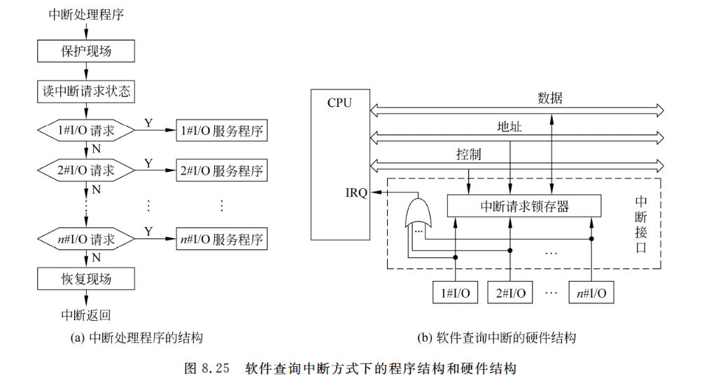
   （2）采用硬件判优方法
   硬件判优方式是一种向量中断方式，它不同于软件查询的中断处理技术。它根据中断控制器接口中的中断判优电路和编码器，得到当前所有未被屏蔽的中断请求中具有最高响应优先权的中断源类型（中断源标识信息）。
   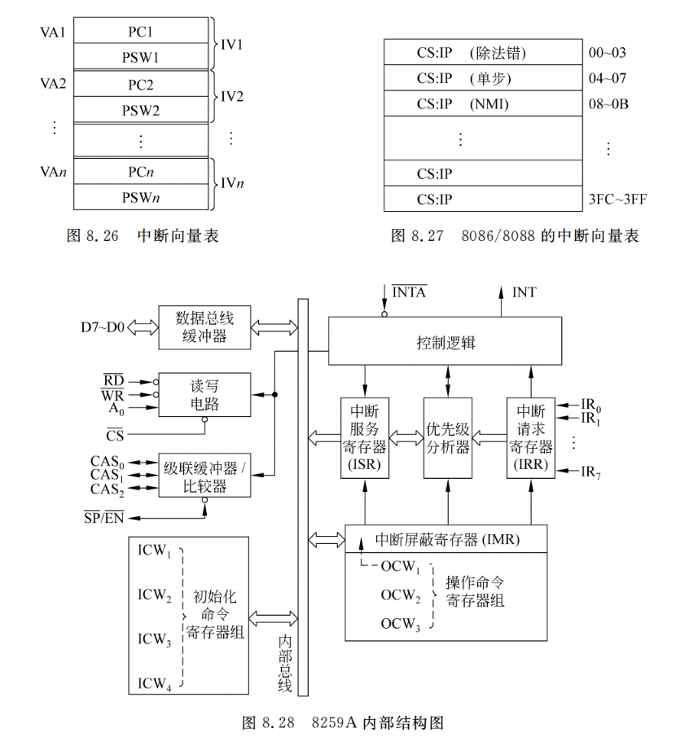

（2）中断处理
    就是CPU执行响应的中断服务程序（或称为中断处理程序）的过程，不同的中断源其对应的中断服务程序不同。

#### DMA方式

  DMA即直接存储器存取，该输入输出方式用专门的DAM接口硬件来控制外设与主存间的直接数据交换，数据不通过CPU。通常把专门用来控制总线进行DMA传送的接口硬件称为DMA控制器，在进行DMA传送时，CPUO让出总线控制权，由DMA控制器控制总线，通过“挪用”一个主存周期完成和主存之间的一次数据交换，或独占若干主存周期完成一批数据的交换。
    DMA方式主要用于磁盘等高速设备的数据传送，成批数据交换方式。

1. 三种DMA方式
   （1）CPU停止法
   DMA传输时，由DMA控制器发出一个停止信号给CPU，使CPU脱离总线，停止访问主存，直到DMA传送一块数据结束。
   （2）周期挪用法。
   DMA传输时，CPU让出一个总线事务周期，由DMA控制器挪用一个主存周期来访问主存，传送完一个数据后立即释放总线。是一种单字传送方式。
   （3）交替分时访问法。
   每个存储周期分成里两个时间片，一个给CPU，另一个给DMA控制器，这样在每个存储周期内，CPU和DMA控制器都可以访问存储器
2. DMA操作步骤
   DMA控制器与设备控制器一样，其中也有若干寄存器，用于存放I/O传送所需的各种参数。这些寄存器包括主存地址寄存器、字计数器、控制寄存器、设备地址寄存器等，此外还有其他的控制逻辑，能控制设备通过总线与主存直接交换数据。
   第一步：DMA控制器的预置（初始化）
   (1)准备内存区。
   （2）设置传送参数。
   （3）发送“启动DMA传送”命令，然后调度CPU执行其他进程。
   第二步：DMA数据传送（DMA传送）。
   CPU对DMA传送参数进行预置并发送“启动DMA传送”命令后，就把数据传送的工作交给了DMA控制器。在整个DMA传送过程中，不再需要CPU的参与，完全由DMA控制器实现数据的传送。
   DMA控制器给出内存地址，并在其读/写线上发出“读命令”或“写”命令，随后在数据总线上给数据。DMA控制器每完成一个数据的传送，就将字计数值减1，并修改主存地址。当字计数器为0时，完成所有I/O操作。
   第三步：DMA结束处理（后处理）
   当字计数器为0，则发出“DMA结束”中断请求信号给CPU，转入中断服务程序，做一些数据校验等后处理工作。
   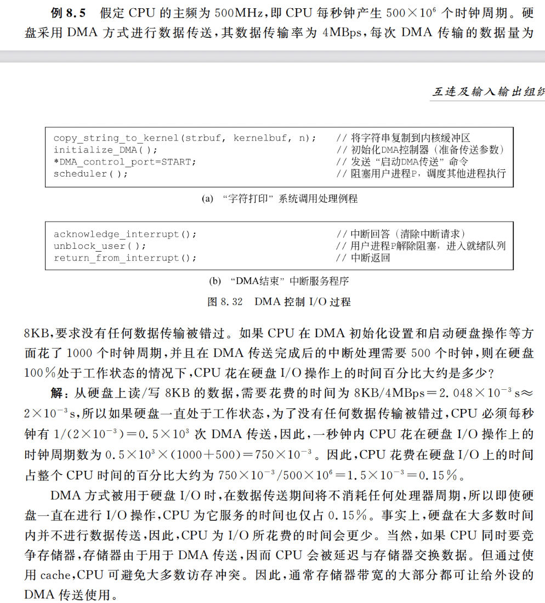
3. DMA与存储系统
   DMA采用物理地址，只能限定在一个页面内进行。

### I/O子系统概述

### 内核空间I/O软件

#### 与设备无关的I/O软件

1. 设备驱动程序统一接口
2. 缓冲区处理
3. 错误报告
4. 打开与关闭文件
5. 逻辑块大小的处理

#### 设备驱动程序

#### 中断服务程序

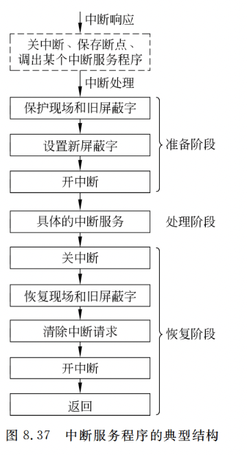
中断响应是通过CPU执行中断隐指令来完成，完全由硬件来完成；
中断处理就是CPU执行一个中断服务程序的过程，完全由软件来完成。
中断服务程序包含3个阶段：准备阶段、处理阶段和恢复阶段。
